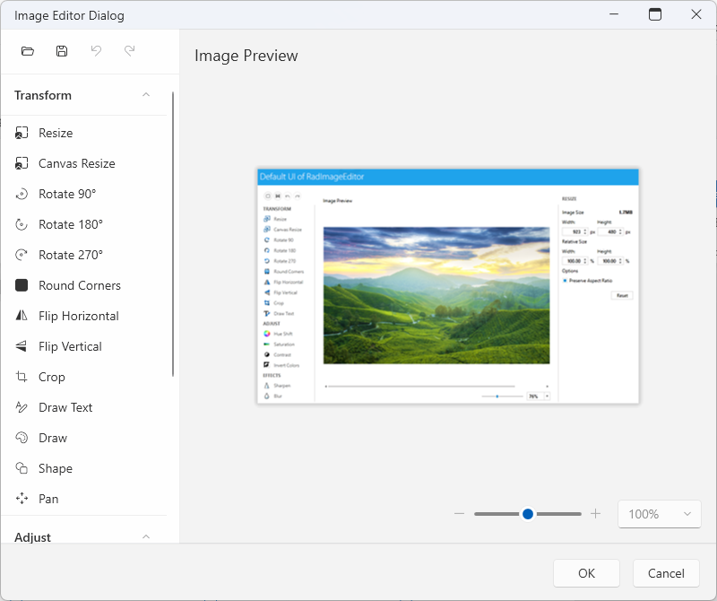
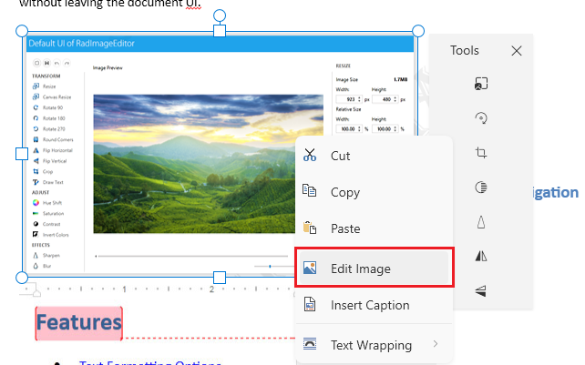

# Image Editor Dialog

This dialog allows you to [edit images]() in the document.

The dialog can be opened from the __Edit Image__ option in the context menu (right click menu) of `RadRichTextBox`. This option is available only when the context menu is opened over an image.

## Showing the Dialog Manually

The dialog can be shown by executing the `ShowImageEditorDialogCommand`. See how to bind the command to an external button in the [Commands]() article.

#### __[C#] Executing the show dialog command__
{{region richtextbox-dialogs-image-editor-0}}
	this.richTextBox.Commands.ShowImageEditorDialogCommand.Execute(null);
{{endregion}}

Alternatively, call the `ShowImageEditorDialog` method of `RadRichTextBox`.

#### __[C#] Using the show dialog method__
{{region richtextbox-dialogs-image-editor-1}}
	this.richTextBox.ShowImageEditorDialog();
{{endregion}}