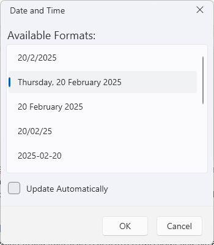
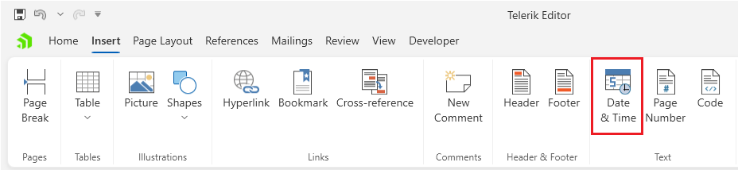

# Insert Date and Time Dialog

This dialog allows you to insert a date-time value in the document.

The dialog can be opened from the __Date & Time__ button in the __Insert__ tab of the [RadRichTextBoxRibbonUI]().

## Showing the Dialog Manually

The dialog can be shown by executing the `ShowInsertDateTimeDialogCommand`. See how to bind the command to an external button in the [Commands]() article.

#### __[C#] Executing the show dialog command__
{{region richtextbox-dialogs-insert-date-time-0}}
	this.richTextBox.Commands.ShowInsertDateTimeDialogCommand.Execute(null);
{{endregion}}

Alternatively, call the `ShowInsertDateTimeDialog` method of `RadRichTextBox`.

#### __[C#] Using the show dialog method__
{{region richtextbox-dialogs-insert-date-time-1}}
	this.richTextBox.ShowInsertDateTimeDialog();
{{endregion}}