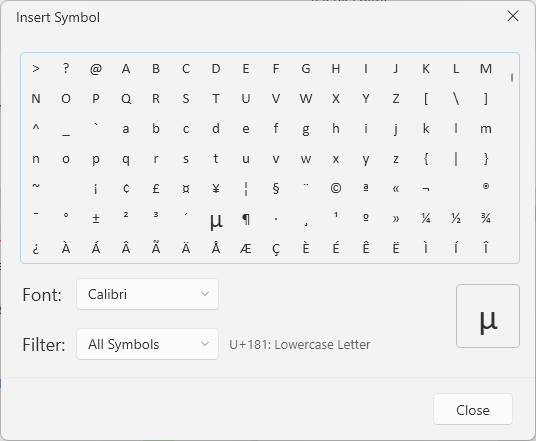
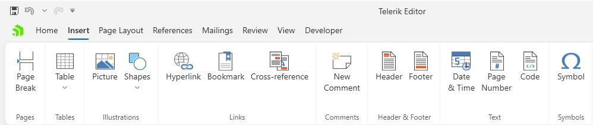

# Insert Symbol Dialog

This dialog allows you to insert special symbols at the cursor position in the document.

The dialog can be opened from the __Symbol__ button in the __Insert__ tab of the [RadRichTextBoxRibbonUI]().

## Showing the Dialog Manually

The dialog can be shown by executing the `ShowInsertSymbolWindowCommand`. See how to bind the command to an external button in the [Commands]() article.

#### __[C#] Executing the show dialog command__
{{region richtextbox-dialogs-insert-symbol-0}}
	this.richTextBox.Commands.ShowInsertSymbolWindowCommand.Execute(null);
{{endregion}}

Alternatively, call the `ShowInsertSymbolWindow` method of `RadRichTextBox`.

#### __[C#] Using the show dialog method__
{{region richtextbox-dialogs-insert-symbol-1}}
	this.richTextBox.ShowInsertSymbolWindow();
{{endregion}}