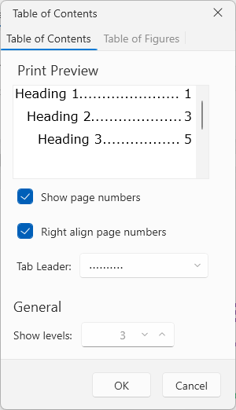
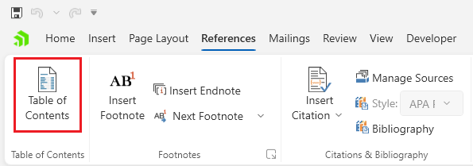

# Table of Contents Dialog

This dialog allows you to insert a table of contents in the document.



The dialog can be opened from the __Table of Contents__ button in the __References__ tab of the [RadRichTextBoxRibbonUI]().



## Showing the Dialog Manually

The dialog can be shown by executing the `ShowInsertTableOfContentsDialogCommand`. See how to bind the command to an external button in the [Commands]() article.

__Executing the show dialog command__
```C#
	this.richTextBox.Commands.ShowInsertTableOfContentsDialogCommand.Execute(null);
```

Alternatively, call the `ShowInsertTableOfContentsDialog` method of `RadRichTextBox`.

__Using the show dialog method__
```C#
	this.richTextBox.ShowInsertTableOfContentsDialog();
```