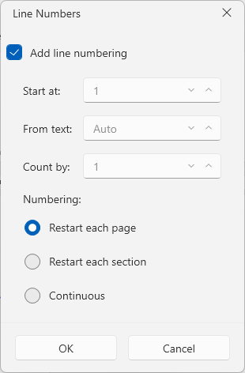
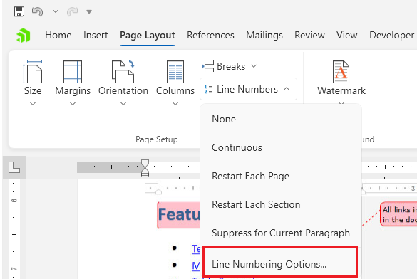

# Line Numbers Dialog

This dialog allows you to adjust the [line numbering]() in the document.



The dialog can be opened from the __Line Numbers__ drop down button in the __Page Layout__ tab of the [RadRichTextBoxRibbonUI]().



## Showing the Dialog Manually

The dialog can be shown by executing the `ShowLineNumberingDialogCommand`. See how to bind the command to an external button in the [Commands]() article.

__Executing the show dialog command__
```C#
	this.richTextBox.Commands.ShowLineNumberingDialogCommand.Execute(null);
```

Alternatively, call the `ShowInsertHyperlinkDialog` method of `RadRichTextBox`.

__Using the show dialog method__
```C#
	this.richTextBox.ShowLineNumberingDialog();
```