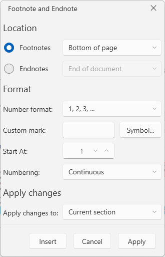
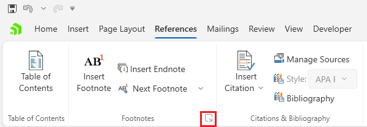

# Footnote and Endnote Dialog

This dialog allows you to insert [footnotes and endnotes]() in the document.



The dialog can be opened from the dialog launcher button at the bottom right corner of the __Footnotes__ group in the __References__ tab of the [RadRichTextBoxRibbonUI]().



## Showing the Dialog Manually

The dialog can be shown by executing the `ShowNotesDialogCommand`. See how to bind the command to an external button in the [Commands]() article.

__Executing the show dialog command__
```C#
	this.richTextBox.Commands.ShowNotesDialogCommand.Execute(null);
```

Alternatively, call the `ShowNotesDialog` method of `RadRichTextBox`.

__Using the show dialog method__
```C#
	this.richTextBox.ShowNotesDialog();
```