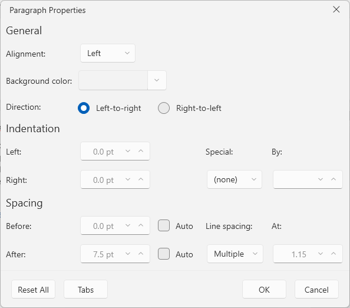
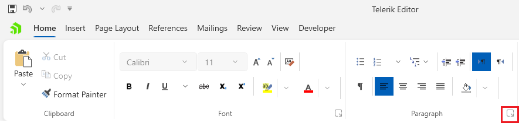
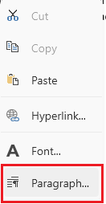
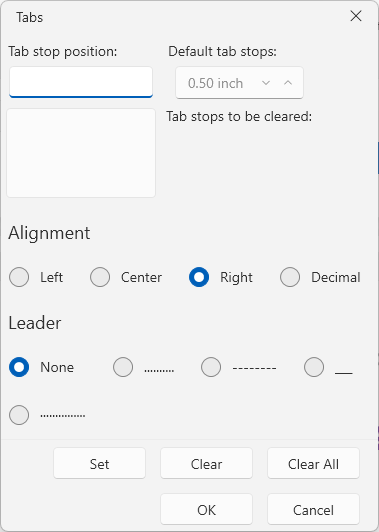

# Paragraph Properties Dialog

This dialog allows you edit the settings of the current (where the caret is positioned) [paragraph]() in the document.

The dialog can be opened from the dialog launcher button at the bottom right corner of the __Paragraph__ group in the __Home__ tab of the [RadRichTextBoxRibbonUI]() or via the in the same option in the right-click menu (context menu) of `RadRichTextBox`.

The paragraph properties dialog allows you to open the __Tab Stops__ dialog via its __Tabs__ button.

## Showing the Dialog Manually

The dialog can be shown by executing the `ShowParagraphPropertiesDialogCommand`. See how to bind the command to an external button in the [Commands]() article.

#### __[C#] Executing the show dialog command__
{{region richtextbox-paragraph-properties-0}}
	this.richTextBox.Commands.ShowParagraphPropertiesDialogCommand.Execute(null);
{{endregion}}

Alternatively, call the `ShowParagraphPropertiesDialog` method of `RadRichTextBox`.

#### __[C#] Using the show dialog method__
{{region richtextbox-paragraph-properties-1}}
	this.richTextBox.ShowParagraphPropertiesDialog();
{{endregion}}

The __Tab Stops__ dialog can be manually opened with the `ShowTabStopsPropertiesDialogCommand` or with the `ShowTabStopsPropertiesDialog` method of `RadRichTextBox`.
