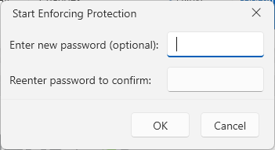
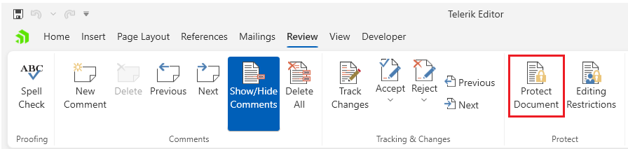
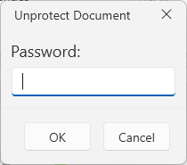
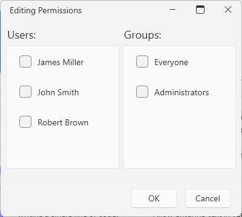
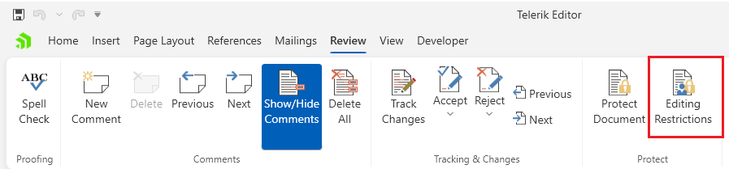

# Protect Document Dialogs

These dialogs allow you to [protect the document]() by adding a password or change the edit restrictions.

## Protect and Unprotect Document Dialogs

The protect document dialog can be opened from the __Protect Document__ button in the __Review__ tab of the [RadRichTextBoxRibbonUI]().

If the document is protected with a password, the __Protect Document__ button will open the __Unprotect Document__ dialog.

## Editing Restrictions Dialog

This dialog can be opened from the __Editing Restrictions__ button in the __Review__ tab of the [RadRichTextBoxRibbonUI]().

## Showing the Dialogs Manually

The dialog can be shown by executing the following commands:

* `ToggleDocumentProtectionCommand`
* `ShowChangeEditingPermissionsDialogCommand`

See how to bind the commands to external buttons in the [Commands]() article.

#### __[C#] Executing the show dialog command__
{{region richtextbox-dialogs-protect-document-0}}
	this.richTextBox.Commands.ToggleDocumentProtectionCommand.Execute();
	
	this.richTextBox.Commands.ShowChangeEditingPermissionsDialogCommand.Execute(null);
{{endregion}}

Alternatively, you can use the following methods of `RadRichTextBox`:

* `ShowProtectDocumentDialog`
* `ShowUnprotectDocumentDialog`
* `ShowChangeEditingPermissionsDialog`

#### __[C#] Using the show dialog method__
{{region richtextbox-dialogs-protect-document-1}}
	this.richTextBox.ShowProtectDocumentDialog();
	
	this.richTextBox.ShowChangeEditingPermissionsDialog();
{{endregion}}