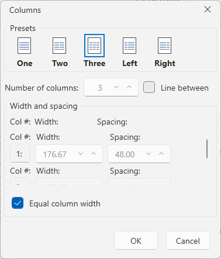
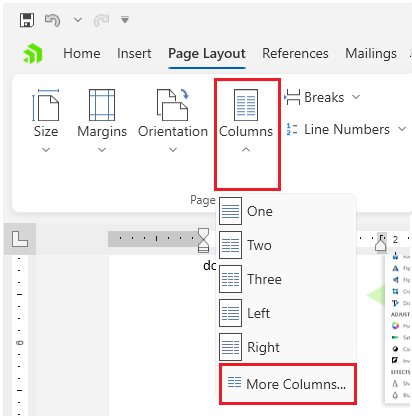

# Section Columns Dialog

This dialog allows you to arrange the text in the document into [columns]().

The dialog can be opened from the __More Columns__ option in the __Page Layout__ tab of the [RadRichTextBoxRibbonUI]().

## Showing the Dialog Manually

The dialog can be shown by executing the `ShowSectionColumnsDialogCommand`. See how to bind the command to an external button in the [Commands]() article.

#### __[C#] Executing the show dialog command__
{{region richtextbox-dialogs-section-columns-0}}
	this.richTextBox.Commands.ShowSectionColumnsDialogCommand.Execute(null);
{{endregion}}

Alternatively, call the `ShowSectionColumnsDialog` method of `RadRichTextBox`.

#### __[C#] Using the show dialog method__
{{region richtextbox-dialogs-section-columns-1}}
	this.richTextBox.ShowSectionColumnsDialog();
{{endregion}}