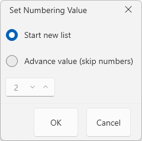
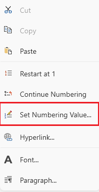

# Set List Numbering Value Dialog

This dialog allows you adjust the numbering values in ordered list in the document.



The dialog can be opened using the __Set Numbering Value__ option in the right-click menu (context menu) of `RadRichTextBox`.



## Showing the Dialog Manually

The dialog can be shown by executing the `ShowSetNumberingValueDialogCommand`. See how to bind the command to an external button in the [Commands]() article.

__Executing the show dialog command__
```C#
	this.richTextBox.Commands.ShowSetNumberingValueDialogCommand.Execute(null);
```

Alternatively, call the `ShowSetNumberingValueDialog` method of `RadRichTextBox`.

__Using the show dialog method__
```C#
	this.richTextBox.ShowSetNumberingValueDialog();
```