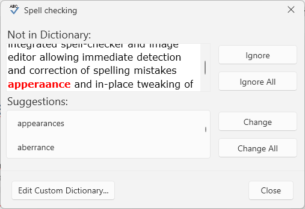
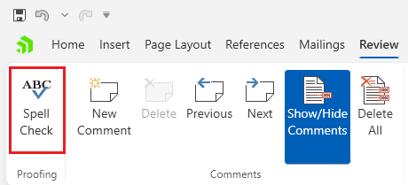
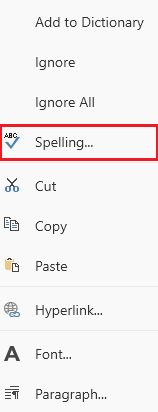

# Spell Checking Dialog

This dialog allows you to [spell check]() the text in the document.



The dialog can be opened from the __Spell Check__ button in the __Review__ tab of the [RadRichTextBoxRibbonUI]() or via the in the same option in the right-click menu (context menu) of `RadRichTextBox`.





## Showing the Dialog Manually

The dialog can be shown by executing the `ShowSpellCheckingDialogCommand`. See how to bind the command to an external button in the [Commands]() article.

__Executing the show dialog command__
```C#
	this.richTextBox.Commands.ShowSpellCheckingDialogCommand.Execute(null);
```

Alternatively, call the `ShowSpellCheckingDialog` method of `RadRichTextBox`.

__Using the show dialog method__
```C#
	this.richTextBox.ShowSpellCheckingDialog();
```