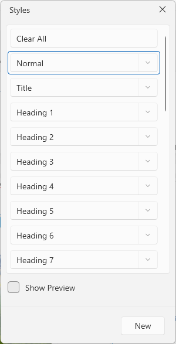
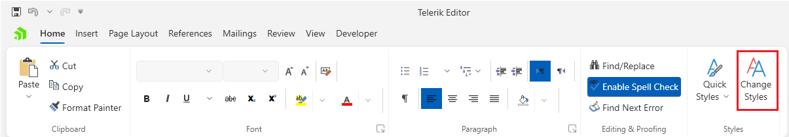

# Styles Dialog

This dialog allows you to manage and apply the [styles]() used in the document.

The dialog can be opened from the __Change Styles__ button in the __Home__ tab of the [RadRichTextBoxRibbonUI]().

## Showing the Dialog Manually

The dialog can be shown by executing the `ShowManageStylesDialogCommand`. See how to bind the command to an external button in the [Commands]() article.

#### __[C#] Executing the show dialog command__
{{region richtextbox-dialogs-styles-0}}
	this.richTextBox.Commands.ShowManageStylesDialogCommand.Execute(null);
{{endregion}}

Alternatively, call the `ShowManageStylesDialog` method of `RadRichTextBox`.

#### __[C#] Using the show dialog method__
{{region richtextbox-dialogs-styles-1}}
	this.richTextBox.ShowManageStylesDialog();
{{endregion}}