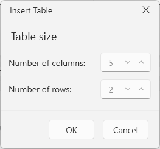
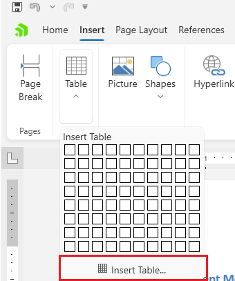
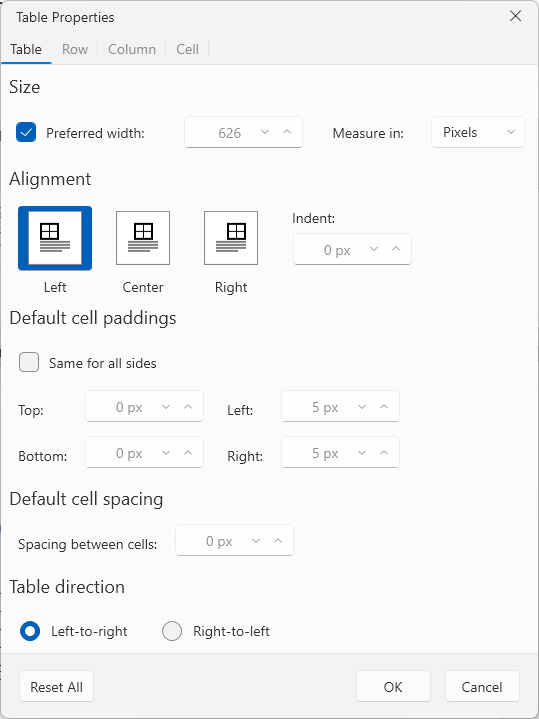
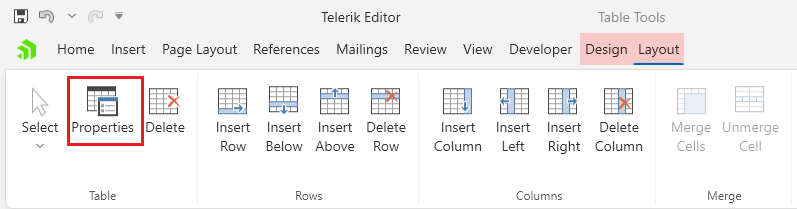
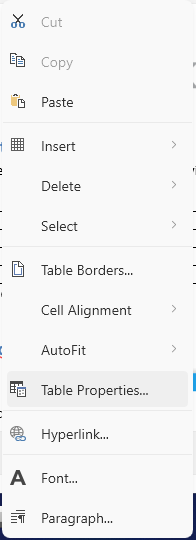
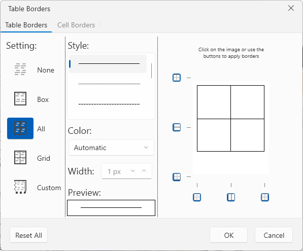
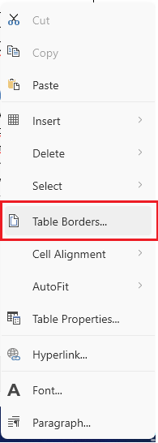
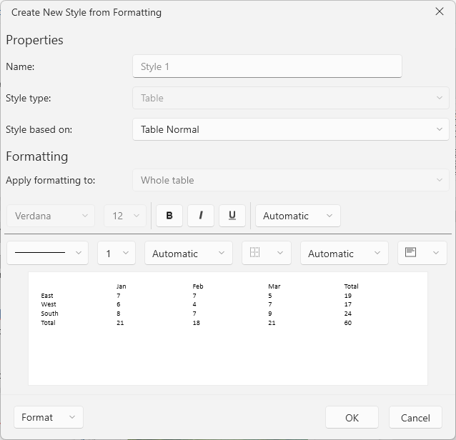
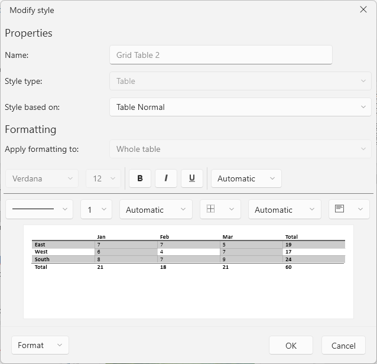

# Tables Dialogs

The RichTextBox component provides several dialogs to work create and modify [tables]().

## Insert Table Dialog

This dialog allows you to create a table by defining its dimensions.

The dialog can be opened from the __Insert Table__ option in the __Table__ drop down button located in the __Insert__ tab of the [RadRichTextBoxRibbonUI]().

## Table Properties Dialog

This dialog allows you to adjust the table's [properties]().

The dialog can be opened from the __Properties__ option in the __Layout__ contextual tab of the [RadRichTextBoxRibbonUI]() or via the in the __Table Properties__ option in the right-click menu (context menu) of `RadRichTextBox`.

## Table Borders Dialog

This dialog allows you to adjust the table boders.

The dialog can be opened from the __Table Borders__ option in the right-click menu (context menu) of `RadRichTextBox`.

## Table Styles Dialog

The table style dialogs allows you to create and modify the styling used in the tables of the document.

The table styles dialogs can be opened from the __New Table Style__ and __Modify Table Style__ buttons in the __Table Styles__ drop down of the __Design__ contextual tab of [RadRichTextBoxRibbonUI]().

## Showing the Dialogs Manually

The table dialogs can be shown by executing the following commands:

* `ShowTablePropertiesDialogCommand`
* `ShowTableBordersDialogCommand`
* `ShowInsertTableDialogCommand`

See how to bind the commands to external buttons in the [Commands]() article.

#### __[C#] Executing the show dialog command__
{{region richtextbox-dialogs-tables-0}}
	this.richTextBox.Commands.ShowTablePropertiesDialogCommand.Execute(null);
{{endregion}}

Alternatively, you can call the associated `RadRichTextBox` methods.

* `ShowInsertTableDialog`
* `ShowTableBordersDialog`
* `ShowTablePropertiesDialog`

#### __[C#] Using the show dialog method__
{{region richtextbox-dialogs-tables-1}}
	this.richTextBox.ShowInsertTableDialog();
{{endregion}}
