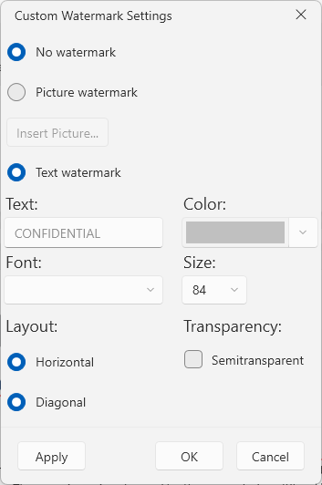
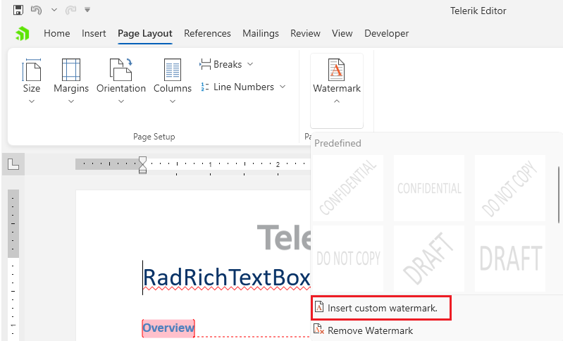

# Watermark Settings Dialog

This dialog allows you to insert [watermarks]() in the document.



The dialog can be opened using the __Watermark__ drop down button in the __Page Layout__ tab of the [RadRichTextBoxRibbonUI]().



## Showing the Dialog Manually

The dialog can be shown by executing the `ShowWatermarkSettingsDialogCommand`. See how to bind the command to an external button in the [Commands]() article.

__Executing the show dialog command__
```C#
	this.richTextBox.Commands.ShowWatermarkSettingsDialogCommand.Execute(null);
```

Alternatively, call the `ShowWatermarkSettingsDialog` method of `RadRichTextBox`.

__Using the show dialog method__
```C#
	this.richTextBox.ShowWatermarkSettingsDialog();
```