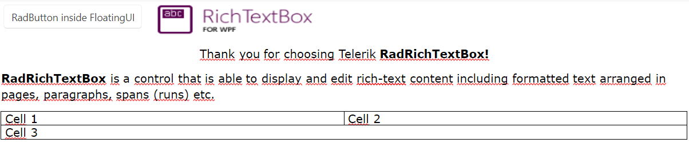

# Floating Containers

`RadRichTextBox` provides you with the functionality of enclosing custom UI elements in its document that you can display over its content. To do so, you can use the `FloatingUIContainer` element, which can wrap any object of type `UIElement`, e.g. a button, an image, or even a media element or media player. It is inserted as an [inline]()

The following example showcases how to add a `RadButton` element inside a FloatingUIContainer instance and display it in the RadDocument:

__Adding a UIElement to a FloatingUIContainer__
```C#
    RadButton radButton = new RadButton()
    {
        Content = "Hello",
        Width = 200,
        Height = 40
    };

    FloatingUIContainer floatingContainer = new FloatingUIContainer(radButton, new Size(radButton.Width,    radButton.Height));

    radRichTextBox.InsertInline(floatingContainer);
```

__RadRichTextBox with a FloatingUIContainer containing a RadButton element__



## Not Supported Scenarios

* There isn't a UI for resizing/ deleting the FloatingUIContainer element. Changing the properties of the FloatingUIContainer is not possible through the UI.
* The FloatingUIContainer is not copyable. 
* The FloatingUIContainer cannot be dragged and dropped.
* The FloatingUIContainer element can only be imported/exported from/to an XAML format via the [XamlFormatProvider](%slug radrichtextbox-import-export-using-xamlformatprovider%) class. To perform additional logic when importing/exporting the FloatingUIContainer and its layout, subscribe to the the `ExportSettings.InlineUIContainerExporting` and `ImportSettings.InlineUIContainerImported` events of the XamlFormatProvider instance.
