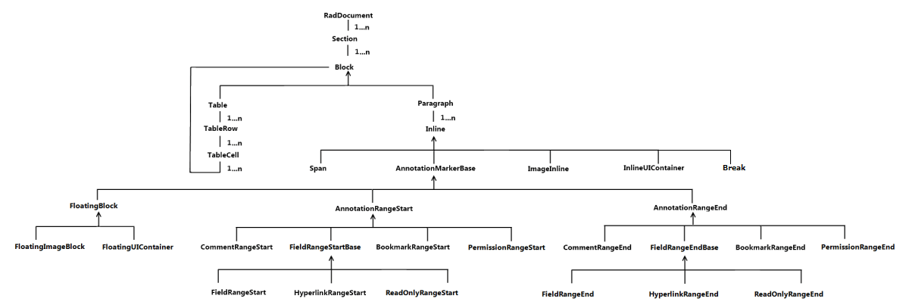

# Elements Hierarchy

## 

There is an element hierarchy which you must consider when building your rich content manually. To become familiar with it, take a look at the diagram below.

# See Also

 * [RadDocument]()

 * [Section]()

 * [Paragraph]()

 * [Span]()

 * [Hyperlink]()

 * [InlineImage]()
