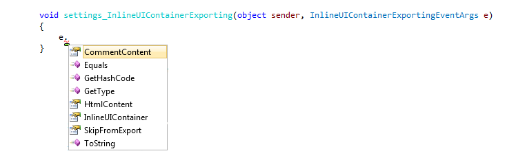
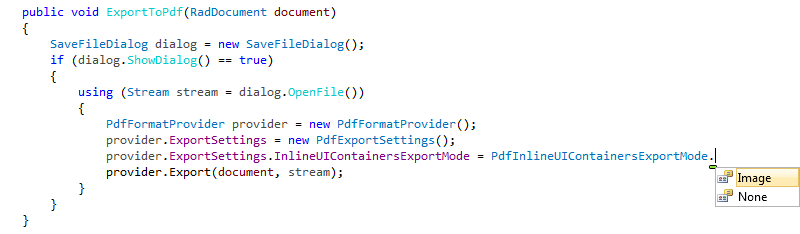

# InlineUIContainer

__RadRichTextBox__ provides you with the functionality of enclosing custom UI elements in its document. This is achieved with the help of a special type of inline document element called __InlineUIContainer__, which can wrap any object of type System.Windows.__UIElement__, e.g. a button, an image or even a media element or media player.
      
The __InlineUIContainer__ is an inline element, so it should be placed in a __Block__ that can contain inline elements (e.g. __Paragraph__).      

## Add UI Element to an InlineUIContainer

You can add any element that derives from the UIElement class inside the __InlineUIContainer__. To do that, simply wrap the desired element inside the tag of the __InlineUIContainer__ in case you are defining it in XAML. If you are using code, use the __UIElement__ property of the container. Here is a simple example with a __Button__.        

>In order to utilize the __InlineUIContainer__, you have to set its __Height__ and __Width__ explicitly (or use the constructor that takes a __Size__ as a parameter). Otherwise, they will not be shown in the document.          

__Example 1: Add UI Element to an InlineUIContainer__  
```XAML
	<telerik:RadRichTextBox Name="radRichTextBox">
	    <telerik:RadDocument>
	        <telerik:Section>
	            <telerik:Paragraph>
	                <telerik:InlineUIContainer Height="25" Width="70">
	                    <Button Name="button" Content="Button" />
	                </telerik:InlineUIContainer>
	            </telerik:Paragraph>
	        </telerik:Section>
	    </telerik:RadDocument>
	</telerik:RadRichTextBox>
```

__Example 1: Add UI Element to an InlineUIContainer__  
```C#
	Section section = new Section();
	Paragraph paragraph = new Paragraph();
	InlineUIContainer container = new InlineUIContainer();
	container.UiElement = new Button();
	container.Height = 25;
	container.Width = 70;
	paragraph.Inlines.Add(container);
	section.Blocks.Add(paragraph);
	this.radRichTextBox.Document.Sections.Add(section);
```
```VB.NET
	Dim _section As New Section()
	Dim _paragraph As New Paragraph()
	Dim container As New InlineUIContainer()
	container.UiElement = New Button()
	container.Height = 25
	container.Width = 70
	_paragraph.Inlines.Add(container)
	_section.Blocks.Add(_paragraph)
	Me.radRichTextBox.Document.Sections.Add(_section)
```

__Example 2__ is a more complex example, which demonstrates how to implement a Button that inserts a MediaElement inside the __RadRichTextBox__'s document.

__Example 2: Add MediaElement on Button Click__ 
```C#
	private static Size defaultSize = new Size(900, 400);
	private void InsertMedia(Size size)
	{
	    OpenFileDialog ofd = new OpenFileDialog();
	    if (ofd.ShowDialog() == true)
	    {
	        Stream stream = ofd.File.OpenRead();
	        MediaElement media = new MediaElement();
	        media.SetSource(stream);
	        media.AutoPlay = true;
	        InlineUIContainer container = new InlineUIContainer()
	        {
	            UiElement = media
	        };
	        if (size != Size.Empty)
	        {
	            container.Height = size.Height;
	            container.Width = size.Width;
	        }
	        this.radRichTextBox1.InsertInline(container);
	    }
	}
	private void buttonInsertVideo_Click(object sender, RoutedEventArgs e)
	{
	    InsertMedia(defaultSize);
	}
	private void buttonInsertAudio_Click(object sender, RoutedEventArgs e)
	{
	    InsertMedia(Size.Empty);
	}
```
```VB.NET

	Private Shared defaultSize As New Size(900, 400)
	Private Sub InsertMedia(ByVal _size As Size)
	 Dim ofd As New OpenFileDialog()
	 If ofd.ShowDialog() = True Then
	  Dim _stream As Stream = ofd.File.OpenRead()
	  Dim media As New MediaElement()
	  media.SetSource(_stream)
	  media.AutoPlay = True
	  Dim container As New InlineUIContainer() With {.UiElement = media}
	  If _size <> Size.Empty Then
	   container.Height = _size.Height
	   container.Width = _size.Width
	  End If
	  Me.radRichTextBox1.InsertInline(container)
	 End If
	End Sub
	Private Sub buttonInsertVideo_Click(ByVal sender As Object, ByVal e As RoutedEventArgs)
	 InsertMedia(defaultSize)
	End Sub
	Private Sub buttonInsertAudio_Click(ByVal sender As Object, ByVal e As RoutedEventArgs)
	 InsertMedia(Size.Empty)
	End Sub
```

## Specifics

>important InlineUIContainer elements are not copyable. 

The following scenarios are affected:

* Drag-and-drop operation	
* Copy/paste operation	
* Update of the layout when the InlineUIContainer is in the header/footer
* Print operation 

The reason is that copying InlineUIContainer involves cloning of the internal UIElement, which cannot be handled in a generic way. 

To enable copying of InlineUIContainers in your application, you can create a custom object, which can copy the UIElement inside the container. What you need to do is to inherit the InlineUIContainer class and override IsCopyable, CreateNewElementInstance(), CopyPropertiesFromOverride(). The container and its parts are copied in the CopyPropertiesFromOverride() method, so you should ensure that the override copies the UIElement inside the container as well.

__Example 3: Implement CopyableInlineUIContainer for a Button as underlying UIElement__
```C#
	public class CopyableInlineUIContainer : InlineUIContainer
	{
		internal CopyableInlineUIContainer()
		{
	
		}
	
		public CopyableInlineUIContainer(UIElement uiElement, Size size)
			: base(uiElement, size)
		{
	
		}
	
		public override bool IsCopyable
		{
			get
			{
				return true;
			}
		}
	
		protected override DocumentElement CreateNewElementInstance()
		{
			return new CopyableInlineUIContainer();
		}
	
		protected override void CopyPropertiesFromOverride(DocumentElement fromElement)
		{
			CopyableInlineUIContainer fromUIContainer = (CopyableInlineUIContainer) fromElement;
			this.Width = fromUIContainer.Width;
			this.Height = fromUIContainer.Height;
	
			Button originalButton = (Button) fromUIContainer.UiElement;
			this.UiElement = new Button()
			{
				Width = originalButton.Width,
				Height = originalButton.Height,
				Content = originalButton.Content.ToString()
			};
		}
	}
```
```VB.NET
	
	Public Class CopyableInlineUIContainer
	    Inherits InlineUIContainer
	
	    Friend Sub New()
	    End Sub
	
	    Public Sub New(ByVal uiElement As UIElement, ByVal size As Size)
	        MyBase.New(uiElement, size)
	    End Sub
	
	    Public Overrides ReadOnly Property IsCopyable As Boolean
	        Get
	            Return True
	        End Get
	    End Property
	
	    Protected Overrides Function CreateNewElementInstance() As DocumentElement
	        Return New CopyableInlineUIContainer()
	    End Function
	
	    Protected Overrides Sub CopyPropertiesFromOverride(ByVal fromElement As DocumentElement)
	        Dim fromUIContainer As CopyableInlineUIContainer = CType(fromElement, CopyableInlineUIContainer)
	        Me.Width = fromUIContainer.Width
	        Me.Height = fromUIContainer.Height
	        Dim originalButton As Button = CType(fromUIContainer.UiElement, Button)
	        Me.UiElement = New Button() With {
	            .Width = originalButton.Width,
	            .Height = originalButton.Height,
	            .Content = originalButton.Content.ToString()
	        }
	    End Sub
	End Class
```

There is a very generic option for copying UIElement objects, which might help in most of the cases. However, have in mind that depending on the UI elements on which it will be invoked, **the implementation might differ**.

__Example 4: Copy UI Element__
```C#
	public static UIElement Clone(this UIElement elementToClone)
	{
	    if (elementToClone != null)
	    {
	        string elementXaml = XamlWriter.Save(elementToClone);
	        StringReader stringReader = new StringReader(elementXaml);
	
	        XmlReader xmlReader = XmlTextReader.Create(stringReader, new XmlReaderSettings());
	        return (UIElement)XamlReader.Load(xmlReader);
	    }
	
	    return null;
	}
```
```VB.NET
    <Extension()>
    Public Shared Function Clone(ByVal elementToClone As UIElement) As UIElement
        If elementToClone IsNot Nothing Then
            Dim elementXaml As String = XamlWriter.Save(elementToClone)
            Dim stringReader As StringReader = New StringReader(elementXaml)
            Dim xmlReader As XmlReader = XmlTextReader.Create(stringReader, New XmlReaderSettings())
            Return CType(XamlReader.Load(xmlReader), UIElement)
        End If

        Return Nothing
    End Function
```

## Import/Export InlineUIContainers

Most features that __RadRichTextBox__ provides are also supported in the format providers that it uses for export and import.        

>tip For more information on Import/Export, please refer to [this topic]().          

However, as the UIElement class is a WPF specific concept, some format providers support them in a non-standard way and others do not support them at all.

### Exporting InlineUIContainers:

Different approaches have been adopted when it comes to exporting inline UI containers via the format providers:

* __XamlFormatProvider__: Inline UI containers are serialized as expected, thus ensuring lossless export in simple cases, e.g. when a button is in the container. Custom attached properties may not be exported.            

* __HtmlFormatProvider__: The inline UI containers are serialized as XAML and are included in the HTML as comments. If the user handles the __InlineUIContainerExporting__ event, they can provide their own implementation for the export of the UI elements by accessing the properties of the __InlineUIContainerExportingEventArgs__ and setting the ones they need. The __CommentContent__ contains the XAML serialization and the __HtmlContent__ string property can be set to the desired user-defined HTML equivalent of the UI element. It will appear when the page is rendered outside __RadRichTextBox__. The UI element can also be omitted from the document altogether.



* __DocxFormatProvider__: All __InlineUIContainers__ are ignored as the Microsoft Word concept of controls is quite different.
            

* __RtfFormatProvider__: All __InlineUIContainers__ are ignored as the RTF standard does not have a concept for similar elements.


* __PdfFormatProvider__: The __InlineUIContainers__ are taken a snapshot of and included in the export. If you like, you can prevent that by setting the __InlineUIContainersExportMode__ property of the provider to __None__.
	

### Importing InlineUIContainers

There are some differences between the format providers when it comes to importing __InlineUIContainers__, too.

* __XamlFormatProvider__: All inline UI containers are deserialized and imported.

* __DocxFormatProvider__: There cannot be any inline UI containers in DOCX, as they are not exported in the first place.

* __RtfFormatProvider__: There cannot be any inline UI containers in RTF, as they are not exported in the first place.            

* __PdfFormatProvider__: PDF import is currently not supported.

## See Also  
* [Paragraph]()
* [Section]()
* [RadDocument]()
