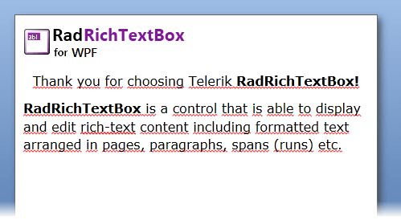

# RadDocument

__RadDocument__ is the root element for __RadRichTextBox's__ content. It holds the collection of __Sections__ defined for the __RadRichTextBox__ content. It also enables you to configure the appearance of its child elements.
      
## RadDocument Settings

The **RadDocument** class exposes numerous properties and methods enabling you to control settings and apply modifications related to the document. The next list shows several of the most used properties:

* __LayoutMode__: Specifies whether the page should be in __Paged__, __Flow__ or __FlowNoWrap__ layout mode. To learn more about layout modes, read [here]().

* __SectionDefaultPageSize__: This property is of type __Size__ and represents the default page size of the document. **Example 1** shows how to use it.

	__Example 1: Setting SectionDefaultPageSize__
	
	<snippet id='radrichtextbox-document-elements-features-raddocument-block_1-xaml' />
	
	>The __SectionDefault~__ settings get applied only when Paged layout mode is used.                  

* __SectionDefaultPageMargin__: Defines the default margin for each of the sections in the **RadDocument**. To assign different margins for each of the sections, use the respective property of the [__Section__](https://docs.telerik.com/devtools/wpf/api/telerik.windows.documents.model.section) class.

* __SectionDefaultPageOrientation__: Defines the default section page orientation. This property is of type [**PageOrientation**](https://docs.telerik.com/devtools/wpf/api/telerik.windows.documents.model.pageorientation) and could be set to **Portrait** or **Landscape**.

* __ParagraphDefaultSpacingAfter__: Defines the default spacing after for each of the paragraphs in the __RadDocument__. To assign different spacing after each of the paragraphs, use the respective property of the [__Paragraph__](https://docs.telerik.com/devtools/wpf/api/telerik.windows.documents.model.paragraph) class.      

* __ParagraphDefaultSpacingBefore__: Defines the default spacing before for each of the paragraphs in the __RadDocument__. To assign different spacing before each of the paragraphs, use the respective property of the __Paragraph__ class.

* __LineSpacing__: Specifies the value for the space between the lines.

* __LineSpacingType__: Specifies the type of spacing:
    * __AtLeast__: The space between the lines should be equal to or greater than the value of the __LineSpacing__ property.
    * __Auto__: The space between the lines is determined automatically.
    * __Exact__: The space between the lines should equal the value of the __LineSpacing__ property.

* __ShowFormattingSymbols__: Indicates whether the formatting symbols should be displayed or not.

* __DefaultTabWidth__: Specifies the default tab width of the document.
          
* **IsEmpty**: Allows you to determine whether the document instance has any content.

There are also members allowing you to control different features and functionalities, like:

- Bibliographics
- Document variables and fields
- Captions
- Caret position
- Comments
- Endnotes and footnotes
- Revisions 
- Layout and styling settings
- Line breaking rules
- Mail merge 
- Protection
- Selection

>For the full list of the members refer to the [RadDocument API Reference](https://docs.telerik.com/devtools/{{ site.framework_name }}/api/telerik.windows.documents.model.raddocument) page.

## Specifics

The first time a __RadDocument__ is shown inside a __RadRichTextBox__ in the Visual Tree, it is measured by the framework and arranges its children. This is the moment when the layout cycle is completed; each of the document elements calculates its size and arranges its children.

As the two states of the document - measured and not measured are too different, distinct methods for manipulating the content of the document should be used before the document is measured and after the first time that it is shown in the editor.

The RadDocument class provides a rich set of settings, but because of the required measure and arrange phases, the rendering of its contents may not work properly when working with the RadDocument API directly. Instead, when modifying content __we recommend using the [RadDocumentEditor]()__ instead.

## Adding Sections to RadDocument

As explained in the previous section, the state of the document is essential for the methods that can be used on it.

For example, you can build a RadDocument from scratch and add Sections to it as demonstrated in **Example 2**.

>tip You can also merge RadDocument instances. For more information, see the [Merge Documents section]().

__Example 2: Add a section to a not measured document__

<snippet id='radrichtextbox-document-elements-features-raddocument-block_2-cs' />
<snippet id='radrichtextbox-document-elements-features-raddocument-block_3-vb' />

Splitting an already measured document into two sections at the current caret position, on the other hand, can be done by inserting a section break.

__Example 3: Insert a Section break in a measured document__

<snippet id='radrichtextbox-document-elements-features-raddocument-block_4-cs' />
<snippet id='radrichtextbox-document-elements-features-raddocument-block_5-vb' />

>More details about the Section element and the section break types is available [here]().

>tip The distribution of the document content in sections is only visible when the document is in **Paged** layout mode. Furthermore, the sections and section breaks can be persisted in XAML, Docx and Rtf. If you export the document to HTML or plain text, the section breaks will be lost.

## Creating a Document at Run Time

One of the common uses of __RadRichTextBox__ is to create a document programmatically and show it in the editor. **RadDocument** can contain several other elements.        

* [Section]()
* [Paragraph]()
* [Span]()
* [InlineImage]()
* [Hyperlink]()
* [Table]()

>The whole hierarchy of the document elements can be found [here]().

**Example 4** shows a sample code that creates a new **RadDocument** instance and assigns it to **RadRichTextBox**. 

__Example 4: Create a document in code-behind__

<snippet id='radrichtextbox-document-elements-features-raddocument-block_6-cs' />
<snippet id='radrichtextbox-document-elements-features-raddocument-block_7-vb' />

__The document created at run time__

This document is editable. To make it **read only** you have to set the [IsReadOnly]() property of the __RadRichTextBox__ to __True__.     

## See Also  
 * [Elements Hierarchy]()
 * [Section]()
 * [Paragraph]()
 * [Span]()
 * [Hyperlink]()
 * [InlineImage]() 
 * [Merge Documents]()