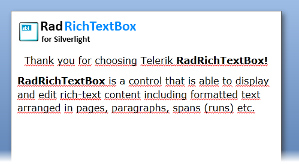

# RadDocument

__RadDocument__ is the root element for __RadRichTextBox's__ content. It holds the collection of __Sections__ defined for the __RadRichTextBox__ content. It also allows you to configure the appearance of its child elements.
      

This topic will explain how you can customize the contents of the RadDocument.

* [Customizing a RadDocument](#customize-the-contents-of-raddocument)

* [Specifics](#specifics)

* [Adding Sections to a RadDocument](#adding-sections-to-raddocument)

* [Creating a Document at Run-Time](#creating-a-document-at-run-time)

## Customize the contents of RadDocument

__RadDocument__ exposes several properties that allow you to customize the layout of the elements placed underneath it. Here is a list of them:
        

* __LayoutMode__: Specifies whether the page should be in __Paged__, __Flow__ or __FlowNoWrap__ layout mode. To learn more about layout modes read [here]().

* __DefaultPageLayoutSettings__: This property is of type __PageLayoutSettings__. The __PageLayoutSettings__ class exposes the following properties:        
	* __Height__: Represents the height of the page.             	
	* __Width__: Represents the width of the page. Here is an example:

#### __[XAML] Example 1: Setting DefaultPageLayoutSettings__

{{region radrichtextbox-features-document-elements-raddocument_0}}
	<telerik:RadRichTextBox x:Name="radRichTextBox" LayoutMode="Paged">
	    <telerik:RadDocument DefaultPageLayoutSettings="600,800" />
	</telerik:RadRichTextBox>
{{endregion}}

>The __DefaultPageLayoutSettings__ get applied only when Paged layout mode is used.
                  

* __SectionDefaultPageMargin__: Defines the default margin for each of the sections in the **RadDocument**. To assign different margins for each of the sections use the respective property of the [__Section__](http://docs.telerik.com/devtools/wpf/api/html/T_Telerik_Windows_Documents_Model_Section.htm) class.

* __ParagraphDefaultSpacingAfter__: Defines the default spacing after for each of the paragraphs in the __RadDocument__. To assign different spacing after for each of the paragraphs use the respective property of the [__Paragraph__](http://docs.telerik.com/devtools/wpf/api/html/T_Telerik_Windows_Documents_Model_Paragraph.htm) class.
          

* __ParagraphDefaultSpacingBefore__: Defines the default spacing before for each of the paragraphs in the __RadDocument__. To assign different spacing before for each of the paragraphs use the respective property of the __Paragraph__ class.

* __LineSpacing__: Specifies the value for the space between the lines.

* __LineSpacingType__: Specifies the type of spacing:
    * __AtLeast__: The space between the lines should equal or greater than the value of the __LineSpacing__ property.
    * __Auto__: The space between the lines is determined automatically.
    * __Exact__: The space between the lines should equal to the value of the __LineSpacing__ property.

* __ShowFormattingSymbols__: Indicates whether the formatting symbols should be displayed or not.
          

## Specifics

The first time a __RadDocument__ is shown inside a __RadRichTextBox__ in the Visual Tree, it is measured by the framework and arranges its children. This is the moment when the layout cycle is completed, each of the document elements calculates its size and arranges its children.

As the two states of the document - measured and not measured are too different, distinct methods for manipulating the content of the document should be used before the document is measured and after the first time that it is shown in the editor.

## Adding Sections to RadDocument

As explained in the previous section, the state of the document is essential for the methods that can be used on it.

For example, you can build a RadDocument from scratch and add Sections to it as demonstrated in **Example 2**:

#### __[C#] Example 2: Add a Section to a Non-Measured Document__

{{region radrichtextbox-features-document-elements-raddocument_1}}
	Section section = new Section();
	this.radRichTextBox.Document.Sections.Add(section);
{{endregion}}

#### __[VB.NET] Example 2: Add a Section to a Non-Measured Document__

{{region radrichtextbox-features-document-elements-raddocument_2}}
	Dim section As New Section()
	Me.radRichTextBox.Document.Sections.Add(section)
{{endregion}}

Splitting an already measured document into two sections at the current caret position, on the other hand, can be done by inserting a section break.

#### __[C#] Example 3: Insert a Section Break in a Measured Document__

{{region radrichtextbox-features-document-elements-raddocument_3}}
	this.radRichTextBox.InsertSectionBreak(SectionBreakType.NextPage);
{{endregion}}

#### __[VB.NET] Example 3: Insert a Section Break in a Measured Document__

{{region radrichtextbox-features-document-elements-raddocument_4}}
	Me.radRichTextBox.InsertSectionBreak(SectionBreakType.NextPage)
{{endregion}}

The InsertSectionBreak() method accepts a parameter of type **SectionBreakType**. The possible values are:

* **SectionBreakType.NextPage**: The default value. The next section will start on the next page.
* **SectionBreakType.OddPage**: The next section will start on the next odd page.
* **SectionBreakType.EvenPage**: Analogically, the next section will start on the next even page.

>The distribution of the document content in sections is only visible when the document is in **Paged** layout mode. Furthermore, the sections and section breaks can be persisted in XAML, Docx and Rtf. If you export the document to HTML or plain text, the section breaks will be lost.

## Creating a Document at Run-Time

One of the common uses of __RadRichTextBox__ is to create a document programmatically and show it in the editor. **RadDocument** can contain several other elements:
        

* [Section]()
* [Paragraph]()
* [Span]()
* [InlineImage]()
* [Hyperlink]()
* [Table]()

>The whole hierarchy of the document elements can be found [here]().

**Example 4** shows a sample code that creates a new **RadDocument** instance and assigns it to **RadRichTextBox**. 

#### __[C#] Example 4: Create a Document in Code-Behind__

{{region radrichtextbox-features-document-elements-raddocument_5}}
    RadDocument document = new RadDocument();
    Section section = new Section();

    Paragraph paragraph1 = new Paragraph();
    Stream stream = Application.GetResourceStream(new Uri(@"/RadRichTextBox-Getting-Started;component/Images/RadRichTextBox.png", UriKind.RelativeOrAbsolute)).Stream;
    Size size = new Size(236, 50);
    ImageInline imageInline = new ImageInline(stream, size, "png");
    paragraph1.Inlines.Add(imageInline);
    section.Blocks.Add(paragraph1);

    Paragraph paragraph2 = new Paragraph();
    paragraph2.TextAlignment = Telerik.Windows.Documents.Layout.RadTextAlignment.Center;
    Span span1 = new Span("Thank you for choosing Telerik");
    paragraph2.Inlines.Add(span1);

    Span span2 = new Span();
    span2.Text = " RadRichTextBox!";
    span2.FontWeight = FontWeights.Bold;
    paragraph2.Inlines.Add(span2);
    section.Blocks.Add(paragraph2);

    Paragraph paragraph3 = new Paragraph();
    Span span3 = new Span("RadRichTextBox");
    span3.FontWeight = FontWeights.Bold;
    paragraph3.Inlines.Add(span3);

    Span span4 = new Span(" is a control that is able to display and edit rich-text content including formatted text arranged in pages, paragraphs, spans (runs) etc.");
    paragraph3.Inlines.Add(span4);
    section.Blocks.Add(paragraph3);

    document.Sections.Add(section);

    this.radRichTextBox.Document = document;
{{endregion}}

#### __[VB.NET] Example 4: Create a Document in Code-Behind__

{{region radrichtextbox-features-document-elements-raddocument_6}}

    Dim document As New RadDocument()
    Dim section As New Section()

    Dim paragraph1 As New Paragraph()
    Dim stream As Stream = Application.GetResourceStream(New Uri("/RadRichTextBox-Getting-Started;component/Images/RadRichTextBox.png", UriKind.RelativeOrAbsolute)).Stream
    Dim size As New Size(236, 50)
    Dim imageInline As New ImageInline(stream, size, "png")
    paragraph1.Inlines.Add(imageInline)
    section.Blocks.Add(paragraph1)

    Dim paragraph2 As New Paragraph()
    paragraph2.TextAlignment = Telerik.Windows.Documents.Layout.RadTextAlignment.Center
    Dim span1 As New Span("Thank you for choosing Telerik")
    paragraph2.Inlines.Add(span1)

    Dim span2 As New Span()
    span2.Text = " RadRichTextBox!"
    span2.FontWeight = FontWeights.Bold
    paragraph2.Inlines.Add(span2)
    section.Blocks.Add(paragraph2)

    Dim paragraph3 As New Paragraph()
    Dim span3 As New Span("RadRichTextBox")
    span3.FontWeight = FontWeights.Bold
    paragraph3.Inlines.Add(span3)

    Dim span4 As New Span(" is a control that is able to display and edit rich-text content including formatted text arranged in pages, paragraphs, spans (runs) etc.")
    paragraph3.Inlines.Add(span4)
    section.Blocks.Add(paragraph3)

    document.Sections.Add(section)

    Me.radRichTextBox.Document = document
{{endregion}}

#### Figure 1: The Document Created at Run-Time




This document is editable. To make it **read only** you have to set the __IsReadOnly__ property of the __RadRichTextBox__ to __True__.
        

>tipTo learn more about the read only feature read [this topic]().

# See Also

 * [Elements Hierarchy]()

 * [Section]()

 * [Paragraph]()

 * [Span]()

 * [Hyperlink]()

 * [InlineImage]()
