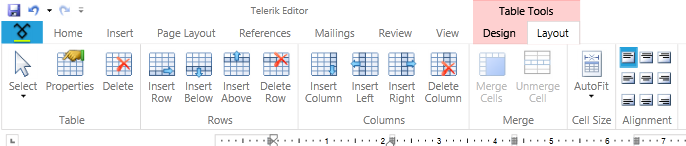
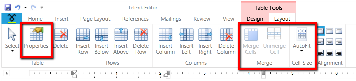

# Table
<<Comment: You should make headings (especially near the front of an article) more SEO-friendly. The heading should mention the name of the control. For example: "Overview of Tables in RadRichTextBox" is better for SEO than what you have here.>>

The __RadRichTextBox__ is capable of displaying and editing tables. You can use one of the following approaches to add or modify a table:
      

* [Programmatically via RadRichTextBox's API](#using-radrichtextboxs-api)

	* [Creating a Table Programmatically](#creating-a-table-programmatically)
	
	* [Formatting a Table at Runtime](#formatting-a-table-at-runtime)

* [Via the Built-in UI](#using-the-built-in-ui)

	* [Creating a Table](#creating-a-table)
	
	* [Formatting a Table](#formatting-a-table)

## Using RadRichTextBox's API
<<Comment: I suggest better SEO for this heading would be "Creating a Table Using the RadRichTextBox API">>
### Creating a Table Programmatically
<<Comment: I suggest better SEO for this heading would be "Creating a Table Programmatically using the RadRichTextBox">>
>tipTo learn more about the __Formatting API__ of the __RadRichTextBox__, read [this topic]().

The __RadRichTextBox__ exposes a rich API, which allows you to use various methods to add, modify or delete elements from the [__RadDocument__](). The methods exposed by the API can be wired to a UI and get executed upon user interaction with this UI.

#### __[C#] Example 1: Create a Table in Code-Behind__

{{region radrichtextbox-features-document-elements-tables_2}}
    RadDocument document = new RadDocument();
    Section section = new Section();

    Table table = new Table();
    table.StyleName = RadDocumentDefaultStyles.DefaultTableGridStyleName;

    TableRow row1 = new TableRow();

    TableCell cell1 = new TableCell();
    Paragraph p1 = new Paragraph();
    Span s1 = new Span();
    s1.Text = "Cell 1";
    p1.Inlines.Add(s1);
    cell1.Blocks.Add(p1);
    row1.Cells.Add(cell1);

    TableCell cell2 = new TableCell();
    Paragraph p2 = new Paragraph();
    Span s2 = new Span();
    s2.Text = "Cell 2";
    p2.Inlines.Add(s2);
    cell2.Blocks.Add(p2);
    row1.Cells.Add(cell2);
    table.Rows.Add(row1);

    TableRow row2 = new TableRow();

    TableCell cell3 = new TableCell();
    cell3.ColumnSpan = 2;
    Paragraph p3 = new Paragraph();
    Span s3 = new Span();
    s3.Text = "Cell 3";
    p3.Inlines.Add(s3);
    cell3.Blocks.Add(p3);
    row2.Cells.Add(cell3);
    table.Rows.Add(row2);

    section.Blocks.Add(new Paragraph());
    section.Blocks.Add(table);
    section.Blocks.Add(new Paragraph());
    document.Sections.Add(section);

    this.radRichTextBox.Document = document;
{{endregion}}

#### __[VB.NET] Example 1: Create a Table in Code-Behind__

{{region radrichtextbox-features-document-elements-tables_3}}
    Dim document As New RadDocument()
    Dim section As New Section()
    section.Blocks.Add(New Paragraph())

    Dim table As New Table()
    table.StyleName = RadDocumentDefaultStyles.DefaultTableGridStyleName

    Dim row1 As New TableRow()

    Dim cell1 As New TableCell()
    Dim p1 As New Paragraph()
    Dim s1 As New Span()
    s1.Text = "Cell 1"
    p1.Inlines.Add(s1)
    cell1.Blocks.Add(p1)
    row1.Cells.Add(cell1)

    Dim cell2 As New TableCell()
    Dim p2 As New Paragraph()
    Dim s2 As New Span()
    s2.Text = "Cell 2"
    p2.Inlines.Add(s2)
    cell2.Blocks.Add(p2)
    row1.Cells.Add(cell2)
    table.Rows.Add(row1)

    Dim row2 As New TableRow()

    Dim cell3 As New TableCell()
    cell3.ColumnSpan = 2
    Dim p3 As New Paragraph()
    Dim s3 As New Span()
    s3.Text = "Cell 3"
    p3.Inlines.Add(s3)
    cell3.Blocks.Add(p3)
    row2.Cells.Add(cell3)
    table.Rows.Add(row2)

    section.Blocks.Add(table)
    section.Blocks.Add(New Paragraph())
    document.Sections.Add(section)

    Me.radRichTextBox.Document = document
{{endregion}}

__Figure 1__ shows the result of the code in __Example 1__.

#### __Figure 1: Table generated in code-behind__

<<Comment: ALT text improves search results. Can you add SEO friendly ALT text to figures?>>

>tipYou can obtain an existing table from the document using the EnumerateChildrenOfType() method as demonstrated in __Example 2__. For more information about how to select a table, please check [this article]().    

#### __[C#] Example 2: Get a Table from RadDocument__
{{region radrichtextbox-features-document-elements-tables_4}}
	Table table = this.radRichTextBox.Document.EnumerateChildrenOfType<Table>().First();
{{endregion}}

#### __[VB.NET] Example 2: Get a Table from RadDocument__
{{region radrichtextbox-features-document-elements-tables_5}}
	Dim table As Table = Me.radRichTextBox.Document.EnumerateChildrenOfType(Of Table)().First()
{{endregion}}

__RadRichTextBox__ exposes the following methods that regard the creation or deletion of a table:

* __DeleteTable__: Deletes the currently selected table.
            

* __DeleteTableColumn__: Deletes the currently selected column.
            

* __DeleteTableRow__: Deletes the currently selected row.
            

* __InsertTable__: Inserts a table. Allows you to specify the number of rows and columns. Has an overload that allows you to specify if a Paragraph should be inserted before the table.            
        
>important In versions earlier than Q1 2015 before and after each Table element is inserted a Paragraph. When the Table is inserted via the UI or the InsertTable() method this is done automatically, otherwise paragraphs should be inserted manually. In next versions the Paragraph before the Table is not mandatory.

* __InsertTableColumn__: Inserts a column at the end of the table.
            

* __InsertTableColumnToTheLeft__: Inserts a column to the left of the selected one.
            

* __InsertTableColumnToTheRight__: Inserts a column to the right of the selected one.
            

* __InsertTableRow__: Inserts a row at the end of the table.
            

* __InsertTableRowAbove__: Inserts a row above the selected one.
            

* __InsertTableRowBelow__: Inserts a row below the selected one.

### Formatting a Table at Runtime
<<Comment: A more SEO-friendly heading suggestion "Formatting a Table of a RadRichTextBox at Runtime">>
>tipTo learn more about the __Formatting API__ of the __RadRichTextBox__, read [this topic]().
        

__RadRichTextBox__ exposes a API allowing you to use various methods to add, modify or delete elements from [__RadDocument__](). The methods exposed by the API can be wired to a UI and get executed upon user interaction with this UI. __RadRichTextBox__ exposes the following methods in regard to modifying of a table:
        

* __ChangeTableBorders__: Modifies the borders of the currently selected table via a [__TableBorders__](http://docs.telerik.com/devtools/silverlight/api/html/T_Telerik_Windows_Documents_Model_TableBorders.htm)(http://docs.telerik.com/devtools/wpf/api/html/T_Telerik_Windows_Documents_Model_TableBorders.htm) object.

	#### __[C#] Example 3: Change Table Borders__
	{{region radrichtextbox-features-document-elements-tables_6}}
		Border leftBorder = new Telerik.Windows.Documents.Model.Border(BorderStyle.Single, Colors.Red);
		Border topBorder = new Telerik.Windows.Documents.Model.Border(BorderStyle.Dashed, Colors.Red);
		Border rightBorder = new Telerik.Windows.Documents.Model.Border(BorderStyle.Dotted, Colors.Red);
		Border bottomBorder = new Telerik.Windows.Documents.Model.Border(BorderStyle.DotDotDash, Colors.Red);
		Border insideHorizontalBorder = new Telerik.Windows.Documents.Model.Border(BorderStyle.Double, Colors.Red);
		Border insideVerticalBorder = new Telerik.Windows.Documents.Model.Border(BorderStyle.DotDash, Colors.Red);
		
		TableBorders borders = new TableBorders(leftBorder, topBorder, rightBorder, bottomBorder, insideHorizontalBorder, insideVerticalBorder);
		this.radRichTextBox.ChangeTableBorders(borders);
	{{endregion}}  

	#### __[VB.NET] Example 3: Change Table Borders__
	{{region radrichtextbox-features-document-elements-tables_7}}
        Dim leftBorder As New Border(BorderStyle.[Single], Colors.Red)
        Dim topBorder As New Border(BorderStyle.Dashed, Colors.Red)
        Dim rightBorder As New Border(BorderStyle.Dotted, Colors.Red)
        Dim bottomBorder As New Border(BorderStyle.DotDotDash, Colors.Red)
        Dim insideHorizontalBorder As New Border(BorderStyle.[Double], Colors.Red)
        Dim insideVerticalBorder As New Border(BorderStyle.DotDash, Colors.Red)

        Dim borders As New TableBorders(leftBorder, topBorder, rightBorder, bottomBorder, insideHorizontalBorder, insideVerticalBorder)
        Me.radRichTextBox.ChangeTableBorders(borders)        
	{{endregion}}  

* __ChangeTableCellBackground__: Sets the background color of the currently selected cell.
            
* __ChangeTableCellBorders__: Modifies the borders of the currently selected table via a [__TableCellBorders__ ](http://docs.telerik.com/devtools/silverlight/api/html/T_Telerik_Windows_Documents_Model_TableCellBorders.htm)(http://docs.telerik.com/devtools/wpf/api/html/T_Telerik_Windows_Documents_Model_TableCellBorders.htm) or a [__Border__](http://docs.telerik.com/devtools/silverlight/api/html/T_Telerik_Windows_Documents_Model_Border.htm)(http://docs.telerik.com/devtools/wpf/api/html/T_Telerik_Windows_Documents_Model_Border.htm) object.
            
* __ChangeTableCellSpacing__: Modifies the spacing between the cells.

* __ChangeTableCellContentAlignment__: Modifies the horizontal and vertical content alignment of the currently selected cell.

	#### __[C#] Example 4: Change Table Cell Content Alignment__
	{{region radrichtextbox-features-document-elements-tables_8}}
		this.radRichTextBox.ChangeTableCellContentAlignment(RadTextAlignment.Center, RadVerticalAlignment.Center);
	{{endregion}}

	#### __[VB.NET] Example 4: Change Table Cell Content Alignment__
	{{region radrichtextbox-features-document-elements-tables_9}}
		Me.radRichTextBox.ChangeTableLayoutMode(table, TableLayoutMode.Fixed)
	{{endregion}}

* __ChangeTableCellVerticalContentAlignment__:  Modifies the vertical alignment of the currently selected cell.

* __ChangeTableCellHorizontalContentAlignment__:  Modifies the horizontal alignment of the currently selected cell.
            

* __ChangeTableCellPadding__: Modifies the padding of the currently selected cell.

* __ChangeTableDefaultCellPadding__: Modifies the default cell padding of the currently selected table.

            
* __ChangeTableLayoutMode__: Modifies the layout mode of a table.

	#### __[C#] Example 4: Change Table Layout Mode__
	{{region radrichtextbox-features-document-elements-tables_10}}
		this.radRichTextBox.ChangeTableLayoutMode(table, TableLayoutMode.Fixed);
	{{endregion}}           

	#### __[VB.NET] Example 4: Change Table Layout Mode__
	{{region radrichtextbox-features-document-elements-tables_11}}
		Me.radRichTextBox.ChangeTableCellContentAlignment(RadTextAlignment.Center, RadVerticalAlignment.Center)
	{{endregion}}  
* __ChangeTableHorizontalAlignment__: Modifies the horizontal alignment of the currently selected table.

* __ChangeTableGridColumnWidth__: Modifies the width of the column with the specified zero-based index.

	#### __[C#] Example 5: Change the Width of a Table Column__
	{{region radrichtextbox-features-document-elements-tables_12}}
		 this.radRichTextBox.ChangeTableGridColumnWidth(table, 3, new TableWidthUnit(TableWidthUnitType.Fixed, 12));
	{{endregion}}  
            
	#### __[VB.NET] Example 5: Change the Width of a Table Column__
	{{region radrichtextbox-features-document-elements-tables_13}}
		Me.radRichTextBox.ChangeTableGridColumnWidth(table, 3, New TableWidthUnit(TableWidthUnitType.Fixed, 12))
	{{endregion}}  
* __ChangeTableRowHeight__: Changes the height of a table row.
  
	#### __[C#] Example 6: Change the Height of a Table Row__
	{{region radrichtextbox-features-document-elements-tables_14}}
		this.radRichTextBox.ChangeTableRowHeight(table.Rows.First, 35.5);
	{{endregion}}  

	#### __[VB.NET] Example 6: Change the Height of a Table Row__
	{{region radrichtextbox-features-document-elements-tables_15}}
        Me.radRichTextBox.ChangeTableRowHeight(table.Rows.First, 35.5)
	{{endregion}} 

* __MergeTableCells__: Merges the currently selected cells.

            
* __UnmergeTableCells__: Splits the currently selected table cell if it has been merged.

* __ChangeTableRowRepeatOnEveryPage__: Changes whether the row is repeated header row and applies the row’s style if necessary. More information about this functionality is available [here]().
 
## Using the Built-in UI

### Creating a Table

You can enable the user to create a table via the built-in UI of the __RadRichTextBox__. This is done by using the __RadRichTextBoxRibbonUI__, which exposes two different ways of creating a table by selection in the UI or on button click. To learn more about how to use the __RadRichTextBoxRibbonUI__ read [this topic]().
        

You can also use the __InsertTableDialog__, which comes out of the box. To show it upon a user action just call the __ShowInsertTableDialog()__ method of the __RadRichTextBox__. Here is a snapshot of it.
        

>The __RadRichTextBoxUI__ also uses this dialog.
          

A table could be deleted or modified via the Table Tools’ contextual tab __Layout__. There are UI buttons for each of the API methods used for deleting and modifying a table.
        

 

### Formatting a Table

You can enable the user to modify a table via the built-in UI of the __RadRichTextBox__. This is done by using the __RadRichTextBoxRibbonUI__, which exposes a __Table Tools__ contextual menu with two tabs – __Design__ and __Layout__. They expose UI buttons for all API methods used for formatting and modifying a table. To learn more about how to use the __RadRichTextBoxRibbonUI__ read [this topic]().
        

The __Design__ contextual tab allows you to use a predefined set of formatting options called Table styles. The __TableStylesGallery__ offers a way to easily create, delete, modify and apply table styles in a document. To learn more about how to use the TableStylesGallery read [this topic]().
        

Additionally, the built-in context menu of the __RadRichTextBox__ gives the user the possibility to open the __Table Properties__ and __Table Borders__ dialogs.
        

>tipTo wire these dialogs to your own UI you can use the __ShowTablePropertiesDialog()__ method of __RadRichTextBox__ or the __ShowTablePropertiesCommand__.
        

# See Also

* [Elements Hierarchy]()

* [Paragraph]()

* [Section]()

* [Repeat Table Header Row]() 
