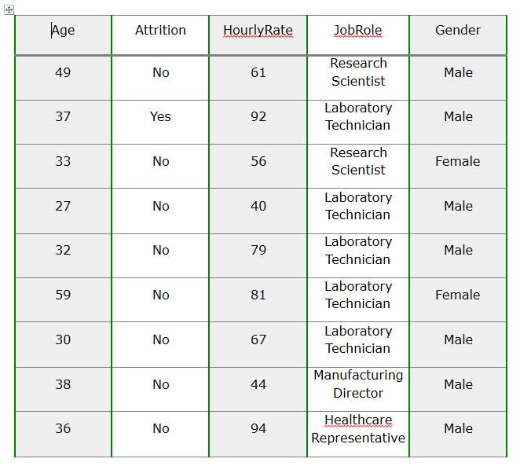
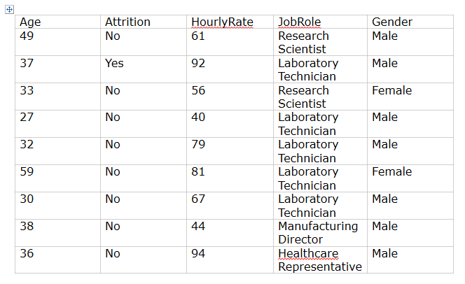

# Formatting Tables 

__RadRichTextBox__ exposes an API that allows you to use various methods to style the tables. The methods exposed by the API can be wired to a UI and get executed upon user interaction with this UI. To learn more about the __Formatting API__ of the __RadRichTextBox__, read [this topic]().

All methods that allow you to interact with Tables are listed here: [Tables Properties and Methods]().


## Formatting the Table in Code

The bellow code shows how you can create a table in the code behind and set its styles:

#### [C#] Example 1: Generate a table and set its borders and background

```C#   

    public void SetBorders()
    {
        var table = new Table(10, 5);

        var blackBorder = new Telerik.Windows.Documents.Model.Border(2, BorderStyle.Single, Colors.Green);
        var grayBorder = new Telerik.Windows.Documents.Model.Border(3, BorderStyle.Single, Colors.Gray);
        var grayBorder1 = new Telerik.Windows.Documents.Model.Border(1, BorderStyle.Single, Colors.Gray);

        var rows = table.Rows.ToArray();

        for (int row = 0; row < table.Rows.Count; row++)
        {
            var currentRow = rows[row];
            currentRow.Height = 50;
            var cells = currentRow.Cells.ToArray();

            for (int col = 0; col < currentRow.Cells.Count; col++)
            {
                var currnetCell = cells[col];
                currnetCell.TextAlignment = Telerik.Windows.Documents.Layout.RadTextAlignment.Center;
                currnetCell.VerticalAlignment = Telerik.Windows.Documents.Layout.RadVerticalAlignment.Center;

                if (row == 0)
                {
                    currnetCell.Borders = new TableCellBorders(blackBorder, grayBorder1, blackBorder, grayBorder);
                }
                else
                {
                    currnetCell.Borders = new TableCellBorders(blackBorder, grayBorder1, blackBorder, grayBorder1);
                }

                if (col % 2 == 0)
                {
                    currnetCell.Background = Color.FromArgb(117, 220, 220, 220);
                }

            }
        }

        SetTableData(table);

        var editor = new RadDocumentEditor(this.radRichTextBox.Document);
        editor.InsertTable(table);
    }

```

#### __[VB.NET] Example 1: Generate a table and set its borders and background

```VB.NET   

	Public Sub SetBorders()
		Dim table = New Table(10, 5)

		Dim blackBorder = New Telerik.Windows.Documents.Model.Border(2, BorderStyle.Single, Colors.Green)
		Dim grayBorder = New Telerik.Windows.Documents.Model.Border(3, BorderStyle.Single, Colors.Gray)
		Dim grayBorder1 = New Telerik.Windows.Documents.Model.Border(1, BorderStyle.Single, Colors.Gray)

		Dim rows = table.Rows.ToArray()

		For row As Integer = 0 To table.Rows.Count - 1
			Dim currentRow = rows(row)
			currentRow.Height = 50
			Dim cells = currentRow.Cells.ToArray()

			For col As Integer = 0 To currentRow.Cells.Count - 1
				Dim currnetCell = cells(col)
				currnetCell.TextAlignment = Telerik.Windows.Documents.Layout.RadTextAlignment.Center
				currnetCell.VerticalAlignment = Telerik.Windows.Documents.Layout.RadVerticalAlignment.Center

				If row = 0 Then
					currnetCell.Borders = New TableCellBorders(blackBorder, grayBorder1, blackBorder, grayBorder)
				Else
					currnetCell.Borders = New TableCellBorders(blackBorder, grayBorder1, blackBorder, grayBorder1)
				End If

				If col Mod 2 = 0 Then
					currnetCell.Background = Color.FromArgb(117, 220, 220, 220)
				End If

			Next col
		Next row

		SetTableData(table)

		Dim editor = New RadDocumentEditor(Me.radRichTextBox.Document)
		editor.InsertTable(table)
	End Sub


```

>caption Figure 1: Generate a table and set its borders and background




## Using the StyleName Property

You can use the __StyleName__ property to set one of the predefined table styles.

__Example 2: Set the StyleName__

```C#   

    var table = new Table(10, 5);
    table.StyleName = RadDocumentDefaultStyles.TableGridLightStyleName;

```
```VB.NET   
    
    Dim table = New Table(10, 5)
    table.StyleName = RadDocumentDefaultStyles.TableGridLightStyleName

```

>caption Figure 2: Use predefined styles



