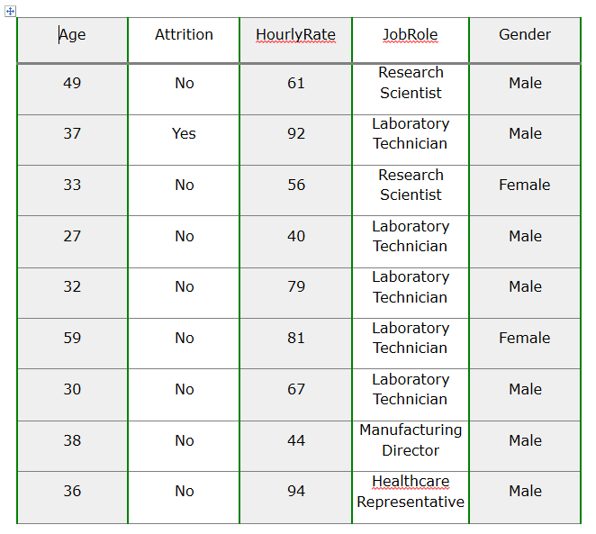
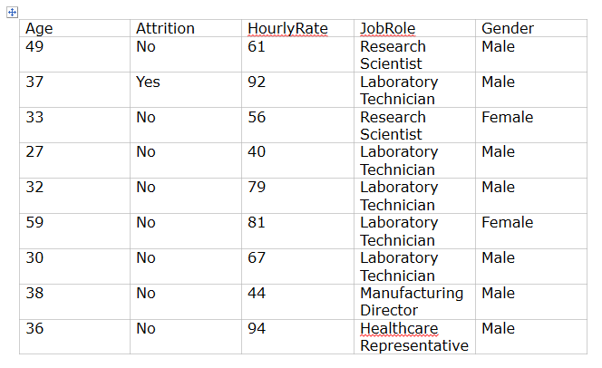

# Formatting Tables 

__RadRichTextBox__ exposes an API that allows you to use various methods to style the tables. The methods exposed by the API can be wired to a UI and get executed upon user interaction with this UI. To learn more about the __Formatting API__ of the __RadRichTextBox__, read [this topic]().

All methods that allow you to interact with Tables are listed here: [Tables Properties and Methods]().

## Formatting the Table in Code

The bellow code shows how you can create a table in the code behind and set its styles:

#### [C#] Example 1: Generate a table and set its borders and background

<snippet id='radrichtextbox-document-elements-table-formatting-tables-block_1-cs' />

#### __[VB.NET] Example 1: Generate a table and set its borders and background

<snippet id='radrichtextbox-document-elements-table-formatting-tables-block_2-vb' />

>caption Figure 1: Generate a table and set its borders and background

## Using the StyleName Property

You can use the __StyleName__ property to set one of the predefined table styles.

__Example 2: Set the StyleName__

<snippet id='radrichtextbox-document-elements-table-formatting-tables-block_3-cs' />
<snippet id='radrichtextbox-document-elements-table-formatting-tables-block_4-vb' />

>caption Figure 2: Use predefined styles

