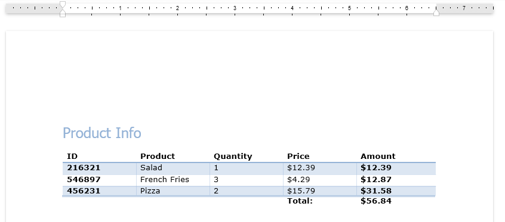

# {{ site.framework_name }} RadRichTextBox Table

__RadRichTextBox__ is capable of displaying and editing tables. The following articles describe how you can create edit and style the tables.
      

* [__Working with Tables in Code__]()
 
* [__Creating tables with the UI__]()
 
* [__Formatting Tables__]()
 
* [__Repeat Header Row__]()

 

