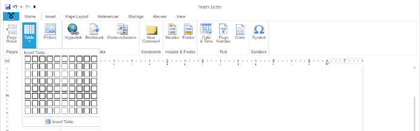
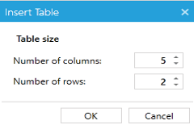
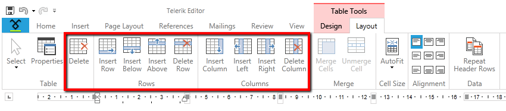
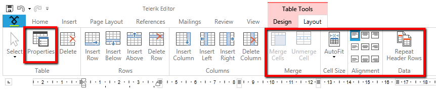
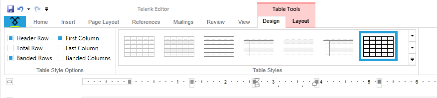
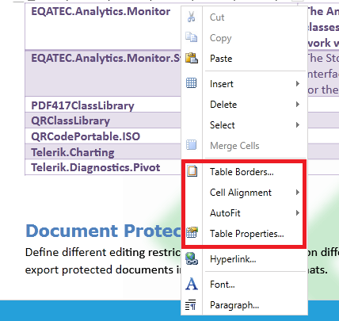

# Using the Built-in UI to work with Tables

* [Creating a Table](#creating-a-table)

* [Formatting a Table](#formatting-a-table)

## Creating a Table

You can enable the user to create a table via the built-in UI of the __RadRichTextBox__. This is done by using the __RadRichTextBoxRibbonUI__, which exposes two different ways of creating a table by selection in the UI or on button click. To learn more about how to use the __RadRichTextBoxRibbonUI__ read [this topic]().
        

You can also use the __InsertTableDialog__, which comes out of the box. To show it upon a user action just call the __ShowInsertTableDialog()__ method of the __RadRichTextBox__. Here is a snapshot of it.
        

>The __RadRichTextBoxUI__ also uses this dialog.
          

A table could be deleted or modified via the Table Tools’ contextual tab __Layout__. There are UI buttons for each of the API methods used for deleting and modifying a table.
        

 

### Formatting a Table

You can enable the user to modify a table via the built-in UI of the __RadRichTextBox__. This is done by using the __RadRichTextBoxRibbonUI__, which exposes a __Table Tools__ contextual menu with two tabs – __Design__ and __Layout__. They expose UI buttons for all API methods used for formatting and modifying a table. To learn more about how to use the __RadRichTextBoxRibbonUI__ read [this topic]().
        

The __Design__ contextual tab allows you to use a predefined set of formatting options called Table styles. The __TableStylesGallery__ offers a way to easily create, delete, modify and apply table styles in a document. To learn more about how to use the TableStylesGallery read [this topic]().
        

Additionally, the built-in context menu of the __RadRichTextBox__ gives the user the possibility to open the __Table Properties__ and __Table Borders__ dialogs.
        

>tip To wire these dialogs to your own UI you can use the __ShowTablePropertiesDialog()__ method of __RadRichTextBox__ or the __ShowTablePropertiesCommand__.

