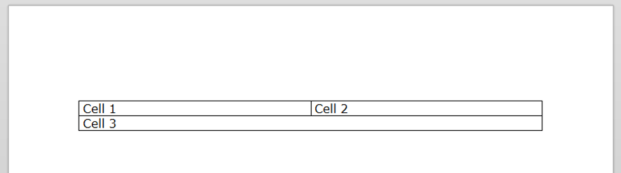
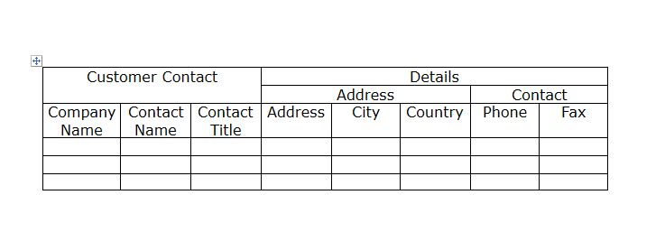

# Working with Tables in Code

This article shows you can create or retrieve tables in the code behind. 

>tip To modify the document content at runtime we recommend using the [RadDocumentEditor]() class when possible, instead of working with `RadDocument` directly. The document editor ensures that the document will be measured and arranged properly on each change.

## Creating a Table Programmatically

The __RadRichTextBox__ exposes a rich API, which allows you to use various methods to add, modify or delete elements from the [__RadDocument__](). Information about the table properties and methods can be found here: [Properties and Methods]()

__Example 1: Create a Table in Code-Behind__
```C#
    RadDocument document = new RadDocument();
    Section section = new Section();

    Table table = new Table();
    table.StyleName = RadDocumentDefaultStyles.DefaultTableGridStyleName;

    TableRow row1 = new TableRow();

    TableCell cell1 = new TableCell();
    Paragraph p1 = new Paragraph();
    Span s1 = new Span();
    s1.Text = "Cell 1";
    p1.Inlines.Add(s1);
    cell1.Blocks.Add(p1);
    row1.Cells.Add(cell1);

    TableCell cell2 = new TableCell();
    Paragraph p2 = new Paragraph();
    Span s2 = new Span();
    s2.Text = "Cell 2";
    p2.Inlines.Add(s2);
    cell2.Blocks.Add(p2);
    row1.Cells.Add(cell2);
    table.Rows.Add(row1);

    TableRow row2 = new TableRow();

    TableCell cell3 = new TableCell();
    cell3.ColumnSpan = 2;
    Paragraph p3 = new Paragraph();
    Span s3 = new Span();
    s3.Text = "Cell 3";
    p3.Inlines.Add(s3);
    cell3.Blocks.Add(p3);
    row2.Cells.Add(cell3);
    table.Rows.Add(row2);

    section.Blocks.Add(new Paragraph());
    section.Blocks.Add(table);
    section.Blocks.Add(new Paragraph());
    document.Sections.Add(section);

    this.radRichTextBox.Document = document;
```
```VB.NET
    Dim document As New RadDocument()
    Dim section As New Section()
    section.Blocks.Add(New Paragraph())

    Dim table As New Table()
    table.StyleName = RadDocumentDefaultStyles.DefaultTableGridStyleName

    Dim row1 As New TableRow()

    Dim cell1 As New TableCell()
    Dim p1 As New Paragraph()
    Dim s1 As New Span()
    s1.Text = "Cell 1"
    p1.Inlines.Add(s1)
    cell1.Blocks.Add(p1)
    row1.Cells.Add(cell1)

    Dim cell2 As New TableCell()
    Dim p2 As New Paragraph()
    Dim s2 As New Span()
    s2.Text = "Cell 2"
    p2.Inlines.Add(s2)
    cell2.Blocks.Add(p2)
    row1.Cells.Add(cell2)
    table.Rows.Add(row1)

    Dim row2 As New TableRow()

    Dim cell3 As New TableCell()
    cell3.ColumnSpan = 2
    Dim p3 As New Paragraph()
    Dim s3 As New Span()
    s3.Text = "Cell 3"
    p3.Inlines.Add(s3)
    cell3.Blocks.Add(p3)
    row2.Cells.Add(cell3)
    table.Rows.Add(row2)

    section.Blocks.Add(table)
    section.Blocks.Add(New Paragraph())
    document.Sections.Add(section)

    Me.radRichTextBox.Document = document
```

__Figure 1__ shows the result of the code in __Example 1__.

#### __Figure 1: Table generated in code-behind__



## Row and Column Span

In order to merge cells in the table you can use the __RowSpan__ and __ColumnSpan__ properties of the __TableCell__. The below code shows how you can use these properties to create a complex table header.

>note Please note that when using __RowSpan__ and __ColumnSpan__ the cells are not merged. The cells are only resized and they will be on top of the other cells.  

__Example 2: Use RowSpan and ColumnSpan Properties__
```C#   
    Table table = new Table();
    table.StyleName = RadDocumentDefaultStyles.DefaultTableGridStyleName;

    //add header
    TableRow headerRow1 = new TableRow();

    TableCell cell = CreateCellWithText("Customer Contanct");
    cell.ColumnSpan = 3;
    cell.RowSpan = 2;
    headerRow1.Cells.Add(cell);

    cell = CreateCellWithText("Details");
    cell.ColumnSpan = 5;
    headerRow1.Cells.Add(cell);

    TableRow headerRow2 = new TableRow();

    cell = CreateCellWithText("Address");
    cell.ColumnSpan = 3;
    headerRow2.Cells.Add(cell);


    cell = CreateCellWithText("Contact");
    cell.ColumnSpan = 2;
    headerRow2.Cells.Add(cell);

    TableRow headerRow3 = new TableRow();

    cell = CreateCellWithText("Comapny Name");
    headerRow3.Cells.Add(cell);

    cell = CreateCellWithText("Contanct Name");
    headerRow3.Cells.Add(cell);

    cell = CreateCellWithText("Contanct Title");
    headerRow3.Cells.Add(cell);

    cell = CreateCellWithText("Address");
    headerRow3.Cells.Add(cell);

    cell = CreateCellWithText("City");
    headerRow3.Cells.Add(cell);

    cell = CreateCellWithText("Country");
    headerRow3.Cells.Add(cell);

    cell = CreateCellWithText("Phone");
    headerRow3.Cells.Add(cell);

    cell = CreateCellWithText("Fax");
    headerRow3.Cells.Add(cell);

    table.Rows.Add(headerRow1);
    table.Rows.Add(headerRow2);
    table.Rows.Add(headerRow3);

    //add data rows
    for (int i = 0; i < 3; i++)
    {
        TableRow row = new TableRow();
        for (int j = 0; j < 8; j++)
        {
            row.Cells.Add(new TableCell());

        }
        table.Rows.Add(row);
    }

    radRichTextBox.InsertTable(table);
```
```VB.NET   
	Dim table As New Table()
	table.StyleName = RadDocumentDefaultStyles.DefaultTableGridStyleName

	'add header
	Dim headerRow1 As New TableRow()

	Dim cell As TableCell = CreateCellWithText("Customer Contanct")
	cell.ColumnSpan = 3
	cell.RowSpan = 2
	headerRow1.Cells.Add(cell)

	cell = CreateCellWithText("Details")
	cell.ColumnSpan = 5
	headerRow1.Cells.Add(cell)

	Dim headerRow2 As New TableRow()

	cell = CreateCellWithText("Address")
	cell.ColumnSpan = 3
	headerRow2.Cells.Add(cell)


	cell = CreateCellWithText("Contact")
	cell.ColumnSpan = 2
	headerRow2.Cells.Add(cell)

	Dim headerRow3 As New TableRow()

	cell = CreateCellWithText("Comapny Name")
	headerRow3.Cells.Add(cell)

	cell = CreateCellWithText("Contanct Name")
	headerRow3.Cells.Add(cell)

	cell = CreateCellWithText("Contanct Title")
	headerRow3.Cells.Add(cell)

	cell = CreateCellWithText("Address")
	headerRow3.Cells.Add(cell)

	cell = CreateCellWithText("City")
	headerRow3.Cells.Add(cell)

	cell = CreateCellWithText("Country")
	headerRow3.Cells.Add(cell)

	cell = CreateCellWithText("Phone")
	headerRow3.Cells.Add(cell)

	cell = CreateCellWithText("Fax")
	headerRow3.Cells.Add(cell)

	table.Rows.Add(headerRow1)
	table.Rows.Add(headerRow2)
	table.Rows.Add(headerRow3)

	'add data rows
	For i As Integer = 0 To 2
		Dim row As New TableRow()
		For j As Integer = 0 To 7
			row.Cells.Add(New TableCell())

		Next j
		table.Rows.Add(row)
	Next i

	radRichTextBox.InsertTable(table)
```

The result is demonstrated in the following image.

>caption Figure 2: Merging cells with __RowsSpan__ and __ColSpan__ properties

 

## Get and Iterate Tables from existing document

In order to iterate a table you need to get it first. You can use the __EnumerateChildrenOfType__ method to get all tables in the document.

__Example 3: Get all tables from an existing document__
```C#   
    var tables = radRichTextBox.Document.EnumerateChildrenOfType<Table>();   
```
```VB.NET   
    Dim tables = radRichTextBox.Document.EnumerateChildrenOfType(Of Table)()   
```

Now that you have the table you can iterate the rows and columns by using the following approach. 

__Example 4: Iterate all Rows and Columns__
```C#   
    var table = radRichTextBox.Document.EnumerateChildrenOfType<Table>().FirstOrDefault();
    if (table != null)
    {
        foreach (TableRow row in table.Rows)
        {
            foreach (TableCell cell in row.Cells)
            {
                var content = cell.EnumerateChildrenOfType<Span>().FirstOrDefault();
                if (content != null)
                {
                    Console.WriteLine(content.Text);
                }

            }
        }
    }
```
```VB.NET   
    Dim table = radRichTextBox.Document.EnumerateChildrenOfType(Of Table)().FirstOrDefault()
    If table IsNot Nothing Then
        For Each row As TableRow In table.Rows
            For Each cell As TableCell In row.Cells
                Dim content = cell.EnumerateChildrenOfType(Of Span)().FirstOrDefault()
                If content IsNot Nothing Then
                    Console.WriteLine(content.Text)
                End If

            Next cell
        Next row
    End If
```