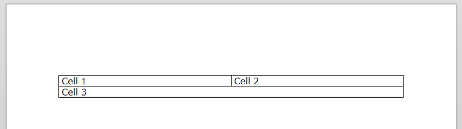
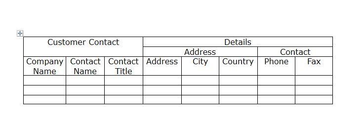

# Working with Tables in Code

This article shows you can create or retrieve tables in the code behind. 

>tip To modify the document content at runtime we recommend using the [RadDocumentEditor]() class when possible, instead of working with `RadDocument` directly. The document editor ensures that the document will be measured and arranged properly on each change.

## Creating a Table Programmatically

The __RadRichTextBox__ exposes a rich API, which allows you to use various methods to add, modify or delete elements from the [__RadDocument__](). Information about the table properties and methods can be found here: [Properties and Methods]()

__Example 1: Create a Table in Code-Behind__
<snippet id='radrichtextbox-document-elements-table-working-with-tables-block_1-cs' />
<snippet id='radrichtextbox-document-elements-table-working-with-tables-block_2-vb' />

__Figure 1__ shows the result of the code in __Example 1__.

#### __Figure 1: Table generated in code-behind__

## Row and Column Span

In order to merge cells in the table you can use the __RowSpan__ and __ColumnSpan__ properties of the __TableCell__. The below code shows how you can use these properties to create a complex table header.

>note Please note that when using __RowSpan__ and __ColumnSpan__ the cells are not merged. The cells are only resized and they will be on top of the other cells.  

__Example 2: Use RowSpan and ColumnSpan Properties__
<snippet id='radrichtextbox-document-elements-table-working-with-tables-block_3-cs' />
<snippet id='radrichtextbox-document-elements-table-working-with-tables-block_4-vb' />

The result is demonstrated in the following image.

>caption Figure 2: Merging cells with __RowsSpan__ and __ColSpan__ properties

 

## Get and Iterate Tables from existing document

In order to iterate a table you need to get it first. You can use the __EnumerateChildrenOfType__ method to get all tables in the document.

__Example 3: Get all tables from an existing document__
<snippet id='radrichtextbox-document-elements-table-working-with-tables-block_5-cs' />
<snippet id='radrichtextbox-document-elements-table-working-with-tables-block_6-vb' />

Now that you have the table you can iterate the rows and columns by using the following approach. 

__Example 4: Iterate all Rows and Columns__
<snippet id='radrichtextbox-document-elements-table-working-with-tables-block_7-cs' />
<snippet id='radrichtextbox-document-elements-table-working-with-tables-block_8-vb' />