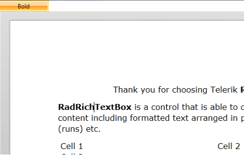
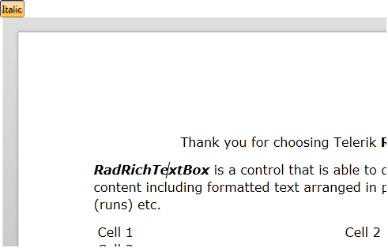

# Commands


__RadRichTextBox__ exposes a full set of commands that provide an alternative to its API methods, exposed through its __Commands__ property. For each of the [Formatting API]() methods there is a respective command. 

## Binding Commands to UI Elements

In order to use the command with a UI Element that supports commanding, you have to bind the __Command__ property of the element to the respective command of the __RadRichTextBox__.
        

>tip To see a list of all the commands exposed by __RadRichTextBox__, visit [this topic](https://docs.telerik.com/devtools/silverlight/api/telerik.windows.documents.richtextboxcommands)[this topic](https://docs.telerik.com/devtools/wpf/api/telerik.windows.documents.richtextboxcommands).
        

Here is an example with a __RadToggleButtonControl__.
        

#### [XAML] Example 1: Binding a command

```XAML

	<telerik:RadToggleButton x:Name="BoldButton"
	                            Content="Bold"
	                            DataContext="{Binding Commands, ElementName=radRichTextBox}"
	                            Command="{Binding ToggleBoldCommand}" />
	<telerik:RadRichTextBox x:Name="radRichTextBox"
	                                    Height="500"
	                                    Width="500">
	    <telerik:RadDocument LayoutMode="Paged" />
	</telerik:RadRichTextBox>
```


Now when the button is clicked, it will toggle the boldness of the current selection. The thing it won't do is to respond to the current state of the selection. For example, if the context of the caret is a bold text, the button in the UI won't get automatically toggled. In order to implement this behavior, you have to handle the __ToggleStateChanged__ event of the __ToggleBoldCommand__ following an approach similar to the one shown in **Example 2**. 
        

#### [C#] Example 2: Update toggle button state using the ToggleStateChanged event of ToggleBoldCommand

```C#

	public CommandsSample()
	{
	    InitializeComponent();
	    this.radRichTextBox.Commands.ToggleBoldCommand.ToggleStateChanged += this.ToggleBoldCommand_ToggleStateChanged;
	}
	public void ToggleBoldCommand_ToggleStateChanged( object sender, StylePropertyChangedEventArgs<bool> e )
	{
	    this.BoldButton.IsChecked = e.NewValue;
	}
```


#### [VB.NET] Example 2: Update toggle button state using the ToggleStateChanged event of ToggleBoldCommand

```VB.NET

    Public Sub New()
        InitializeComponent()
        Me.radRichTextBox.Commands.ToggleBoldCommand.ToggleStateChanged += Me.ToggleBoldCommand_ToggleStateChanged
    End Sub
    Public Sub ToggleBoldCommand_ToggleStateChanged(sender As Object, e As StylePropertyChangedEventArgs(Of Boolean))
        Me.BoldButton.IsChecked = e.NewValue
    End Sub
```


Now the button will respond to the current state of the selection.



You can also use the functionality provided by the __RadRichTextBoxRibbonUI__ class in order to get the event handling out of the box.
        

>tip The __RadRichTextBoxRibbonUI__ provides you with a fully predefined UI for RadRichTextBox. To learn how to use it read [this topic]().
        

If you are building your UI manually, for example using a **RadRibbonView** control, you have to only bind the command to the __RadRichTextBoxRibbonUI__.__RichTextCommand__ attached property of the desired __RadRibbonView__ control. Here is an example with a __RadRibbonToggleButton__.
        

#### [XAML] Example 3: Bind a command to a RadRibbonView control

```XAML

	<telerik:RadRibbonToggleButton x:Name="ItalicButton"
	                                Content="Italic"
	                                DataContext="{Binding Commands, ElementName=radRichTextBox}"
	                                telerik:RadRichTextBoxRibbonUI.RichTextCommand="{Binding ToggleItalicCommand}" />
```


The __RadRibbonToggleButton__ will get automatically toggled whenever the context of the caret is an italic text.
        

>tip More about the specific buttons introduced with __RadRibbonView__ you can find [here](http://www.telerik.com/help/wpf/allmembers_t_telerik_windows_documents_richtextboxcommands_richtextboxcommands.html).





## Modifying Default Application Commands Bindings

By default, __RadRichTextBox__ defines built-in mappings between [ApplicationCommands](http://msdn.microsoft.com/en-us/library/system.windows.input.applicationcommands.aspx) and its Commands:

<table>
<tr><th><b>Application Command</b></th><th><b>RadRichTextBox Command</b></th></tr>
<tr><td> ApplicationCommands.Cut </td><td> CutCommand </td></tr>
<tr><td> ApplicationCommands.Copy </td><td> CopyCommand </td></tr>
<tr><td> ApplicationCommands.Paste </td><td> PasteCommand </td></tr>
<tr><td> ApplicationCommands.Delete </td><td> DeleteCommand </td></tr>
<tr><td> ApplicationCommands.Find </td><td> ShowFindReplaceDialogCommand </td></tr>
<tr><td> ApplicationCommands.New </td><td> NewDocumentCommand </td></tr>
<tr><td> ApplicationCommands.Open </td><td> OpenDocumentCommand </td></tr>
<tr><td> ApplicationCommands.Save </td><td> SaveCommand </td></tr>
<tr><td> ApplicationCommands.SelectAll </td><td> SelectAllCommand </td></tr>
<tr><td> ApplicationCommands.Undo </td><td> UndoCommand </td></tr>
<tr><td> ApplicationCommands.Redo </td><td> RedoCommand </td></tr>
<tr><td> ApplicationCommands.Print </td><td> PrintCommand </td></tr>
</table>

You can remove some of the bindings by using __RadRichTextBox.RegisteredApplicationCommands__ collection.

#### [C#] Example 4: Remove ApplicationCommands bindings

```C#

    this.radRichTextBox.RegisteredApplicationCommands.Remove(ApplicationCommands.Save);
```

#### [VB.NET] Example 4: Remove ApplicationCommands bindings

```VB.NET

     Me.radRichTextBox.RegisteredApplicationCommands.Remove(ApplicationCommands.Save)
```

and re-add them (as long as they are among the default mappings list) at later time:

#### [C#] Example 5: Add ApplicationCommands bindings

```C#

    this.radRichTextBox.RegisteredApplicationCommands.Add(ApplicationCommands.Save);
```

#### [VB.NET] Example 5: Add ApplicationCommands bindings

```VB.NET

     Me.radRichTextBox.RegisteredApplicationCommands.Add(ApplicationCommands.Save)
```

If you want to handle application commands on RadRichTextBox owner's level, you should suppress the default handling mechanism for the specified shortcut using __RadRichTextBox.PreviewEditorKeyDown__ event:

#### [C#] Example 6: Suppress default action for application command

```C#

    this.radRichTextBox.PreviewEditorKeyDown += (sender, e) =>
        {
            if (Keyboard.IsKeyDown(Key.LeftCtrl) && e.Key == Key.S)
            {
                e.SuppressDefaultAction = true;
            }
        };
```

#### [VB.NET] Example 6: Suppress default action for application command

```VB.NET

	Me.radRichTextBox.PreviewEditorKeyDown += Function(sender, e) Do
		If Keyboard.IsKeyDown(Key.LeftCtrl) AndAlso e.Key = Key.S Then
			e.SuppressDefaultAction = True
		End If
	End Function
```



## Command-related Events

**RadRichTextBox** exposes two events that allow you interfere the process of executing a command.

#### [C#] Example 7: Subscribing to the events

```C#
	
	this.radRichTextBox.CommandExecuting += RadRichTextBox_CommandExecuting;
	this.radRichTextBox.CommandExecuted += RadRichTextBox_CommandExecuted;
	this.radRichTextBox.CommandError += RadRichTextBox_CommandError;
```

#### [VB.NET] Example 7: Subscribing to the events

```VB.NET
	
	AddHandler Me.radRichTextBox.CommandExecuting, AddressOf radRichTextBox_CommandExecuting
	AddHandler Me.radRichTextBox.CommandExecuted, AddressOf RadRichTextBox_CommandExecuted
	AddHandler Me.radRichTextBox.CommandError, AddressOf RadRichTextBox_CommandError
```


>You can find a runnable [example demonstrating how to use the CommandExecuting and CommandExecuted events](https://github.com/telerik/xaml-sdk/tree/master/RichTextBox/CustomizeCommands) to customize the behavior of a command in our [SDK repository](https://github.com/telerik/xaml-sdk) on GitHub. 

### CommandExecuting

The **CommandExecuting** event fires just before the execution of a command. You can use it to stop the command or modify its behavior/parameter. The parameters the event enables you to use are of type **CommandExecutingEventArgs** and can give you information about the command the event is fired for and its parameter. 

An example usage of this event is when you need to modify the content that is pasted into the document. In this case, you can easily obtain the content in the clipboard and change it according to your needs just before executing the PasteCommand.  

#### [C#] Example 8: Handling CommandExecuting

```C#

	void radRichTextBox_CommandExecuting(object sender, Telerik.Windows.Documents.RichTextBoxCommands.CommandExecutingEventArgs e)
	{
	    if (e.Command is PasteCommand)
	    {
	        // Process the text
	    }
	}
```

#### [VB.NET] Example 8: Handling CommandExecuting

```VB.NET

	Private Sub radRichTextBox_CommandExecuting(sender As Object, e As Telerik.Windows.Documents.RichTextBoxCommands.CommandExecutingEventArgs)
	    If (TypeOf (e.Command) Is PasteCommand) Then
	        'Process the text
	    End If
	End Sub
```


#### [C#] Example 9: Canceling CommandExecuting

```C#

	void radRichTextBox_CommandExecuting1(object sender, Telerik.Windows.Documents.RichTextBoxCommands.CommandExecutingEventArgs e)
	{
	    if (e.Command is PasteCommand)
	    {
	        e.Cancel = true;
	    }
	}
```


#### [VB.NET] Example 9: Canceling CommandExecuting

```VB.NET

	Private Sub RadRichTextBox_CommandExecuting1(sender As Object, e As Telerik.Windows.Documents.RichTextBoxCommands.CommandExecutingEventArgs)
	
	    If (TypeOf (e.Command) Is PasteCommand) Then
	        e.Cancel = True
	    End If
	End Sub
```


You can combine the code from **Examples 8 and 9** so you can stop the default execution of a command and perform your own logic.


### CommandExecuted

The **CommandExecuted** event fires after the execution of a command. You can use it to stop the command or modify its behavior/parameter. The parameters the event enables you to use are of type **CommandExecutedEventArgs** and can give you information about the command the event is fired for. It is useful when you need to add an additional logic that should be executed after a particular command.

**Example 10** demonstrates how you can modify each image after its insertion into the document to ensure it is not wider than the maximum width defined.


#### [C#] Example 10: Using CommandExecuted

```C#

	private void RadRichTextBox_CommandExecuted(object sender, CommandExecutedEventArgs e)
	{
	    if (e.Command is InsertPictureCommand)
	    {
	        // After inserting an image, ensure that its width is not more than 200px.
	        double maxWidth = 200;
	
	        foreach (var image in this.radRichTextBox.Document.EnumerateChildrenOfType<ImageInline>())
	        {
	            double ratio = image.Height / image.Width;
	            this.radRichTextBox.ChangeImageSize(image, new Size(maxWidth, maxWidth * ratio));
	        }
	    }
	}
```


#### [VB.NET] Example 10: Using CommandExecuted

```VB.NET

	Private Sub RadRichTextBox_CommandExecuted(sender As Object, e As CommandExecutedEventArgs)
	
	    If (TypeOf (e.Command) Is InsertPictureCommand) Then
	
	        'After inserting an image, ensure that its width Is Not more than 200px.
	        Dim maxWidth As Double = 200
	
	        For Each image In Me.radRichTextBox.Document.EnumerateChildrenOfType(Of ImageInline)
	
	            Dim ratio = image.Height / image.Width
	            Me.radRichTextBox.ChangeImageSize(image, New Size(maxWidth, maxWidth * ratio))
	        Next
	    End If
	End Sub
```

### CommandError

This event fires when a command fails to execute its operation. It is useful to handle issues that might occur and collect more information about them. The parameters of this event give you information about the error and enable you to set it as handled.


#### [C#] Example 11: Using CommandError

```C#

	private void RadRichTextBox_CommandError(object sender, CommandErrorEventArgs e)
	{
	    // Log the error 
	    e.Handled = true;
	}
```


#### [VB.NET] Example 11: Using CommandError

```VB.NET

	Private Sub RadRichTextBox_CommandError(sender As Object, e As CommandErrorEventArgs)
	    'Log the error 
	    e.Handled = True
	End Sub
```


## See Also 

* [Formatting API]()

* [RichTextBoxCommands Class](https://www.telerik.com/help/silverlight/t_telerik_windows_documents_richtextboxcommands_richtextboxcommands.html)

* [RichTextBoxCommands Class](https://docs.telerik.com/devtools/wpf/api/telerik.windows.documents.richtextboxcommands.richtextboxcommands)
* [Customize Commands SDK example](https://github.com/telerik/xaml-sdk/tree/master/RichTextBox/CustomizeCommands)
