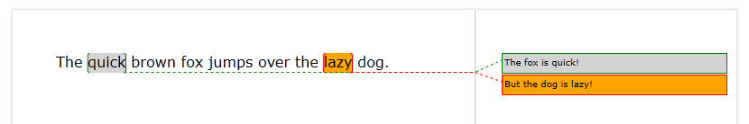

# Comments


__RadRichTextBox__ control provides functionality for inserting comment annotations inside the document. You can programmatically insert and delete comments though the [RadDocumentEditor]() class or you can use UI Commands in XAML views.
      

## UI and Commands

Commenting functionality is available in the Review tab inside the RadRichTextBoxRibbonUI:


The following commands related to the commenting functionality are available in the __Commands__ property of the RadRichTextBox:
        

* __InsertCommentCommand__: Adds a comment about the current selection.
            

* __DeleteCommentCommand__: Deletes the selected comment.
            

* __DeleteAllCommentsCommand__: Deletes all of the comments in the document.
            

* __GoToPreviousCommentCommand__: Navigates to the previous comment in the document.
            

* __GoToNextCommentCommand__: Navigate to the next comment in the document.
            

* __ToggleCommentsCommand__: Toggles comments visibility.
            

Here is an example usage of these commands:
        

#### __XAML__

```XAML
    <telerik:RadButton Content="New Comment" 
                       Command="{Binding ElementName=radRichTextBox, Path=Commands.InsertCommentCommand}" />
    <CheckBox Content="Show Comments" 
              telerik:RadRichTextBoxRibbonUI.RichTextCommand="{Binding ElementName=radRichTextBox, Path=Commands.ToggleCommentsCommand}" />
```


>tipIn order to learn more about commands and how to use them refer to [this article]().
          

## Working with Comments Programmatically

Comments inside the __RadDocument__ model are implemented using the __CommentRangeStart__ and __CommentRangeEnd__ annotations. The actual __Comment__ object which contains the content of the comment is a property of the __CommentRangeEnd__.
        

Comments can be programmatically inserted/deleted using the following methods of __RadDocumentEditor__:
        

* __public void InsertComment(Comment comment)__

* __public void DeleteComment()__

* __public void DeleteComment(CommentRangeStart commentRangeStart)__

* __DeleteAllComments()__

Note, that these methods work with the current position and selection in the document.
        

You can also programmatically navigate and select comments using the API of __RadDocument__:
        

* __public CommentRangeStart GetNextComment()__

* __public CommentRangeStart GetPreviousComment()__

* __public CommentRangeStart GoToNextComment()__

* __public CommentRangeStart GoToPreviousComment()__

* __public void GoToComment(Comment comment)__

* __public void GoToComment(CommentRangeStart commentRangeStart)__

* __public CommentRangeStart GetCommentRangeStartByComment(Comment comment)__

There are also __GoToNextComment()__ and __GoToPreviousComment()__ methods available in __RadRichTextBox__. They select the appropriate comment and place the focus inside the comment balloon if the comments are visible. These methods also show a message box if no comment is found.
        

## Customizing Visualization

You can customize the looks of the comments by attaching to the __CommentShowing__ event of __RadRichTextBox__. Inside the event handler you can access the __Comment__ and modify the __AppearanceSettings__ that are used to visualize the comment. Here is an example:
        

#### __C#__

```C#
    private void RadRichTexBox_CommentShowing(object sender, CommentShowingEventArgs e)
    {
        if (e.Comment.Author == "Boss")
        {
            e.AppearanceSettings.BorderBrush = new SolidColorBrush(Colors.Red);
            e.AppearanceSettings.BackgroundBrush = new SolidColorBrush(Colors.Orange);
            e.AppearanceSettings.HighlightColor = Colors.Orange;
        }
        else
        {
            e.AppearanceSettings.BorderBrush = new SolidColorBrush(Colors.Green);
            e.AppearanceSettings.BackgroundBrush = new SolidColorBrush(Colors.LightGray);
            e.AppearanceSettings.HighlightColor = Colors.LightGray;
        }
    }
```


And the result looks like this:



Note, that for performance reasons this event will be thrown only once per each comment – the first time it is shown. The __AppearanceSettings__ will then be cached and used for the associated comment when needed.
        

## See Also

 * [RadDocumentEditor]()

 * [RadRichTextBoxRibbonUI]()

 * [Annotations Overview]()
