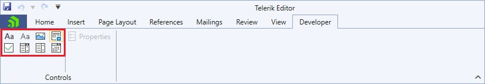
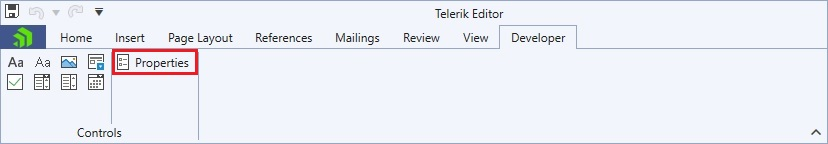
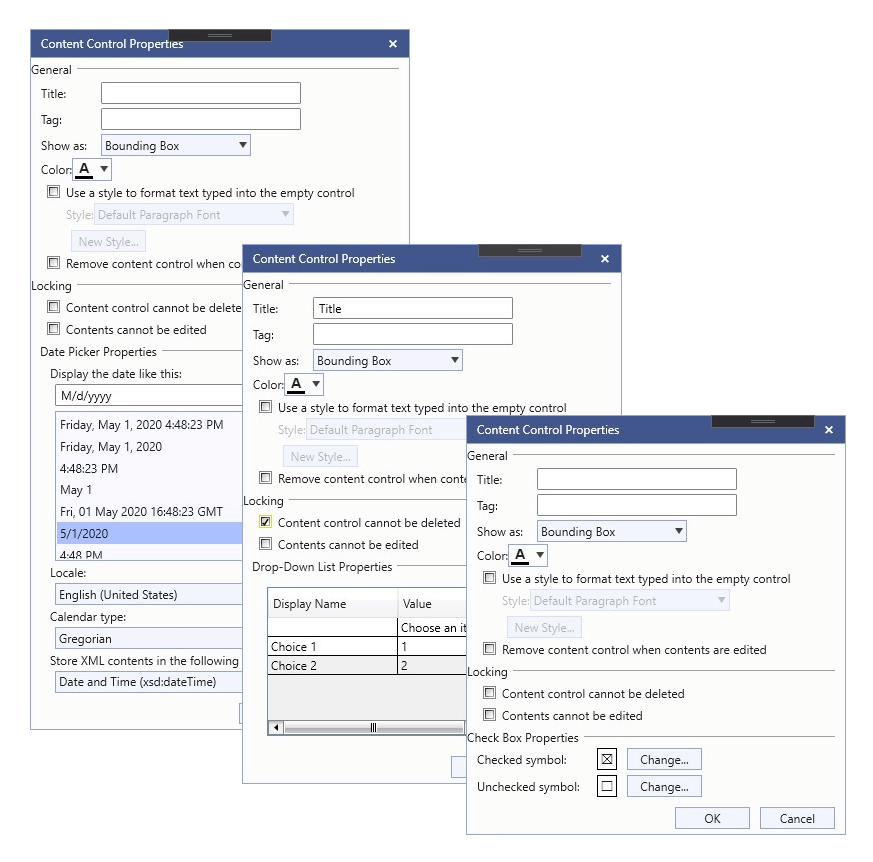

# Content Controls UI
The easiest way to create a content control is through the user interface. You can also create them programmatically following the [Working with Content Controls Programmatically]() article. 

## User Interface
You can specify which type of content control you wish to insert from the predefined UI of RadRichTextBox. You can select it from the Developer Tab which is part of the [RadRichTextBoxRibbonUI]() by default:



You can choose between the following content controls:
* **Rich Text** content control
* **Plain Text** content control
* **Picture** content control
* **Repeating Section** content control
* **Check Box** content control
* **Combo Box** content control
* **Drop-Down List**  content control
* **Date Picker** content control

### Content Controls Commands
The following commands related to the content controls functionality are available in the Commands property of the RadRichTextBox:

* **InsertStructuredDocumentTagCommand**

    In order to successfully execute the InsertStructuredDocumentTagCommand you have to pass the wanted content control type (**SdtType**) as a CommandParameter:

    #### [XAML] Example 1: Binding the command
    ```XAML

        <telerik:RadRibbonButton 
                        telerik:ScreenTip.Description="Insert a picture content control."
                        SmallImage="{telerik:IconResource IconRelativePath=16/contentControl-picture.png,IconSources={StaticResource IconSources}}" 
                        telerik:RadRichTextBoxRibbonUI.RichTextCommand="{Binding InsertStructuredDocumentTagCommand}"
                        CommandParameter="Picture"
                        Size="Small" telerik:ScreenTip.Title="Picture Content Control">
        </telerik:RadRibbonButton>
    ```

* **ShowContentControlPropertiesDialogCommand**

    #### [XAML] Example 2: Binding the command

    ```XAML

        <telerik:RadRibbonButton x:Name="propertiesDialogButton"
                        telerik:ScreenTip.Description="View or modify properties for the selected control."
                        SmallImage="{telerik:IconResource IconRelativePath=16/contentControl-properties.png,IconSources={StaticResource IconSources}}"
                        telerik:RadRichTextBoxRibbonUI.RichTextCommand="{Binding ShowContentControlPropertiesDialogCommand}"
                        CommandParameter="Sdt"
                        Size="Medium" telerik:ScreenTip.Title="Control Properties"
                        Text="Properties">
        </telerik:RadRibbonButton>
    ```

    >tip In order to learn more about commands and how to use them refer to [Commands]() help article.

### Dialogs
You can manipulate the properties for every specific content control using the assigned Properties Dialog which you can open from the Properties button.



These are the predefined Properties Dialogs:
* **RichTextPropertiesDialog**
* **PlainTextPropertiesDialog**
* **PicturePropertiesDialog**
* **RepeatingSectionPropertiesDialog**
* **CheckBoxPropertiesDialog**
* **DropDownListPropertiesDialog**
* **DatePickerPropertiesDialog**



# See also
* [Content Controls Overview]()
* [Manipulating Annotations]() 
* [Working with Content Controls]()
