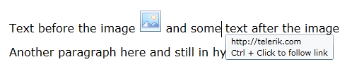
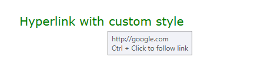

# Hyperlink

The hyperlink functionality in RadRichTextBox is encapusalted in the [HyperlinkInfo](#hyperlinkinfo), [HyperlinkRangeStart and HyperlinkRangeEnd](#hyperlinkrangestart-and-hyperlinkrangeend) classes. 

## HyperlinkInfo

The `HyperlinkInfo` class allows you to easily insert hyperlinks in the current selection of the document. The class exposes the following properties:

* `IsAnchor`&mdash;A boolean property determining if the hyperlink points to a URL or a bookmark;

* `NavigateUri`&mdash;The URI of the hyperlink;

* `Target`&mdash;Determines if the link should be opened in another window (when set to `HyperlinkTargets.Blank`) or in the same frame (`HyperlinkTargets.Self`).

__Inserting a hyperlink pointing to a web address__  
```C#
	HyperlinkInfo info = new HyperlinkInfo()
	{
	    NavigateUri = "https://www.telerik.com/products/wpf/overview.aspx",
	    Target = HyperlinkTargets.Blank,
	    IsAnchor = false
	};
	this.radRichTextBox.InsertHyperlink(info, "RichTextBox demo");
```

To insert a hyperlink to a bookmark within the document, specify the bookmark's name as the `NavigateUri` and set the `IsAnchor` to `true`.

__Inserting a hyperlink pointing to a bookmark in the document__  
```C#  
	HyperlinkInfo info = new HyperlinkInfo()
	{
	   NavigateUri = "bookmark1",
	   Target = HyperlinkTargets.Self,
	   IsAnchor = true
	};
	this.radRichTextBox.InsertHyperlink(info, "Link to Bookmark 1");
```

The `InsertHyperlink` method provides the following overloads:         

* `public void InsertHyperlink(HyperlinkInfo hyperlinkInfo, IEnumerable&lt;Inline&gt; inlines)`&mdash;Inserts a hyperlink which spans several different adjacent inlines, e.g. part of the hyperlink text is Bold or there is an image inside the hyperlink.

* `public void InsertHyperlink(HyperlinkInfo hyperlinkInfo)`&mdash;Creates a hyperlink from the currently selected part of the document.

To remove hyperlink from the document, position the caret within the hyperlink span and call the `RemoveHyperlink`.

__Removing the hyperlink under the caret position__  
```C#
	this.radRichTextBox.RemoveHyperlink();
```

## HyperlinkRangeStart and HyperlinkRangeEnd

The `HyperlinkRangeStart` and `HyperlinkRangeEnd` are Inline DocumentElements and can be added to the inlines of a document when building the contents of a RadDocument in code-behind. Using these classes give a bit more control over the creation and spanning of hyperlinks.

To add a hyperlink using this API, add the range start object and then pair it with the range end. The information about the hyperlink is stored in a `HyperlinkInfo` object assigned to the `HyperlinkRangeStart`. Then, the range objects are added to the `Paragraph`'s `Inlines` collection.

__Adding a hyperlink that spans on multiple document elements__  
```C#
	// creating the hyperlink range	
	HyperlinkRangeStart hyperlinkStart = new HyperlinkRangeStart();
	HyperlinkRangeEnd hyperlinkEnd = new HyperlinkRangeEnd();
	hyperlinkEnd.PairWithStart(hyperlinkStart);
	HyperlinkInfo hyperlinkInfo = new HyperlinkInfo() { NavigateUri = "http://telerik.com", Target = HyperlinkTargets.Blank };
	hyperlinkStart.HyperlinkInfo = hyperlinkInfo;
	
	// document setup
	RadDocument document = new RadDocument();
	Section section = new Section();
	Paragraph paragraph = new Paragraph();
	Span spanBefore = new Span("Text before the image ");
	ImageInline image = new ImageInline(new Uri("/Telerik.Windows.Controls.RichTextBoxUI;component/Images/MSOffice/32/Picture.png", UriKind.Relative));
	image.Size = new Size(32, 32);
	Span spanAfter = new Span(" and some text after the image");
	
	// inserting the hyper link range and the content where the hyper links spans
	paragraph.Inlines.Add(hyperlinkStart);
	paragraph.Inlines.Add(spanBefore);
	paragraph.Inlines.Add(image);
	paragraph.Inlines.Add(spanAfter);
	section.Blocks.Add(paragraph);
	Paragraph anotherParagraph = new Paragraph();
	anotherParagraph.Inlines.Add(new Span("Another paragraph here and still in hyperlink"));
	anotherParagraph.Inlines.Add(hyperlinkEnd);
	
	section.Blocks.Add(anotherParagraph);
	document.Sections.Add(section);	
	this.radRichTextBox.Document = document;
```

__The document created with the hyperlink range setup__  



The `HyperlinkRangeStart` and `HyperlinkRangeEnd` objects are used also when accessing and modifying the hyperlinks from the document.

__Deleting all hyperlinks in a document and replace them with text__  
```C#
	IEnumerable<HyperlinkRangeStart> links = this.radRichTextBox.Document.EnumerateChildrenOfType<HyperlinkRangeStart>();
	foreach (HyperlinkRangeStart link in links)
	{
	    this.radRichTextBox.Document.CaretPosition.MoveToInline(link.FirstLayoutBox as InlineLayoutBox, 0);
	    this.radRichTextBox.Document.Selection.SelectAnnotationRange(link);
	    this.radRichTextBox.Delete(false);
	    this.radRichTextBox.Insert("Removed hyperlink");
	}
```

## Changing the Hyperlink ToolTip

By default the hyperlink tooltip displays the navigation Uri along with the navigation mode (Ctrl+Click or Click only). To change format used to display this information, set the `HyperlinkToolTipFormatString` property of `RadRichTextBox`. This will set the format for all hyperlinks in the document.

__Change the default hyperlink tooltip format__  
```C#
	<telerik:RadRichTextBox HyperlinkToolTipFormatString="{}Navigate to '{0}' by pressing {1}"/>
```

[Showing the custom tooltip format](images/RadRichTextBox_Features_LayoutElements_Hyperlinks_HyperlinkToolTipFormatString.png)

## Hyperlink Navigation Trigger

The trigger that navigates to the corresponding Uri is controlled by the `HyperlinkNavigationMode` property of `RadRichTextBox`. The mode can be set to one of the following values:

* `CtrlClick`&mdash;Triggers the hyperlink when users hold the Ctrl key and click on the hyperlink.
* `Click`&mdash;Triggers the hyperlink when users click on the hyperlink.

__Change the default hyperlink navigation mode__  
```C#
	this.radRichTextBox.HyperlinkNavigationMode = Telerik.Windows.Documents.UI.HyperlinkNavigationMode.Click;
```

## Handling the Hyperlink Click Navigation

When a hyperlink is clicked, the `HyperlinkClicked` event of `RadRichTextBox` is raised. The sender of the event is the document element, which the user has clicked on, e.g. a `Span`, an `Image`, `InlineUIContainer`, etc. The event args provide the possibility to cancel or replace the navigation action. This is helpful when you need to validate the clicked hyperlink and prevent it from navigating to an unsecure address or from starting a local process.

The default hyperlink navigation can be cancelled by setting the `Handled` property of the `HyperlinkClickedEventArgs` to `true` or `IsTrustedUrl` to `false`.

__Prompting that the clicked linked may be unsafe and allows it to cancel the navigation action__  
```C#
	private void RadRichTextBox_HyperlinkClicked(object sender, HyperlinkClickedEventArgs e)
	{
		var link = e.URL;
		if (link.EndsWith("exe"))
		{
			e.Handled = true;
			MessageBoxResult Result = MessageBox.Show("You are about to open an executable file. Do you want to proceed", "Possible unsafe link", MessageBoxButton.YesNo, MessageBoxImage.Question);
		   
			if (Result == MessageBoxResult.Yes)
			{
				Process.Start(new ProcessStartInfo()
				{
					FileName = link,
					UseShellExecute = true
				});
			}
		}
	}
```

With the 2024 Q4 release, the default navigation behavior of the hyperlinks is to automatically open only valid web or email addresses.

## Customizing the Hyperlink Visual

By default, when the users insert a hyperlink in RadRichTextBox, it is styled with the built-in Hyperlink style. To change the default appearance of the hyperlinks in a document, modifying the [associated style]().

#### __Change the default hyperlink style__
{{region radrichtextbox-features-document-elements-hyperlink_9}}	
	StyleDefinition hyperlinkStyle = this.radRichTextBox.Document.StyleRepository[RadDocumentDefaultStyles.HyperlinkStyleName];
	hyperlinkStyle.SpanStyle.FontSize = 20; 
	hyperlinkStyle.SpanStyle.ForeColor = Colors.Green;
	hyperlinkStyle.SpanStyle.UnderlineDecoration = UnderlineTypes.None;
{{endregion}}

__A hyperlink with customized font styles__  



## See Also  
 * [Elements Hierarchy]()
 * [RadDocument]()
 * [Section]()
 * [Paragraph]()
 * [Span]()
 * [InlineImage]()
