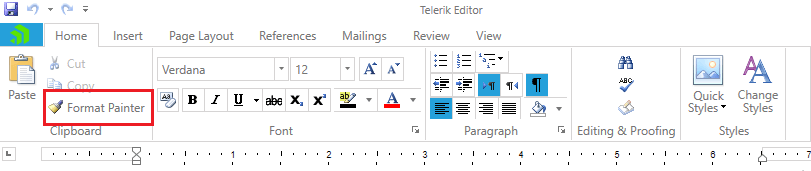

# Format Painter

The Format Painter feature in **RadRichTextBox** enables you to copy the formatting of a document element and apply it to other elements. the functionality can be used programmatically through the methods of the [RadDocumentEditor]() class or you can use the UI.
      
* [UI and Commands](#ui-and-commands)
* [Using Format Painter Programmatically](#using-format-painter-programmatically)


## UI and Commands

The Format Painter functionality can be used through the button inside the Home tab of [RadRichTextBoxRibbonUI]().




The following commands related to the copying of formatting are available in the **Commands** property of **RadRichTextBox**:

* **CopyFormatting**: Copies the formatting of the current selection.
* **PasteFormatting**: Pastes the currently copied formatting on the current selection.
* **CancelFormatPainter**: Untoggles the UI button and stops pasting of the formatting by using the selection. Still, pasting is possible through the Ctrl+Shift+V shortcut and through the PasteFormatting command.
* **ChangeFormatPainterState**: The Execute() method of this command accepts a parameter of type [ChangeFormatPainterStateCommandParameter](https://docs.telerik.com/devtools/wpf/api/telerik.windows.documents.richtextboxcommands.changeformatpainterstatecommandparameter). Depending on the parameter passed to this command, it can perform one of the following actions:
	* **CopyForSinglePaste**: The format painter copies the current formatting and prepares to paste it once.
	* **CopyForMultiplePaste**: The format painter copies the current formatting and prepares to paste it in multiple places.
	* **Cancel**: The format painter cancels pasting.


>tipIn order to learn more about commands and how to use them refer to the [Commands topic]().
        
>There are also shortcuts implemented for easier usage:
>- *Ctrl+Shift+C* copies the formatting.
>- *Ctrl+Shift+V* pastes the formatting to the current selection.
>- *Esc* untoggles the UI button and stops pasting of the formatting by using the selection.


## Using Format Painter Programmatically


The format painting functionality can be programmatically used through the following methods of __RadDocumentEditor__:
        

* **CopyFormatting()**: Copies the formatting of the current selection.
* **PasteFormatting()**: Pastes the currently copied formatting on the current selection.

Note, that these methods work with the current position and selection in the document.
        
#### [C#] Example 1: Copy the formatting of the selected content and apply it to the first paragraph

```C#

	this.radRichTextBox.CopyFormatting();
	
	DocumentPosition start = new DocumentPosition(this.radRichTextBox.Document.CaretPosition);
	DocumentPosition end = new DocumentPosition(start);
	
	start.MoveToFirstPositionInDocument();
	end.MoveToEndOfDocumentElement(start.GetCurrentParagraphBox().AssociatedParagraph);
	
	this.radRichTextBox.Document.Selection.SetSelectionStart(start);
	this.radRichTextBox.Document.Selection.AddSelectionEnd(end);
	
	this.radRichTextBox.PasteFormatting();
```

The example uses the **DocumentPosition** and **DocumentSelection** APIs to create different positions and select content. More information about these APIs is available in the [Positioning]() and [Selection]() topics. 

## See Also

 * [RadDocumentEditor]()
 * [RadRichTextBoxRibbonUI]()
 * [Styles]()
