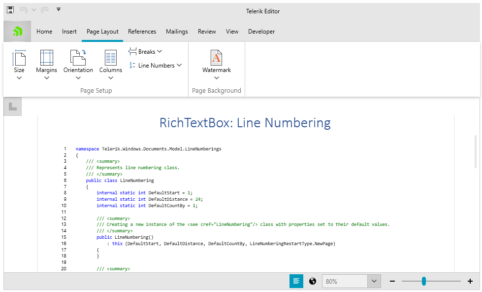
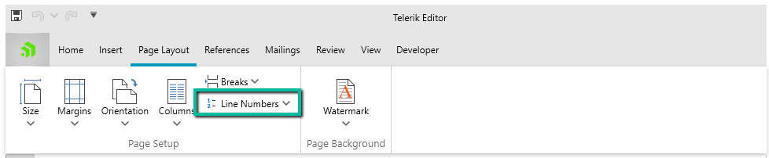

# Line Numbering

RadRichTextBox enables you to display the appropriate number beside each line of text. This functionality is useful for specific types of content, such as scripts, legal or medical documents.



By default, each line in a document is numbered, excluding those in tables, footnotes, endnotes, text boxes, and headers and footers. However, you can choose which line numbers to display. For example, you can display line numbers in all or part of the document, or disable the numbering for some of the content. All options for customization are described below.

>note The settings related to line numbering are preserved when working with the DOCX, RTF, and XAML formats. 

## UI and Commands

The Line Numbering functionality can be used through the button inside the *Page Layout* tab of [RadRichTextBoxRibbonUI]().




The following commands related to the numbering of lines are available in the **Commands** property of **RadRichTextBox**:

* **InsertLineNumberingCommand**: Adds line numbering to the selected sections.
* **SuppressLineNumberingForCurrentParagraphCommand**: Disables the numbering for the currently selected paragraph(s).
* **ShowLineNumberingDialogCommand**: Opens the dialog enabling users to set different line numbering options.

>tipIn order to learn more about commands and how to use them refer to the [Commands topic]().
        
## Using Line Numbering Programmatically

The LineNumbering class is the entity that represents a line numbering and holds information about its settings. This class exposes the following members:

* **Start**: Defines the initial value of the numbering. The default value is 1.
* **Distance**: Controls the distance between the numbering and the document content. The default value is 24.
* **CountBy**: The value the numbering increments with. Default value is 1.
* **Restart**: This property is of type **LineNumberingRestartType** and defines when the numbering should be restarted. The possible values are:
	* **NewPage**: Restart the line numbering on each page.
	* **NewSection**: Restart the line numbering when starting a new section.
	* **Continuous**: The line numbering is not restarted.

The line numbering functionality can be programmatically used through the following methods of __RadRichTextBox__ and __RadDocumentEditor__:
        
* **ChangeSectionLineNumbering**: Changes the line numbering for the selected sections.
* **ChangeLineNumberingRestartType**: Changes the restart type of line numberings for the selected sections.
* **SuppressLineNumberingForCurrentParagraph**: Disables the line numbering for specified paragraphs.

       
#### [C#] Example 1: Create and apply line numbering for the whole document

```C#

	Documents.Model.LineNumberings.LineNumbering numbering = new Telerik.Windows.Documents.Model.LineNumberings.LineNumbering(
		start:10, 
		distance:20, 
		countBy:2,
		restart:LineNumberingRestartType.Continuous); 

	this.radRichTextBox.Document.Selection.SelectAll();
	this.radRichTextBox.ChangeSectionLineNumbering(numbering);
```

You can also directly control the line numbering settings for a specific Section object through its **LineNumbering** property and suppress the numbering for a specific Paragraph using **SuppressLineNumbers**.

## See Also

 * [RadDocumentEditor]()
 * [RadRichTextBoxRibbonUI]()
