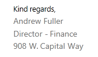
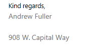
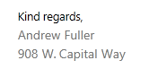

# Insert a New Line in Merge Field

In RadRichtextBox, you can insert a line break using the [Break element](). However, when working with mail merge fields, inserting a similar document element is not possible. This is why we introduced support for the vertical tab symbol. This article explains how you can use this symbol to insert a new line in the document content and in a merge field. 

* [What is the Vertical Tab Symbol?](#what-is-the-vertical-tab-symbol)

* [How to Insert a Vertical Tab in RadDocument?](#how-to-insert-a-vertical-tab-in-raddocument)

* [Insert a Line Break Before/After a Merge Field If the Field Result Isn't Empty](#insert-a-line-break-beforeafter-a-merge-field-if-the-field-result-isnt-empty)

* [Using Vertical Tab in a DocumentVariableField](#using-vertical-tab-in-a-documentvariablefield)


## What is the Vertical Tab Symbol?

The vertical tab character is __*"\v"*__. It can be inserted directly into a document as a string or through the merge field switches. The vertical tab character itself won’t be preserved, but it is evaluated to a [Break element]() of type LineBreak.

## How to Insert a Vertical Tab in RadDocument?


The [RadDocumentEditor class]() exposes the Insert() method that enables you add text to the document. **Example 1** shows you how to insert a vertical tab using this method.

__Example 1: Insert vertical tab through RadDocumentEditor__

```C#

	radDocumentEditor.Insert("\v");
```
```VB.NET

	radDocumentEditor.Insert("\v")
```


Another option is to create a [Span]() and assign the vertical tab character to it. 

>This option is suitable only when the document is still not measured. For more information on the measured and not measured states of RadDocument, see [this topic](#specifics).

__Example 2: Create vertical tab through document model__

```C#

	Span span = new Span("\v");
```
```VB.NET

	Dim span As New Span("\v")
```
When the vertical tab symbol is inserted in a document, it is replaced with a Break element of type LineBreak.

## Insert a Line Break Before/After a Merge Field If the Field Result Isn't Empty

The vertical tab symbol enables you to insert a new line in the resulting fragment of a merge field. You can use the symbol to insert a line break before or after the result of a merge field only if it is not empty.

The next figures demonstrate a sample scenario that uses the vertical tab to separate the result values in lines. **Figure 1** shows the result fragments of merge fields for a sender's name, job title and address. 

#### __Figure 1: Result fragment of mail merge, when all the fields have values__


If a line break is inserted after each merge field and a value for a field is missing, the result is an empty line. **Figure 2** shows the result of the mail merge when the merge field for job title has no value.

#### __Figure 2: Result fragment of mail merge, when one of the fields has no value__



You could handle a similar scenario using the vertical tab symbol in the TextAfterIfNotEmpty property of the merge field. **Example 3** shows you how to create such a field and the result is demonstrated in **Figure 3**.


__Example 3: Insert vertical tab in the switch of a merge field__

```C#

	MergeField mergeField = new MergeField() { PropertyPath = "JobTitle", TextAfterIfNotEmpty="\v" };
```
```VB.NET

	Dim mergeField As New MergeField() With {.PropertyPath = "JobTitle", .TextAfterIfNotEmpty = "\v"}
```


#### __Figure 3: Result fragment of mail merge, when one of the fields has applied a switch using vertical tab and has no value__



### Using End of Paragraph "\r\n" Instead the Vertical Tab

You could also use the *“\r\n”* in the TextBeforeIfNotEmpty or TextAfterIfNotEmpty switches to create a line break. 

__Example 4: Insert \r\n in the switch of a merge field__

```C#

	MergeField mergeField = new MergeField() { PropertyPath = "FirstName", TextAfterIfNotEmpty="\r\n" };
```
```VB.NET

	Dim mergeField As New MergeField() With {.PropertyPath = "FirstName", .TextAfterIfNotEmpty = "\r\n"}
```


>important The vertical tab is serialized only when it is used as a value for a document variable. In all other cases, it is not included in the document content on export.


## Using the Vertical Tab in a DocumentVariableField

The suggested approach in scenarios that include export is to use a [document variable]() as a nested field. Using this approach, the field will be persisted when importing or exporting XAML and DOCX documents.

__Example 5: Insert the vertical tab in the switch of a merge field__

```C#

	string verticalTabSymbol = "\v";
	string verticalTabKey = "verticalTab";
	this.radRichTextBox.Document.DocumentVariables.Add(verticalTabKey, verticalTabSymbol);
	
	DocumentVariableField documentVariableField = new DocumentVariableField();
	documentVariableField.VariableName = verticalTabKey;
	
	var mergeField = new MergeField() { PropertyPath = "FirstName" };
	mergeField.SetPropertyValue(MergeField.TextAfterIfNotEmptyProperty, documentVariableField);
	
	this.radRichTextBox.InsertField(mergeField, FieldDisplayMode.Result);

```
```VB.NET

    Dim verticalTabSymbol As String = "\v"
    Dim verticalTabKey As String = "verticalTab"
    Me.radRichTextBox.Document.DocumentVariables.Add(verticalTabKey, verticalTabSymbol)

    Dim documentVariableField As New DocumentVariableField()
    documentVariableField.VariableName = verticalTabKey

    Dim mergeField = New MergeField() With {.PropertyPath = "FirstName"}
    mergeField.SetPropertyValue(MergeField.TextAfterIfNotEmptyProperty, documentVariableField)

    Me.radRichTextBox.InsertField(mergeField, FieldDisplayMode.Result)

```

As a value of the document variable, you could also insert the "\r\n". Keep in mind that this value is exported to DOCX files only.

## See Also

* [Mail Merge]()
* [Break]()
* [Document Variables]()
* [RadDocumentEditor]()
 