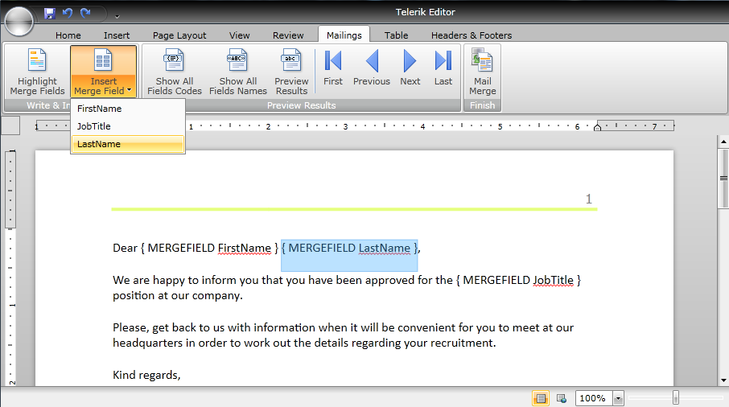

# Mail Merge

The general use of mail merge is the creation of a document serving as a template and filling in different data, e.g. the name of a person, their address, job title, etc. However, mail merge can be used in other scenarios as well, when some part of the document will be repeated several times with slight alterations. The template which stays mostly unchanged in all records is regarded as “Main Document”. In addition to the static content, it also contains placeholders – “Merge Fields” – which represent the variable data and are replaced with the actual content upon performing the mail merge. The information used for filling up the Merge Fields is kept separately and is called “Data Source”.      

## Setting up the Data Source

The first thing you need to do is assign a value to the ItemsSource property of the MailMergeDataSource of the document. For example, if you will be writing letters to Employees of a company, you can have a context which keeps a list of Employees, each Employee having a FirstName, LastName and JobTitle.

   
```C#
	public class ExamplesDataContext
    {
        private List<Employee> employees = new List<Employee>()
		{
			new Employee()
			{
				FirstName = "Andrew",
				LastName = "Fuller", 
				JobTitle = "Director - Finance",
			}, 
			new Employee()
			{
				FirstName = "Nancy",
				LastName = "Davolio", 
				JobTitle = "Director - Human Resources",
			},
			new Employee()
			{
				FirstName = "Robert",
				LastName = "King", 
				JobTitle = "Engineering Design Manager",
			},
			new Employee()
			{
				FirstName = "Margaret",
				LastName = "Peacock", 
				JobTitle = "Finance & Investments Officer",
			}
		};
		
        public List<Employee> Employees 
		{ 
			get { return employees; }  
		}
    }
```

All that is left is to add the following line:

  
```C#
	this.radRichTextBox.Document.MailMergeDataSource.ItemsSource = new ExamplesDataContext().Employees;
```

## Performing Mail Merge

MailMerge can be done both [using the UI](#mailmerging-using-the-ui) and [programmatically.](#programmatic-mail-merge)

### MailMerging using the UI

RadRichTextBoxRibbonUI comes with a predefined UI for inserting merge fields, previewing the results and fulfilling the merge. It is separated in the Mailings tab: 



The options in the drop down button InsertMergeField are automatically populated to match the properties of the objects which are used as data source. You can also switch the display mode of the merge fields from FieldCodes (as in the picture) to FieldNames (e.g. “&lt;&lt;FirstName&gt;&gt;”) or preview the results.            

If you click the “Preview Results” button, the fields will be replaced with the data from the current record, which by default is the first item from the data source. Then, you can further iterate through the records using the First, Last, Previous and Next buttons.

If you wish to save the document as a template, you can do so by executing the SaveFileCommand from the application menu in the ribbon bar. 

>The merge fields are persisted only in XAML and docx.

In the end, you can fulfill the mail merge from the MailMerge button, which executes the MailMergeCommand. A SaveFileDialog dialog will pop up prompting you to choose where you wish to save the document – result of mail merge and in what file format. 

### Programmatic Mail Merge

This same scenario can be carried out programmatically just as easily. The methods that can be used are:            

### Creating a MergeField

  
```C#
	MergeField field = new MergeField() { PropertyPath = "FirstName" };
```

This fields will look for the value of the FirstName property of the Employee objects.

### Changing the display mode of merge fields

  
```C#
	field.DisplayMode = FieldDisplayMode.Result; 	
	this.radRichTextBox.ChangeFieldDisplayMode(field.FieldStart, FieldDisplayMode.Result); 
	this.radRichTextBox.ChangeAllFieldsDisplayMode(FieldDisplayMode.Result);
```


### Inserting a MergeField at the current position of the caret


```C#
	this.radRichTextBox.InsertField(field); 	
	this.radRichTextBox.InsertField(field, FieldDisplayMode.DisplayName);
```

### Previewing the results of Mail Merge:


```C#
	this.radRichTextBox.PreviewFirstMailMergeDataRecord();
	
	this.radRichTextBox.PreviewLastMailMergeDataRecord();
	
	this.radRichTextBox.PreviewMailMergeDataRecordAtIndex(0);
	
	this.radRichTextBox.PreviewNextMailMergeDataRecord();
	
	this.radRichTextBox.PreviewPreviousMailMergeDataRecord();
```

### Performing MailMerge


```C#
	this.radRichTextBox.MailMergeCurrentRecord(); // returns a RadDocument that is the result of substituting the merge fields with the data from the current record. The current record can be specified through the MailMergeSource API:</para>
	
	this.radRichTextBox.Document.MailMergeDataSource.MoveToFirst();
	
	this.radRichTextBox.Document.MailMergeDataSource.MoveToLast();
	
	this.radRichTextBox.Document.MailMergeDataSource.MoveToNext();
	
	this.radRichTextBox.Document.MailMergeDataSource.MoveToPrevious();
	
	this.radRichTextBox.Document.MailMergeDataSource.MoveToIndex(index);
	
	this.radRichTextBox.MailMerge(false); // returns a RadDocument that is the result of Mail Merging all records. The parameter specifies if a page break should be inserted between the records (default value is true).
```

You can further choose what you wish to do with the resulting RadDocument – assign it to a RadRichTextBox’s Document property, export it, etc.
