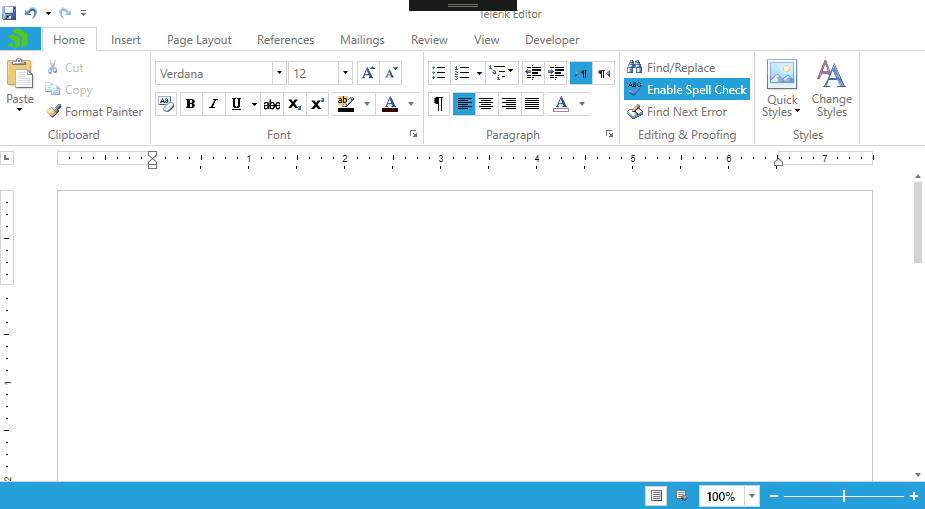

# Mentions (Suggestions)

This functionality enables you to show a predefined list of suggestions to be inserted into the document content when the users type a specific mention character. You can use a default provider for the mentions or define a custom one that suits your needs. Multiple providers are also supported while they have different mention characters. The flexibility of the feature also provides you with the ability to control how the selected item is inserted, how it is visualized, and how it is being matched inside the same collection.

## Basics of Working with Mentions

To enable the functionality in RadRichTextBox, you should define:
- mention items (these are the objects that will be visualized in the drop-down with the suggestions) 
- mention provider (keeps the collection of mention items and the associated mention character)
- mention template (responsible for visualizing a mention item; optional when using PersonMentionProvider)

Once you have the required objects, you should add the provider and the template to the `MentionContext` of RadRichTextBox.

## Default PersonMentionProvider

For your convenience, RadRichTextBox comes with a default implementation of a mention provider that enables you to list and choose persons. This provider:
- Works with **PersonMentionItem** objects that let you specify *Name*, *Mail* and *ImageSource* for a person.
- Shows a list of all persons when the users type the @ symbol and allows them to select the desired person. You can also choose a custom mention character for this provider. The items inside the list are automatically filtered if the users write after the mention character. 
- Comes with a predefined mention template that shows the image and the name of a person (as shown in **Figure 1**), so you shouldn't take care about that.
- Inserts the mention character and the item that has been selected as a hyperlink with the `PersonMentionItem.Name` as text and `PersonMentionItem.Mail` as URL.

#### Figure 1: Default mention template


**Example 1** demonstrates how to populate data and enable the mentions using `PersonMentionProvider`.

>note Do not forget to add the namespace of the mention-related classes:
> - For XAML: `xmlns:mentions="clr-namespace:Telerik.Windows.Documents.UI.Mentions;assembly=Telerik.Windows.Documents"`
> - In code: `Telerik.Windows.Documents.UI.Mentions`

#### [XAML] Example 1: Using PersonMentionProvider

```XAML

    <telerik:RadRichTextBox x:Name="radRichTextBox" >
        <telerik:RadRichTextBox.MentionContext>
            <mentions:MentionContext>
                <mentions:MentionContext.Providers>
                    <mentions:PersonMentionProvider>
                        <mentions:PersonMentionProvider.ItemsSource>
                            <x:Array Type="mentions:PersonMentionItem">
                                <mentions:PersonMentionItem Name = "Maria Anders" Mail = "manders@somecompany.com" ImageSource="/Images/manders.png"/>
                                <mentions:PersonMentionItem Name = "Antonio Taquería" Mail = "ataqueria@somecompany.com" ImageSource="/Images/ataqueria.png"/>
                                <mentions:PersonMentionItem Name = "Thomas Hardy" Mail = "thardy@somecompany.com" ImageSource="/Images/thardy.png"/>
                                <mentions:PersonMentionItem Name = "Anabela Domingues" Mail = "adomingues@somecompany.com" ImageSource="/Images/adomingues.png"/>
                            </x:Array>
                        </mentions:PersonMentionProvider.ItemsSource>
                    </mentions:PersonMentionProvider>
                </mentions:MentionContext.Providers>
            </mentions:MentionContext>
        </telerik:RadRichTextBox.MentionContext>
    </telerik:RadRichTextBox>

```

#### [C#] Example 1: Using PersonMentionProvider

```C#

    List<PersonMentionItem> personMentionItems = new List<PersonMentionItem>() {
                new PersonMentionItem() { Name = "Maria Anders", Mail = "manders@somecompany.com", ImageSource = new BitmapImage(new Uri("../../../../Images/manders.png", UriKind.Relative)) },
                new PersonMentionItem() { Name = "Antonio Taquería", Mail = "ataqueria@somecompany.com", ImageSource = new BitmapImage(new Uri("../../../../Images/ataqueria.png", UriKind.Relative)) },
                new PersonMentionItem() { Name = "Thomas Hardy", Mail = "thardy@somecompany.com", ImageSource = new BitmapImage(new Uri("../../../../Images/thardy.png", UriKind.Relative)) },
                new PersonMentionItem() { Name = "Anabela Domingues", Mail = "adomingues@somecompany.com", ImageSource = new BitmapImage(new Uri("../../../../Images/adomingues.png", UriKind.Relative)) }
            };
    
    
    PersonMentionProvider personMentionProvider = new PersonMentionProvider();
    personMentionProvider.ItemsSource = personMentionItems;
                
    this.radRichTextBox.MentionContext.Providers.Add(personMentionProvider);                
```

#### [VB.NET] Example 1: Using PersonMentionProvider

```VB.NET

    Dim personMentionItems = New List(Of PersonMentionItem)() From {
        New PersonMentionItem() With {.Name = "Maria Anders", .Mail = "manders@somecompany.com", .ImageSource = New BitmapImage(New Uri("../../../../Images/manders.png", UriKind.Relative))},
        New PersonMentionItem() With {.Name = "Antonio Taquería", .Mail = "ataqueria@somecompany.com", .ImageSource = New BitmapImage(New Uri("../../../../Images/ataqueria.png", UriKind.Relative))},
        New PersonMentionItem() With {.Name = "Thomas Hardy", .Mail = "thardy@somecompany.com", .ImageSource = New BitmapImage(New Uri("../../../../Images/thardy.png", UriKind.Relative))},
        New PersonMentionItem() With {.Name = "Anabela Domingues", .Mail = "adomingues@somecompany.com", .ImageSource = New BitmapImage(New Uri("../../../../Images/adomingues.png", UriKind.Relative))}
    }
    
    Dim personMentionProvider = New PersonMentionProvider()
    personMentionProvider.ItemsSource = personMentionItems
    
    Me.radRichTextBox.MentionContext.Providers.Add(personMentionProvider)
```

**Figure 2** shows how the result of **Example 1** would look like in RadRichTextBox.

#### Figure 2: Default MentionProvider

 

## Using Custom Mention Provider

You can implement your own mention provider that enables you to visualize any object as a suggestion of the mentions drop-down list. You should perform the following steps to enable RadRichTextBox to visualize suggestions for custom objects:

1. Define the custom object (mention item)
    
    This object should implement `INotifyPropertyChanged` so it can be later used in the data template for the mention item.
    
    #### [C#] Example 2: Custom mention item
    
    ```C#
    
        public class OrganizationInfo : INotifyPropertyChanged
        {
            private string name;
            private string abbreviation;
        
            public string Name
            {
                get
                {
                    return this.name;
                }
                set
                {
                    if (this.name != value)
                    {
                        this.name = value;
                        this.OnPropertyChanged("Name");
                    }
                }
            }
        
            public string Abbreviation
            {
                get
                {
                    return this.abbreviation;
                }
                set
                {
                    if (this.abbreviation != value)
                    {
                        this.abbreviation = value;
                        this.OnPropertyChanged("Abbreviation");
                    }
                }
            }
        
            /// <summary>
            /// Occurs when a property value changes.
            /// </summary>
            public event PropertyChangedEventHandler PropertyChanged;
        
            private void OnPropertyChanged(string propertyName)
            {
                if (this.PropertyChanged != null)
                {
                    this.PropertyChanged(this, new PropertyChangedEventArgs(propertyName));
                }
            }
        }
    ```
    
        #### [VB.NET] Example 2: Custom mention item
    
        ```VB.NET
        
            Public Class OrganizationInfo
                Inherits INotifyPropertyChanged
            
                Private name As String
                Private abbreviation As String
            
                Public Property Name As String
                    Get
                        Return Me.name
                    End Get
                    Set(ByVal value As String)
            
                        If Me.name <> value Then
                            Me.name = value
                            Me.OnPropertyChanged("Name")
                        End If
                    End Set
                End Property
            
                Public Property Abbreviation As String
                    Get
                        Return Me.abbreviation
                    End Get
                    Set(ByVal value As String)
            
                        If Me.abbreviation <> value Then
                            Me.abbreviation = value
                            Me.OnPropertyChanged("Abbreviation")
                        End If
                    End Set
                End Property
            
                Public Event PropertyChanged As PropertyChangedEventHandler
            
                Private Sub OnPropertyChanged(ByVal propertyName As String)
                    RaiseEvent PropertyChanged(Me, New PropertyChangedEventArgs(propertyName))
                End Sub
            End Class
        ```
    
1. Implement a custom mention provider

    This is done by inheriting the `MentionProviderBase<T>` class where `T` is the mention item. You should implement the **InsertItem** and **DetermineItemVisibility** methods. For more information about them, check the [Customize the Insert Action](#customize-the-insert-action) and [Customize the Filtering](#customize-the-filtering) sections.

    #### [C#] Example 3: Custom mention provider

    ```C#
            
        public class OrganizationMentionProvider : MentionProviderBase<OrganizationInfo>
        {
            public override bool DetermineItemVisibility(OrganizationInfo item, string currentMentionText)
            {
                if (string.IsNullOrEmpty(currentMentionText))
                {
                    return true;
                }
                else if (item == null || string.IsNullOrEmpty(item.Name))
                {
                    return false;
                }
                else
                {
                    string text = currentMentionText.ToUpperInvariant();
                    return item.Name.ToUpperInvariant().Contains(text) ||
                        item.Abbreviation.ToUpperInvariant().StartsWith(text);
                }
            }
        
            public override void InsertItem(RadDocument document, OrganizationInfo item)
            {
                if (item != null)
                {
                    RadDocumentEditor editor = new RadDocumentEditor(document);
                    editor.Insert(item.Name);
                }
            }
        }
    ```
            

    #### [VB.NET] Example 3: Custom mention provider

    ```VB.NET
            
        Public Class OrganizationMentionProvider
            Inherits MentionProviderBase(Of OrganizationInfo)
        
            Public Overrides Function DetermineItemVisibility(ByVal item As OrganizationInfo, ByVal currentMentionText As String) As Boolean
                If String.IsNullOrEmpty(currentMentionText) Then
                    Return True
                ElseIf item Is Nothing OrElse String.IsNullOrEmpty(item.Name) Then
                    Return False
                Else
                    Dim text As String = currentMentionText.ToUpperInvariant()
                    Return item.Name.ToUpperInvariant().Contains(text) OrElse item.Abbreviation.ToUpperInvariant().StartsWith(text)
                End If
            End Function
        
            Public Overrides Sub InsertItem(ByVal document As RadDocument, ByVal item As OrganizationInfo)
                If item IsNot Nothing Then
                    Dim editor As RadDocumentEditor = New RadDocumentEditor(document)
                    editor.Insert(item.Name)
                End If
            End Sub
        End Class
    ```
                
1. Implement a data template for the custom mention provider

    The usage of a custom object requires also a data template for it. This data template is used to instruct RadRichTextBox how the item should be visualized in the mentions drop-down. You should set the `DataTemplate.DataType` property to target the type of the mention item.
    
    > If more than one DataTemplate have the same DataType exception of type **InvalidOperationException** is thrown with a message *“This collection expects unique data types for every DataTemplate!”*. 
    
        
    #### [C#] Example 4: DataTemplate for the custom mention item

    ```C#
    
        string organizationDataTemplateXaml = @" <DataTemplate xmlns='http://schemas.microsoft.com/winfx/2006/xaml/presentation'
                                                            xmlns:x='http://schemas.microsoft.com/winfx/2006/xaml' 
                                                            xmlns:local='clr-namespace:MentionsExample' 
                                                            DataType='{x:Type local:OrganizationInfo}'>
                                                        <StackPanel Orientation='Vertical' VerticalAlignment='Center' Margin='10 0 0 0'>
                                                            <TextBlock FontSize='12' FontWeight='Bold' Text='{Binding Name}'/>
                                                            <TextBlock Text='({Binding Abbreviation})' FontSize='12'/>
                                                        </StackPanel>
                                                </DataTemplate>";
        
        DataTemplate template = (DataTemplate)XamlReader.Load(XmlReader.Create(new StringReader(organizationDataTemplateXaml)));

    ```
    
    
    #### [VB.NET] Example 4: DataTemplate for the custom mention item

    ```VB.NET
    
        Dim organizationDataTemplateXaml As String = " <DataTemplate xmlns='http://schemas.microsoft.com/winfx/2006/xaml/presentation'
                                                                xmlns:x='http://schemas.microsoft.com/winfx/2006/xaml' 
                                                                xmlns:local='clr-namespace:MentionsExample' 
                                                                DataType='{x:Type local:OrganizationInfo}'>
                                                            <StackPanel Orientation='Vertical' VerticalAlignment='Center' Margin='10 0 0 0'>
                                                                <TextBlock FontSize='12' FontWeight='Bold' Text='{Binding Name}'/>
                                                                <TextBlock Text='({Binding Abbreviation})' FontSize='12'/>
                                                            </StackPanel>
                                                    </DataTemplate>"
        Dim template As DataTemplate = CType(XamlReader.Load(XmlReader.Create(New StringReader(organizationDataTemplateXaml))), DataTemplate)
    ```
    
1. Register the mention provider with its mention character and the new data template

    After the prerequisites are completed, you should set the new members to the `MentionContext` property of **RadRichTextBox**.
    
    #### [C#] Example 5: Add the provider and the data template to the MentionContext
    
    ```C#
    
        OrganizationMentionProvider organizationMentionProvider = new OrganizationMentionProvider();
        organizationMentionProvider.MentionCharacter = '#';
        
        List<OrganizationInfo> organizations = new List<OrganizationInfo>() {
            new OrganizationInfo(){ Name="United Nations Organization" , Abbreviation="UN"},
            new OrganizationInfo(){ Name="United Nations Children’s Fund" , Abbreviation="UNICEF"},
            new OrganizationInfo(){ Name="World Health Organization" , Abbreviation="WHO"},
            new OrganizationInfo(){ Name="United Nations Education Scientific & Cultural Organization" , Abbreviation="UNESCO"},
            new OrganizationInfo(){ Name="World Wide Fund for Nature" , Abbreviation="WWF"}
        };
        
        organizationMentionProvider.ItemsSource = organizations;
        this.radRichTextBox.MentionContext.Providers.Add(organizationMentionProvider);
        
        this.radRichTextBox.MentionContext.Templates.Add(template);  
    ```
    
    
    #### [VB.NET] Example 5: Add the provider and the data template to the MentionContext
    
    ```VB.NET
    
        Dim organizationMentionProvider As OrganizationMentionProvider = New OrganizationMentionProvider()
        organizationMentionProvider.MentionCharacter = "#"
        Dim organizations As List(Of OrganizationInfo) = New List(Of OrganizationInfo)() From {
            New OrganizationInfo() With {
                .Name = "United Nations Organization",
                .Abbreviation = "UN"
            },
            New OrganizationInfo() With {
                .Name = "United Nations Children’s Fund",
                .Abbreviation = "UNICEF"
            },
            New OrganizationInfo() With {
                .Name = "World Health Organization",
                .Abbreviation = "WHO"
            },
            New OrganizationInfo() With {
                .Name = "United Nations Education Scientific & Cultural Organization",
                .Abbreviation = "UNESCO"
            },
            New OrganizationInfo() With {
                .Name = "World Wide Fund for Nature",
                .Abbreviation = "WWF"
            }
        }
        
        organizationMentionProvider.ItemsSource = organizations;
        Me.radRichTextBox.MentionContext.Providers.Add(organizationMentionProvider)
        Me.radRichTextBox.MentionContext.Templates.Add(Template)    
    ```    
    
#### Figure 4: Custom mentions 

    
## Custom Mention Character

The mention character is the character that triggers the visibility of the drop-down with suggestions when found at the start of a span. Each mention provider must be associated with a **unique** mention character. The character for the default mention provider is '@'. If you need to change the default character for a provider , you can use its `MentionCharacter` property.

#### [XAML] Example 6: Changing the mention character

```XAML

    <mentions:PersonMentionProvider MentionCharacter="#">
        <mentions:PersonMentionProvider.ItemsSource>
            <x:Array Type="mentions:PersonMentionItem">
                <!--...-->
            </x:Array>
        </mentions:PersonMentionProvider.ItemsSource>
    </mentions:PersonMentionProvider>
```

#### [C#] Example 6: Changing the mention character

```C#

    PersonMentionProvider personMentionProvider = new PersonMentionProvider();
    personMentionProvider.MentionCharacter = '#';
```

#### [VB.NET] Example 6: Changing the mention character

```VB.NET

    Dim personMentionProvider As PersonMentionProvider = New PersonMentionProvider()
    personMentionProvider.MentionCharacter = "#"
```

>If the mention character applied to a mention provider is already used by another provider, an **InvalidOperationException** is thrown.

## Customize the Insert Action

You can implement your own logic determining what and how it is being inserted into the document when the users select an item from the suggestions. You might need to customize the insert logic of PersonMentionProvider or provide the one for your custom provider. This is achieved by creating a custom implementation of a provider and overriding the **InsertItem** method. In **Example 7** you can see how the insert action of a CustomPersonMentionProvider is implemented - it inserts only the name of the person instead of adding the mention character and a hyperlink with the person's email.

#### [C#] Example 7: Custom insert action

```C#

    public class CustomPersonMentionProvider : PersonMentionProvider
    {
        public override void InsertItem(RadDocument document, PersonMentionItem item)
        {
            if (item != null)
            {
                RadDocumentEditor editor = new RadDocumentEditor(document);
                editor.Insert(item.Name);
            }
        }
    }
```

#### [VB.NET] Example 7: Custom insert action

```VB.NET

    Public Class CustomPersonMentionProvider
        Inherits PersonMentionProvider
    
        Public Overrides Sub InsertItem(ByVal document As RadDocument, ByVal item As PersonMentionItem)
            If item IsNot Nothing Then
                Dim editor As RadDocumentEditor = New RadDocumentEditor(document)
                editor.Insert(item.Name)
            End If
        End Sub
    End Class
```

## Customize the Filtering

After typing the mention character in the beginning of a span, the drop-down menu with suggestions shows. If the user continues to type, the list of suggestions is filtered. You can control how the items from the source collection are filtered by overriding the **DetermineItemVisibility** method in the concrete mention provider you are using. 

**Example 8** shows how to implement filtering that matches only the items that start with the content inserted by the customer no matter of their casing.

#### [C#] Example 8: Custom filtering

```C#

    public class CustomPersonMentionProvider : PersonMentionProvider
    {
        public override bool DetermineItemVisibility(PersonMentionItem item, string currentMentionText)
        {
            if (string.IsNullOrEmpty(currentMentionText))
            {
                return true;
            }
            else if (item == null || string.IsNullOrEmpty(item.Name))
            {
                return false;
            }
            else
            {
                return item.Name.ToUpperInvariant().StartsWith(currentMentionText.ToUpperInvariant());
            }
        }
    }
```

#### [VB.NET] Example 8: Custom filtering

```VB.NET

    Public Class CustomPersonMentionProvider
        Inherits PersonMentionProvider
    
        Public Overrides Function DetermineItemVisibility(ByVal item As PersonMentionItem, ByVal currentMentionText As String) As Boolean
            If String.IsNullOrEmpty(currentMentionText) Then
                Return True
            ElseIf item Is Nothing OrElse String.IsNullOrEmpty(item.Name) Then
                Return False
            Else
                Return item.Name.ToUpperInvariant().StartsWith(currentMentionText.ToUpperInvariant())
            End If
        End Function
    End Class
```


## Using Multiple Mention Providers

Through the `MentionContext`, you can register as many providers as you need and invoke their lists of items through the associated mention character. 

#### Figure 5: Multiple mention (suggestion) providers


## See Also
* [RadDocumentEditor]()
* [Content Controls]()
