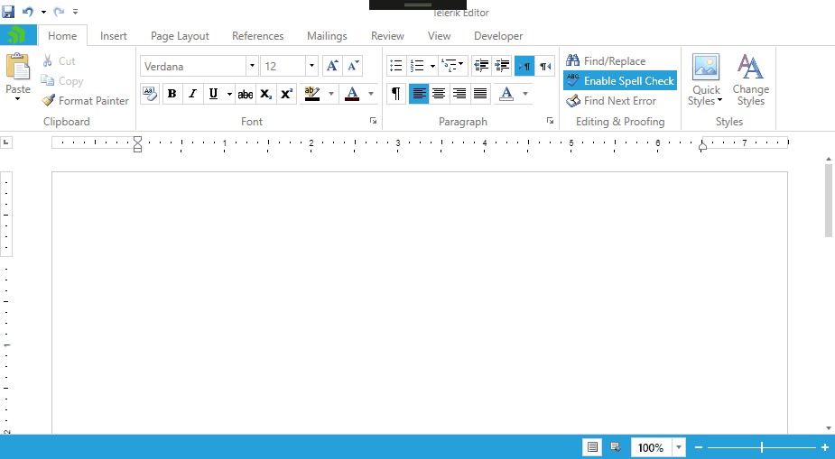

# Mentions (Suggestions)

This functionality enables you to show a predefined list of suggestions to be inserted into the document content when the users type a specific mention character. You can use a default provider for the mentions or define a custom one that suits your needs. Multiple providers are also supported while they have different mention characters. The flexibility of the feature also provides you with the ability to control how the selected item is inserted, how it is visualized, and how it is being matched inside the same collection.

## Basics of Working with Mentions

To enable the functionality in RadRichTextBox, you should define:
- mention items (these are the objects that will be visualized in the drop-down with the suggestions) 
- mention provider (keeps the collection of mention items and the associated mention character)
- mention template (responsible for visualizing a mention item; optional when using PersonMentionProvider)

Once you have the required objects, you should add the provider and the template to the `MentionContext` of RadRichTextBox.

## Default PersonMentionProvider

For your convenience, RadRichTextBox comes with a default implementation of a mention provider that enables you to list and choose persons. This provider:
- Works with **PersonMentionItem** objects that let you specify *Name*, *Mail* and *ImageSource* for a person.
- Shows a list of all persons when the users type the @ symbol and allows them to select the desired person. You can also choose a custom mention character for this provider. The items inside the list are automatically filtered if the users write after the mention character. 
- Comes with a predefined mention template that shows the image and the name of a person (as shown in **Figure 1**), so you shouldn't take care about that.
- Inserts the mention character and the item that has been selected as a hyperlink with the `PersonMentionItem.Name` as text and `PersonMentionItem.Mail` as URL.

#### Figure 1: Default mention template

**Example 1** demonstrates how to populate data and enable the mentions using `PersonMentionProvider`.

>note Do not forget to add the namespace of the mention-related classes:
> - For XAML: `xmlns:mentions="clr-namespace:Telerik.Windows.Documents.UI.Mentions;assembly=Telerik.Windows.Documents"`
> - In code: `Telerik.Windows.Documents.UI.Mentions`

<snippet id='radrichtextbox-features-mentions-block_1-xaml' />

<snippet id='radrichtextbox-features-mentions-block_2-cs' />
<snippet id='radrichtextbox-features-mentions-block_3-vb' />

**Figure 2** shows how the result of **Example 1** would look like in RadRichTextBox.

#### Figure 2: Default MentionProvider

 

## Using Custom Mention Provider

You can implement your own mention provider that enables you to visualize any object as a suggestion of the mentions drop-down list. You should perform the following steps to enable RadRichTextBox to visualize suggestions for custom objects:

1. Define the custom object (mention item)
    
    This object should implement `INotifyPropertyChanged` so it can be later used in the data template for the mention item.
    
    <snippet id='radrichtextbox-features-mentions-block_4-cs' />
	<snippet id='radrichtextbox-features-mentions-block_5-vb' />
    
1. Implement a custom mention provider

    This is done by inheriting the `MentionProviderBase<T>` class where `T` is the mention item. You should implement the **InsertItem** and **DetermineItemVisibility** methods. For more information about them, check the [Customize the Insert Action](#customize-the-insert-action) and [Customize the Filtering](#customize-the-filtering) sections.

    <snippet id='radrichtextbox-features-mentions-block_6-cs' />
    <snippet id='radrichtextbox-features-mentions-block_7-vb' />
                
1. Implement a data template for the custom mention provider

    The usage of a custom object requires also a data template for it. This data template is used to instruct RadRichTextBox how the item should be visualized in the mentions drop-down. You should set the `DataTemplate.DataType` property to target the type of the mention item.
    
    > If more than one DataTemplate have the same DataType exception of type **InvalidOperationException** is thrown with a message *“This collection expects unique data types for every DataTemplate!”*. 
    
    <snippet id='radrichtextbox-features-mentions-block_8-cs' />
    <snippet id='radrichtextbox-features-mentions-block_9-vb' />
    
1. Register the mention provider with its mention character and the new data template

    After the prerequisites are completed, you should set the new members to the `MentionContext` property of **RadRichTextBox**.
    
    #### [C#] Example 5: Add the provider and the data template to the MentionContext
    
    <snippet id='radrichtextbox-features-mentions-block_10-cs' />
	<snippet id='radrichtextbox-features-mentions-block_11-vb' />
    
#### Figure 4: Custom mentions 

    
## Custom Mention Character

The mention character is the character that triggers the visibility of the drop-down with suggestions when found at the start of a span. Each mention provider must be associated with a **unique** mention character. The character for the default mention provider is '@'. If you need to change the default character for a provider , you can use its `MentionCharacter` property.

<snippet id='radrichtextbox-features-mentions-block_12-xaml' />

<snippet id='radrichtextbox-features-mentions-block_13-cs' />
<snippet id='radrichtextbox-features-mentions-block_14-vb' />

>If the mention character applied to a mention provider is already used by another provider, an **InvalidOperationException** is thrown.

## Customize the Insert Action

You can implement your own logic determining what and how it is being inserted into the document when the users select an item from the suggestions. You might need to customize the insert logic of PersonMentionProvider or provide the one for your custom provider. This is achieved by creating a custom implementation of a provider and overriding the **InsertItem** method. In **Example 7** you can see how the insert action of a CustomPersonMentionProvider is implemented - it inserts only the name of the person instead of adding the mention character and a hyperlink with the person's email.

<snippet id='radrichtextbox-features-mentions-block_15-cs' />
<snippet id='radrichtextbox-features-mentions-block_16-vb' />

## Customize the Filtering

After typing the mention character in the beginning of a span, the drop-down menu with suggestions shows. If the user continues to type, the list of suggestions is filtered. You can control how the items from the source collection are filtered by overriding the **DetermineItemVisibility** method in the concrete mention provider you are using. 

The next example shows how to implement filtering that matches only the items that start with the content inserted by the customer no matter of their casing.

<snippet id='radrichtextbox-features-mentions-block_17-cs' />
<snippet id='radrichtextbox-features-mentions-block_18-vb' />

## Using Multiple Mention Providers

Through the `MentionContext`, you can register as many providers as you need and invoke their lists of items through the associated mention character. 

#### Figure 5: Multiple mention (suggestion) providers

## See Also
* [RadDocumentEditor]()
* [Content Controls]()