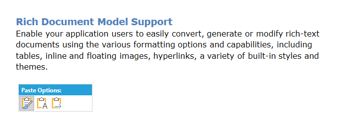

# Paste Options

When pasting content in RadRichTextBox, you might want to style it in different ways depending on the specific situation. The control allows you to specify how the styles of the content being pasted should be resolved and you can choose to preserve the styling as it was in the moment of copying it or you would prefer to keep the formatting you already have in RadRichTextBox. Merging the styles is available as well. This topic explains the API of this functionality and how you can achieve the different scenarios.

## Available Paste Options

The options which can be used are defined in the **PasteOption** enumeration. Here are the possible values:

* **KeepSourceFormatting**: Preserves the formatting of the content as it was when it has been copied.
* **MergeFormatting**: Keeps the underline, font weight and font style applied to the source. The other styles are used from the StyleRepository of the target document.
* **KeepTextOnly**: Strips the formatting of the content and pastes it as plain text.
* **UseDestinationStyles**: Keeps the styles used in the RadDocument instance and ignore the ones of the source.

## Paste Sources

While pasting, the API determines the source of the content which is inside the clipboard and can apply different paste option depending on it. 

The different sources are defined in the **PasteSource** enumeration:

* **SameRadDocument**: Used when the copy and paste operations are performed within the same instance of RadDocument.
* **AnotherRadDocument**: Used when the copy and paste operations are performed between different instances of RadDocument.
* **AnotherRichTextDocument**: A rich text document which was copied from application and not from a RadDocument instance.
* **DocumentWithConflictingStyles**: Document whose styles are in conflict with the ones defined in the target RadDocument. When this option is used, the specific source is not defined.

## Default and Available Paste Options

For each of the [PasteSource](#paste-sources) values, there is defined a specific [PasteOption](#available-paste-options) which will be executed for this source. The next list shows the predefined settings:

<table>
<tr><th>Paste Source</th><th>Available Paste Options</th><th>Default Paste Option</th></tr>
<tr><td>SameRadDocument</td><td>KeepSourceFormatting, KeepTextOnly, Merge Formatting</td><td>KeepSourceFormatting</td></tr>
<tr><td>AnotherRadDocument</td><td>KeepSourceFormatting, KeepTextOnly, Merge Formatting</td><td>KeepSourceFormatting</td></tr>
<tr><td>AnotherRichTextDocument</td><td>KeepSourceFormatting, KeepTextOnly, Merge Formatting</td><td>KeepSourceFormatting</td></tr>
<tr><td>DocumentWithConflictingStyles</td><td>KeepSourceFormatting, KeepTextOnly, Merge Formatting, UseDestinationStyles</td><td>UseDestinationStyles</td></tr>
</table>

You can change these settings using the [PasteSettings](#pastesettings-members) class and the methods it exposes.

## Turning Paste Options On/Off 

The **IsPasteOptionsPopupEnabled** dependency property of RadRichTextBox enables you to control whether the popup shown when pasting will be enabled or not. The default value of the property is `true`.

#### [XAML] Example 1: Turn off the popup providing paste options
```XAML

    <telerik:RadRichTextBox x:Name="radRichTextBox" IsPasteOptionsPopupEnabled="False" />
```


## Setting Default Behavior

The **RadRichTextBox** class exposes the **PasteSettings** property to enable you specify whether you would like to use the Paste Options functionality and how you would like it to behave. The property is of type **PasteSettings** and you can use the members of the class to adjust the settings according to your needs.

### PasteSettings Members

In addition to enabling or disabling the functionality, the members of this class enable you to set how the paste options should behave depending on the source the content has been copied from.

- **GetDefaultPasteOptionForPasteSource(PasteSource pasteSource)**: Gets the default PasteOption which will be executed when content from a given PasteSource is pasted.

- **SetDefaultPasteOptionForPasteSource(PasteSource pasteSource, PasteOption pasteOption)**: Enables you to set the default PasteOptions for a given PasteSource.

- **GetAvailablePasteOptions(PasteSource pasteSource)**: Gets a list of PasteOptions which could be performed when content with a given PasteSource is pasted.

- **SetAvailablePasteOptions(PasteSource pasteSource, params PasteOption[] pasteOptions)**: Sets a list of available PasteOptions for a given PasteSource.

- **SetAvailablePasteOptions(PasteSource pasteSource, IEnumerable&lt;PasteOption&gt; pasteOptions)**: Sets a list of available PasteOptions for a given PasteSource.

In case you would like to stick to the legacy behavior of the paste functionality, you would need to set the available paste options for each of the PasteSource values to `null`.

## Executing Paste in Code

You can invoke the paste with specific options through the RadRichTextBox/RadDocumentEditor class. In addition to the normal paste functionality, invoked using the Paste() method, the interface common for both classes exposes one more overload which enables you to specify the option wich will be used during the paste - **Paste(PasteOption pasteOption)**.

>important The method exposed by **RadRichTextBox** executes the paste and shows the popup for the user to choose another paste option if they would like to. If you would like to paste from the code without showing any UI, you can use the method of **RadDocumentEditor**.

#### [C#] Example 2: Paste with Specific Settings
```C#
    this.radRichTextBox.Paste(PasteOption.MergeFormatting);
```

## Executing Paste through UI

When the users paste content in RadRichTextBox using the Ctrl+V keyboard shortcut, a popup appears to let them choose the paste option they would like to use. If none of the buttons is pressed, the deafult option for the source is used. 

#### Figure 1: Paste Options Popup in RadRichTextBox



## See Also

 * [Clipboard Support]()
 
 * [ClipboardEx API Reference](https://docs.telerik.com/devtools/wpf/api/telerik.windows.documents.base.clipboardex)

 * [Formatting API]()

 * [Layout Modes]()
