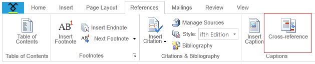
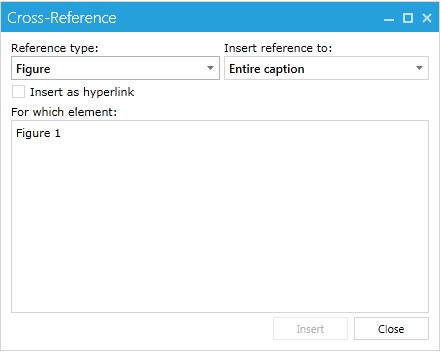
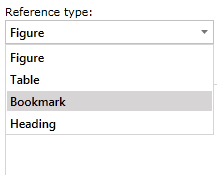
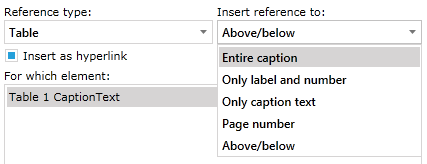
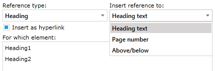
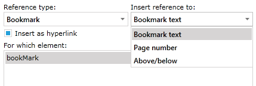

# Cross-Reference


Cross-References represent fields that refer to a part of the document. When that part changes, these fields can be updated to reflect the change. You can have a Cross-Reference to a Caption, Heading or Bookmark. 

You can insert a Cross-Reference from here:



This article covers:

* [Insert Cross-Reference](#insert-cross-reference)

* [Type of Cross-References](#types-of-cross-references)

* [Inserting a Cross-Reference using RadRichTextBox’s API](#inserting-a-cross-reference-using-radrichtextbox’s-api)

## Insert Cross-Reference

The dialog looks like this:



You can choose between 4 Reference types: __Figure__, __Table__, __Bookmark__ and __Heading__.



When you have chosen the [type of the reference](#types-of-cross-references), you should choose one of the items in the “Insert reference to:” combo box. The items depend on the selected item in the “Reference type:” combo box.
        

The __Insert as hyperlink__ checkbox, if checked, will create the field as a hyperlink to the appropriate part of the document. You can click on it while pressing Ctrl. This will force the cursor to move to the start of the part being referenced.
        

The __For which element__ listbox shows all the items of the appropriate type that can be chosen.
        

Clicking on the __Insert__ button inserts the __Cross-Reference__ to the document.
        

## Types of Cross-References

### Figure

These are the options you have when you select the __Figure__ reference type:


* __Entire Caption__ – inserts a field with text equal to the entire caption. In this case the text would be “Figure 1 CaptionText”.

* __Only label and number__ - inserts only the label and the number after it. In this case: “Figure 1”.

* __Only caption text__ - – inserts the caption text only: “CaptionText” (the text after the label and the number).

* __Page number__ - inserts the number of the page on which the field is located. For example if the field is on the third page, the text would be “3”.

* __Above/Below__ – inserts the position of the field relative to the part being referenced. For example if we have a __Caption__ on the first line of the page and we decide to insert a __Cross-Reference__ in the middle of the same page to that __Caption__. We will get the following text – “Above”.
                
### Table

__Table__ and __Figure__ are both __Captions__ so they have the same options.



### Heading

These are the options when __Heading__ is selected:



* __Heading text__ - inserts a field with text equal to the one in the heading chosen. For example here we have a paragraph with text “Heading1” (and style Heading1). The text inserted by the field would be “Heading1”.
                

* __Page Number__ - inserts the number of the page on which the field is located. For example if the field is on the fifth page, the text would be “5”.
                

* __Above/Below__ - inserts the position of the field relative to the part being referenced. For example if we have a __Caption__ in the middle of the page and we decide to insert a Cross-Reference on the first line of the same page to that Caption. We will get the following text – “Below”.
                
### Bookmark

When __Bookmark__ item is selected in the list with all available bookmarks you see only the names (not the text as with captions and headings)



* __Bookmark text__ - inserts the text in the bookmark. Here the name is shown, not the text. So the field would look something like “Bookmark Text Here”, given that this is the text of the bookmark with name “bookMark”.

* __Page number__ – inserts the number of the page on which the field is located. For example if the field is on the seventh page, the text would be “7”.

* __Above/Below__ – inserts the position of the field relative to the part being referenced. For example if we have a __Caption__ on the first line of the page and we decide to insert a Cross-Reference in the middle of the page to that __Caption__ we will get the text “Above”.
                

## Inserting a Cross-Reference using RadRichTextBox’s API

All types of __Cross-References__ can be inserted using methods of __RadRichTextBox__.

### Inserting Cross-Reference to a Bookmark

Every bookmark has a unique name. So in order to insert a reference to a bookmark, you need its name. __RadRichTextBox__ has the following method:

#### __C#__

```C#
	public void InsertCrossReferenceToBookmark(string bookmarkName, ReferenceContentType contentType, bool insertAsHyperlink)
```


__ReferenceContentType__ is an enumeration that has five values – __EntireContent__, __OnlyLabelAndNumber__, __OnlyCaption__, __PageNumber__ and __RelativePosition__. As you can see, those values are the same as in the “Insert reference to:” combo box. You can see what every value means [here](#Type_of_Cross_References/Bookmark). The parameter “insertAsHyperlink” is pretty self-explanatory and also can be read about [in this article](#insert-cross-reference).

### Inserting Cross-Reference to a Heading

You have to pass the paragraph (with heading style applied, of course) that you want to create a Reference to. The method signature is as follows:

#### __C#__

```C#
	public void InsertCrossReferenceToHeading(Paragraph headingParagraph, ReferenceContentType contentType, bool insertAsHyperlink)
```


The parameters are almost the same, except the first one. It represents the paragraph you want to reference. The other two have the same purpose.Inserting Cross-Reference to a Caption

The method signature is:

#### __C#__

```C#
	public void InsertCrossReferenceToCaption(Paragraph captionParagraph, ReferenceContentType contentType, bool insertAsHyperlink)
```


The first parameter represents the paragraph (__Caption__) you want to refer.
            
