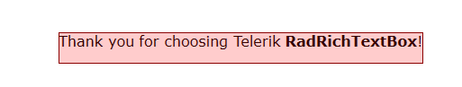
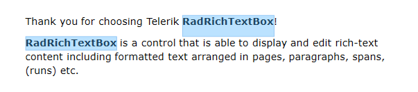

# Selection

`RadRichTextBox` supports not only selection via the UI, but also programmatic selection. This topic shows how you can use both approaches.

## UI Selection

The user is able to select the content inside RadRichTextBox in the same way as in MS Word. This is done by clicking on the desired position and dragging to the desired end of the selection. A multiple ranges selection is also allowed. This one is done by holding the __Ctrl__ key while selecting the different ranges.

You can modify the appearance of the selection in the control through the `SelectionFill` and `SelectionStroke` properties of RadRichTextBox.

#### __[XAML] Customize the appearance of the selection__
{{region radrichtextbox-features-selection_8}}
	<telerik:RadRichTextBox Name="radRichTextBox" SelectionStroke="DarkRed">
	    <telerik:RadRichTextBox.SelectionFill>
	        <SolidColorBrush Color="Red" Opacity="0.5" />
	    </telerik:RadRichTextBox.SelectionFill>
	</telerik:RadRichTextBox>
{{endregion}}

#### __[C#] Customize the appearance of the selection__
{{region radrichtextbox-features-selection_6}}
	this.radRichTextBox.SelectionFill = new System.Windows.Media.SolidColorBrush(Colors.Red); 
	this.radRichTextBox.SelectionFill.Opacity = 0.2;
	this.radRichTextBox.SelectionStroke = System.Windows.Media.Brushes.DarkRed;
{{endregion}}

#### __[VB.NET] Customize the appearance of the selection__
{{region radrichtextbox-features-selection_7}}
	Me.radRichTextBox.SelectionFill = New SolidColorBrush(Colors.Red)
	Ме.radRichTextBox.SelectionFill.Opacity = 0.2
	Ме.radRichTextBox.SelectionStroke = Brushes.DarkRed
{{endregion}}

__Custom selection colors__

## Advanced Selection Mode

By default when the user select text the words are selected letter by letter. We have introduced an advanced selection mode that allow you to select whole word automatically. The automatic words selection begins after the selection leaves the first word. This mode can be enabled by the `IsAdvancedSelectionEnabled` property.

## Programmatic Selection

The developer is allowed to manipulate the selection programmatically. This can be used in a lot of scenarios involving editing of the document, or for example, when implementing [Search functionality]() in your RadRichTextBox and you want to select the found string. 

The programmatic selection is represented via the `DocumentSelection` class. The instance of the class gets associated with the `RadDocument` of RadRichTextBox and allows you to specify selection start and end positions, selection ranges and other. You can manage the selection by either using the `Selection` property of RadDocument or by creating an instance of the `DocumentSelection` class.

>tip To learn more about the `DocumentPosition` read the [Positioning]() topic.

### Members of DocumentSelection

Properties:

* `Ranges`&mdash;Holds a collection of all [SelectionRange](#what-is-selection-range) instances in the selection.
* `IsEmpty`&mdash;Holds a value determining whether the selection is empty or not.

Methods for manipulating the selection:

* `SelectAll`&mdash;Selects all the content of the document.
* `SetSelectionStart`&mdash;Empties the selection and begins a new [SelectionRange](#what-is-selection-range) starting at the specified position. This method starts the creation of a range, which should be finished with the `AddSelectionEnd` method.
* `AddSelectionStart`&mdash;Begins a new [SelectionRange](#what-is-selection-range) starting at the specified position. This method starts the creation of a range, which should be finished with the `AddSelectionEnd` method.
* `AddSelectionEnd`&mdash;Finishes the started [SelectionRange](#what-is-selection-range) by setting its end.
* `SelectAnnotationRange`&mdash;Selects annotation range including the AnnotationRangeStart and AnnotationRangeEnd elements.
* `SelectTableRow`&mdash;Creates a new selection containing the specific table row.
* `SelectTableColumn`&mdash;Creates a new selection containing all the cells in a table column. There are two overloads that allow you to pass a cell from the column or the table and the grid column index, which should be selected.
* `AddDocumentElementToSelection`&mdash;Adds a specified document element to the existing selection.
* `AddTableCellToSelection`&mdash;Adds a table cell to the existing selection.
* `AddParagraphToSelection`&mdash;Adds a paragraph to the existing selection.

Obtaining information and elements from the selection:

* `CopySelectedDocumentElements`&mdash;Copies all selected document elements to a **DocumentFragment** instance.
* `GetSelectedText`&mdash;Gets the text from the selection. Offers an overload allowing you to specify whether the result should include the bullet or numbering characters in case a paragraph is in a list.
* `GetSelectedParagraphs`&mdash;Gets the paragraphs included in the selection.
* `GetSelectedBoxes&lt;T&gt;`&mdash;Enumerates through all inline layout boxes of type `T` included in the selected ranges.
* `GetFullSelectionGeometry`&mdash;Gets a [System.Windows.Media.Geometry](https://docs.microsoft.com/en-us/dotnet/api/system.windows.media.geometry?redirectedfrom=MSDN) instance describing the form of the selection.
* `GetVisibleSelectionGeometry`&mdash;Gets a [System.Windows.Media.Geometry](https://docs.microsoft.com/en-us/dotnet/api/system.windows.media.geometry?redirectedfrom=MSDN) instance describing the form of the selection visible in the rectangle passed as a parameter.
* `CreateDocumentFromSelection`&mdash;Creates a new RadDocument instance containing the selected elements.
* `ContainsAnnotationMarkersOfType&lt;T&gt;`&mdash;Determines whether the selection contains annotation markers of type `T`.
* `GetAnnotationMarkersOfType&lt;T&gt;`&mdash;Gets all annotation markers of type `T` in the selection.
* `GetSelectedSingleInline`&mdash;Gets the selected Inline if it is the only inline selected, otherwise returns __null__. This method is suitable to check if only an `ImageInline` is selected, for example.
* `ToString`&mdash;Gets the text from the selected document elements.

Clearing the selection method:

* `Clear`&mdash;Empties the selection.

Events:

* `SelectionChanging`&mdash;Occurs before the selection is changed.
* `SelectionChanged`&mdash;Occurs after the selection is changed. Such an event is exposed by the RadRichTextBox class as well.

#### __[C#] Select current word__
{{region radrichtextbox-features-selection_0}}
    DocumentPosition startPosition = new DocumentPosition(this.radRichTextBox.Document.CaretPosition);
    DocumentPosition endPosition = new DocumentPosition(startPosition);
    startPosition.MoveToCurrentWordStart();
    endPosition.MoveToCurrentWordEnd();
    this.radRichTextBox.Document.Selection.SetSelectionStart(startPosition);
    this.radRichTextBox.Document.Selection.AddSelectionEnd(endPosition);
{{endregion}}

#### __[VB.NET] Select current word__
{{region radrichtextbox-features-selection_1}}
	Dim startPosition As New DocumentPosition(Me.radRichTextBox.Document.CaretPosition)
	Dim endPosition As New DocumentPosition(startPosition)
	startPosition.MoveToCurrentWordStart()
	endPosition.MoveToCurrentWordEnd()
	Me.radRichTextBox.Document.Selection.SetSelectionStart(startPosition)
	Me.radRichTextBox.Document.Selection.AddSelectionEnd(endPosition)
{{endregion}}

The next snippet demonstrates how you can check the content that is selected and select and delete the current paragraph if the text in the selection contains the word "Test".

#### __[C#] Select current paragraph and delete it__
{{region radrichtextbox-features-selection_9}}
	string selectedText = this.radRichTextBox.Document.Selection.GetSelectedText();
	
	if (selectedText.Contains("Test"))
	{
	    this.radRichTextBox.Document.Selection.Clear();
	    Paragraph currentParagraph = this.radRichTextBox.Document.CaretPosition.GetCurrentParagraph();
	
	    this.radRichTextBox.Document.Selection.AddDocumentElementToSelection(currentParagraph);
	    this.radRichTextBox.Delete(true);
	}
{{endregion}}

#### __[VB.NET] Select current paragraph and delete it__
{{region radrichtextbox-features-selection_10}}
	Dim selectedText As String = Me.radRichTextBox.Document.Selection.GetSelectedText()
	
	If (selectedText.Contains("Test")) Then
	
	    Me.radRichTextBox.Document.Selection.Clear()
	    Dim currentParagraph As Paragraph = Me.radRichTextBox.Document.CaretPosition.GetCurrentParagraph()
	
	    Me.radRichTextBox.Document.Selection.AddDocumentElementToSelection(currentParagraph)
	    Me.radRichTextBox.Delete(True)
	End If
{{endregion}}

### What is Selection Range?

The selection in RadRichTextBox consists of selection ranges. These ranges are represented by the SelectionRange class which exposes the following members:

* `StartPosition`&mdash;The position determining the start of the selection range.
* `EndPosition`&mdash;The position determining the end of the selection range.
* `ContainsPosition`&mdash;Method that determines whether the range contains a specified DocumentPosition.
* `IsEmpty`&mdash;Determines whether the range contains any document elements.
* `IsReversed`&mdash;Returns `true` when the start position is after the end position. This might be achieved as in code as well as when the user starts dragging the mouse from right to left.
* `IsValid`&mdash;A range is considered valid when it has valid start and end positions and is not empty.
* `RangeType`&mdash;When working with ranges, you might need to check what elements are included in a selection range. This could be achieved with the `RangeType` property of `SelectionRange`. This property is of type `SelectionRangeType` and could have one of the following values:

* `Composite`&mdash;Represents selection range with mixed elements.
* `Table`&mdash;SelectionRange, which contains a [Table]().
* `TableRow`&mdash;The range consists of a TableRow.
* `TableCell`&mdash;TableCell selection range.

#### __[C#] Check the type of the elements inside the selection__
{{region radrichtextbox-features-selection_4}}
	SelectionRange selectionRange = this.radRichTextBox.Document.Selection.Ranges.First();
	if (selectionRange.RangeType == SelectionRangeType.Table)
	{
	    SetTableProperties();
	}
{{endregion}}

#### __[VB.NET] Check the type of the elements inside the selection__
{{region radrichtextbox-features-selection_5}}
	Dim selectionRange As SelectionRange = Me.radRichTextBox.Document.Selection.Ranges.First()
	If selectionRange.RangeType = SelectionRangeType.Table Then
		SetTableProperties()
	End If
{{endregion}}

## Multi-Range Selection

You can implement multi-range Selection by either calling multiple times the `AddSelectionStart` and `AddSelectionEnd` methods of the `DocumentSelection` class or by working with the `Ranges` collection.

Here is an example of how you can use the first approach.

#### __[C#] Select all occurrences of the "RadRichTextBox" word__
{{region radrichtextbox-features-selection_2}}
	DocumentPosition position = new DocumentPosition(this.radRichTextBox.Document);
	do
	{
	    //GetCurrentSpan().Text returns the word at the position
	    string word = position.GetCurrentSpanBox().Text;
	    if (word.Contains("RadRichTextBox"))
	    {
	        DocumentPosition wordEndPosition = new DocumentPosition(position);
	        wordEndPosition.MoveToCurrentWordEnd();
	        this.radRichTextBox.Document.Selection.AddSelectionStart(position);
	        this.radRichTextBox.Document.Selection.AddSelectionEnd(wordEndPosition);
	
	    }
	} 
	while (position.MoveToNextWordStart());
{{endregion}}

#### __[VB.NET] Select all occurrences of the "RadRichTextBox" word__
{{region radrichtextbox-features-selection_3}}
	Dim position As New DocumentPosition(Me.radRichTextBox.Document)
	Do
	 'GetCurrentSpan().Text returns the word at the position
	 Dim word As String = position.GetCurrentSpanBox().Text
	 If word.Contains("RadRichTextBox") Then
	  Dim wordEndPosition As New DocumentPosition(position)
	  wordEndPosition.MoveToCurrentWordEnd()
	  Me.radRichTextBox.Document.Selection.AddSelectionStart(position)
	
	  Me.radRichTextBox.Document.Selection.AddSelectionEnd(wordEndPosition)
	 End If
	Loop While position.MoveToNextWordStart()
{{endregion}}

__Multiple selection in RadRichTextBox__

## Mouse Selection Settings

* `MouseSelectionHandler.DoubleClickTime`&mdash;This static property controls the double click speed of the RichTextBox. The default value is __400ms__. It is different from the default value in .NET which is __500ms__. This property allows you to set the value that best suits your case. You can set it in your code usually when initializing the RichTextBox control.

* `MouseSelectionHandler.MouseDragThreshold`&mdash;This static property controls the number of pixels that the mouse needs to travel so that the action is considered a drag operation. The default value is __3__.

* `MouseSelectionHandler.MouseDoubleClickThreshold`&mdash;This static property controls the number of pixels that are allowed for the mouse to move when double-clicking. The default value of this property is __1__.

## Customizing Keyboard Shift Selection

The keyboard selection that happens on __Shift + arrow keys__ press can be customized by creating a custom `KeyboardSelectionHandler`. The handler is assigned to the `KeyboardSelectionHandler` property of the `ActiveEditorPresenter` of `RadRichTextBox`.

The selection handler allows you to override several methods invoked on selection when using the `Shift` key.

* `UpdateSelection`&mdash;Allows you to implement custom logic to update the selection of the document manually.
* `ExpandDownLeft`&mdash;The method is invoked on __Shift + arrow keys__ selection when the cursor is inside a table and the right end of the cell content is reached.
* `ExpandTopRight`&mdash;The method is invoked on __Shift + arrow keys__ selection when the cursor is inside a table and the left end of the cell content is reached.

#### __[C#] Creating custom KeyboardSelectionHandler__
{{region radrichtextbox-features-selection-4}}
	public class CustomSelectionHandler : KeyboardSelectionHandler
	{
		public CustomSelectionHandler(RadDocument document) : base(document)
		{
		}

		public override DocumentPosition ExpandDownLeft(DocumentPosition currentPosition)
		{
			currentPosition.MoveToNext();
			return currentPosition;
		}

		public override DocumentPosition ExpandTopRight(DocumentPosition currentPosition)
		{
			currentPosition.MoveToPrevious();
			return currentPosition;
		}

		public override void UpdateSelection(MoveCaretDirections direction = MoveCaretDirections.Unknown)
		{
			base.UpdateSelection(direction);
		}
	}
{{endregion}}

#### __[C#] Assigning the custom KeyboardSelectionHandler__
{{region radrichtextbox-features-selection-5}}
	private void RadRichTextBox_Loaded(object sender, RoutedEventArgs e)
	{
		var documentPresenter = (DocumentPresenterBase)this.radRichTextBox.ActiveEditorPresenter;
		documentPresenter.KeyboardSelectionHandler = new CustomSelectionHandler(this.radRichTextBox.Document);
	}
{{endregion}}

## Customizing Mouse Selection Behavior

The mouse selection behavior in the RichTextBox control can be customized by creating a class that derives from `MouseSelectionHandler` and override its methods. The custom handler, can be assigned to the `MouseSelectionHandler` property of the `ActiveEditorPresenter` of `RadRichTextBox`.

The following example shows how to implement a custom selection handler which selects specific words on a single click.

#### __[C#] Creating custom MouseSelectionHandler__
{{region radrichtextbox-features-selection-6}}
	public class CustomMouseSelectionHandler : MouseSelectionHandler
	{
		RadDocument currentDocument;
		private List<string> predefinedSingleClickWords;

		internal List<string> PredefinedSingleClickWords
		{
			get 
			{
				if (predefinedSingleClickWords == null)
				{
					predefinedSingleClickWords = new List<string>();
				}
				return predefinedSingleClickWords; 
			}
		}

		public CustomMouseSelectionHandler(RadDocument document, DocumentPresenterBase presenter)
			: base(document, presenter)
		{
			currentDocument = document;
		}

		public override void RegisterDocumentMouseUp(SourceType source = SourceType.Mouse, Point? position = null)
		{
			base.RegisterDocumentMouseUp(source, position);
			TrySelectWordUnderMouse();
		}

		public bool TrySelectWordUnderMouse()
		{
			var position = currentDocument.CaretPosition;
			var clickedInlineBox = position.GetCurrentInlineBox();

			if (predefinedSingleClickWords.Any(x => x.ToLower().Equals(clickedInlineBox.Text.ToLower())))
			{
				DocumentPosition startPosition = new DocumentPosition(position);
				DocumentPosition endPosition = new DocumentPosition(startPosition);
				startPosition.MoveToCurrentWordStart();
				endPosition.MoveToCurrentWordEnd();
				this.currentDocument.Selection.SetSelectionStart(startPosition);
				this.currentDocument.Selection.AddSelectionEnd(endPosition);
				return true;
			}
			return false;
		}

		// Below you can see other methods that can be overridden:

		protected override void RegisterDocumentMultipleMouseDown(bool ctrlPressed, bool shiftPressed, Point position)
		{
			base.RegisterDocumentMultipleMouseDown(ctrlPressed, shiftPressed, position);
		}

		public override void RegisterDocumentMouseRightButtonDown(UIElement originalSource, SourceType source = SourceType.Mouse)
		{
			base.RegisterDocumentMouseRightButtonDown(originalSource, source);
		}

		public override void RegisterDocumentMouseDown(bool ctrlPressed, bool shiftPressed, Point position, UIElement originalSource = null, SourceType source = SourceType.Mouse)
		{
			base.RegisterDocumentMouseDown(ctrlPressed, shiftPressed, position, originalSource, source);
		}

		public override void RegisterDocumentMouseMove(Point position, SourceType source = SourceType.Mouse)
		{
			base.RegisterDocumentMouseMove(position, source);
		}

		protected override void RegisterDocumentSingleMouseDown(bool ctrlPressed, bool shiftPressed, Point position, UIElement originalSource)
		{
			base.RegisterDocumentSingleMouseDown(ctrlPressed, shiftPressed, position, originalSource);
		}
	}
{{endregion}}

#### __[C#] Assigning the custom MouseSelectionHandler__
{{region radrichtextbox-features-selection-7}}
	private void RadRichTextBox_Loaded(object sender, RoutedEventArgs e)
	{
		UpdateMouseSelectionHandler((RadRichTextBox)sender);
	}

	private void RadRichTextBox_DocumentChanged(object sender, EventArgs e)
	{
		UpdateMouseSelectionHandler((RadRichTextBox)sender);
	}

	private void UpdateMouseSelectionHandler(RadRichTextBox rtb)
	{
		var presenter = rtb.ActiveEditorPresenter as DocumentPresenterBase;
		if (presenter != null)
		{
			var selectionHandler = new CustomMouseSelectionHandler(rtb.Document, presenter);
			selectionHandler.PredefinedSingleClickWords.Add("Telerik");
			selectionHandler.PredefinedSingleClickWords.Add("Microsoft");
			selectionHandler.PredefinedSingleClickWords.Add("NET");
			presenter.MouseSelectionHandler = selectionHandler;
		}
	}
{{endregion}}

## See Also  
 * [Positioning]()
 * [History]()
 * [Clipboard Support]()
