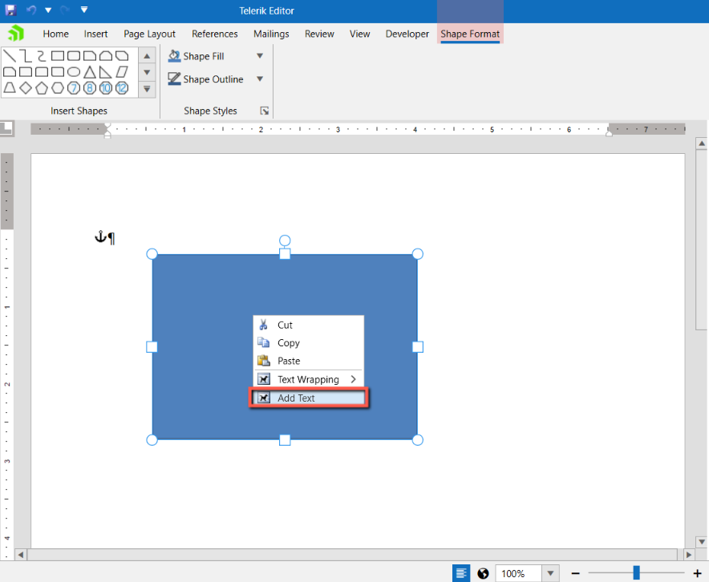

# Shapes Text

The Shapes feature allows you to easily insert shapes like circles, boxes, arrows, and many others directly in your documents. Since R3 2021 you can add styled text to each shape. 

>Currently, RadRichTextBox supports the import and export of shapes from and to Office Open XML (DOCX). When exporting to PDF, the shapes are converted to images. When exporting to other formats the shapes will be lost.

## Adding Text to Shapes via the UI

You can add text to a shape either by directly typing when the shape is selected or using the context menu item. 



Once the shape is inserted, you can change various properties from the format shape pane.


## Manipulating Shapes in Code

There are several methods that allow you to change the properties of a shape. 

|Method|Description|
|---|---|
|ChangeShapeTextFill(ShapeInline shape, IShapeFill fill)|Changes the fill of a shape's text.|
| ChangeShapeTextOutlineFill(ShapeInline shape, IShapeOutlineFill fill)|Changes the fill of a shape's text outline.|
|ChangeShapeTextOutlineDash(ShapeInline shape, LineDashType dash)|Changes the dash of a shape's text outline dash.|
|ChangeShapeTextOutlineWidth(ShapeInline shape, double width)|Changes the width of a shape's outline width.|
| ChangeShapeTextVerticalAlignment(ShapeInline shape, RadVerticalAlignment alignment) | Changes the vertical alignment of a shape text box element. |
| ChangeShapeTextLeftMargin(ShapeInline shape, double margin) | Changes the left margin (inset) of the shape's text box element. |
| ChangeShapeTextRightMargin(ShapeInline shape, double margin) | Changes the right margin (inset) of the shape's text box element. |
| ChangeShapeTextTopMargin(ShapeInline shape, double margin) | Changes the top margin (inset) of the shape's text box element. |
| ChangeShapeTextBottomMargin(ShapeInline shape, double margin) | Changes the bottom margin (inset) of the shape's text box element. |
| ChangeShapeTextRotation(ShapeInline shape, TextRotation rotation) | Changes the rotation angle of the shape's text box element. |
| ChangeRotateTextWithShape(ShapeInline shape, bool shouldRotate) | Changes a value that indicates whether shape's text box element will rotate when the shape is rotated. |
| ChangeShapeTextWrap(ShapeInline shape, bool shouldWrap) | Changes a value that indicates whether shape's text box element should wrap text vertically. |
| ChangeShapeAutoFitToText(ShapeInline shape, bool shouldAutoFit) | Changes a value that indicates whether the parent shape should be horizontally resized in accordance to the text box element's width. |
| AddShapeTextBox(ShapeInline shape) | Initializes a text box element for a shape that does not have any. |


#### [C#] Example 1: Insert and modify shape with text

```C#

    RadDocumentEditor editor = new RadDocumentEditor(this.radRichTextBox.Document);
    editor.InsertShape(ShapeType.Cube, new Size(100, 100));

    ShapeInline shape = this.radRichTextBox.Document.EnumerateChildrenOfType<ShapeInline>().First();
    editor.AddShapeTextBox(shape);
    editor.ChangeShapeTextOutlineDash(shape, LineDashType.DashDot);
    editor.ChangeShapeTextOutlineFill(shape, new ShapeSolidFill(Colors.Chocolate));
    editor.ChangeShapeTextOutlineWidth(shape, 3);
    editor.ChangeShapeTextRotation(shape, Telerik.Windows.Documents.DrawingML.Model.TextRotation.Degrees90);

```

# See Also

* [Shapes](())
