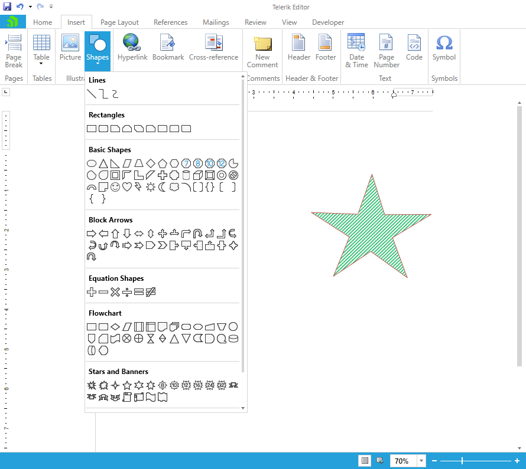
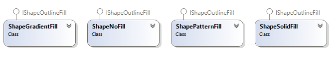

# Shapes

The Shapes feature allows you to easily insert shapes like circles, boxes, arrows, and many others directly in your documents. You can style the inserted shapes by using gradient fills and various patterns outlines, as well as changing the size of the shapes and rotating them. 

>note Currently, RadRichTextBox supports the **import and export** of shapes from and to **Office Open XML (DOCX)**. When exporting to **PDF**, the shapes are converted to images. When exporting to other formats the shapes will be lost.

## Working with Shapes 

RadRichTextBox enables you to insert, edit and delete shapes through its API and UI.



In the Insert tab, you will find a list containing various predefined shapes you can choose between. Once you insert a shape into the document, you can modify its settings and appearance so you can achieve the desired look of your document. Following is a list of the appearance settings you can modify for a shape:

- rotation

    

- position

- size

- fill

- borders

- adjust values (to customize the geometry of the shape)
  
     

## Inserting Shapes in Code

The InsertShape() method of [RadDocumentEditor]() enables you to insert a shape object at the current caret position. The method accepts the shape type and the initial shape size values as parameters.

#### [C#] Example 1: Insert shape in a document

```C#

    RadDocumentEditor editor = new RadDocumentEditor(this.radRichTextBox.Document);
    editor.InsertShape(ShapeType.Heart, new Size(100, 100));
```

## Editing Shapes in Code

The [RadDocumentEditor]() class exposes several methods related to modifying different shape properties. To use them, you should find the shape that you would like to modify.

#### [C#] Example 2: Getting all shapes in a document

```C#

    IEnumerable<ShapeInline> shapes = this.radRichTextBox.Document.EnumerateChildrenOfType<ShapeInline>();
```

Once you have obtained the desired ShapeInline, you can apply the changes to it through the exposed methods:

* **ChangeShapeSize(ShapeInline shape, Size size)**: Changes the size of the specified shape.
* **ChangeShapeRotateAngle(ShapeInline shape, double angle)**: Changes the rotation of the specified shape.
* **AdjustShape(ShapeInline shape, IEnumerable<Guide> updatedGuides)**: Modifies the guides used to draw the shape figure.
* **ChangeShapeOutlineDash(ShapeInline shape, LineDashType dashType)**: Changes the dashing pattern of a shape outline.
* **ChangeShapeOutlineFill(ShapeInline shape, IShapeOutlineFill lineFill)**: Changes the fill of a shape outline.
* **ChangeShapeOutlineWidth(ShapeInline shape, double width)**: Changes the width of the specified shape's outline.
* **ChangeShapeFill(ShapeInline shape, IShapeFill fill)**: Changes the fill of the specified shape.

#### [C#] Example 3: Insert and modify shape

```C#

    RadDocumentEditor editor = new RadDocumentEditor(this.radRichTextBox.Document);
    editor.InsertShape(ShapeType.ArrowPentagon, new Size(100, 100));
    
    ShapeInline shape = this.radRichTextBox.Document.EnumerateChildrenOfType<ShapeInline>().First();
    editor.ChangeShapeOutlineDash(shape, LineDashType.DashDot);
    editor.ChangeShapeOutlineFill(shape, new ShapeSolidFill(Colors.Chocolate));
    editor.ChangeShapeOutlineWidth(shape, 3);
    editor.ChangeShapeRotateAngle(shape, 99);
```


### Shape Fill 

The fill colors related to shapes are defined by two interfaces: **IShapeFill** and **IShapeOutlineFill**. IShapeOutlineFill derives from IShapeFill. All fill colors implementing IShapeOutlineFill can be applied on shapes and on their outlines.

 

#### [C#] Example 4: Create different fill types

```C#

    ShapeNoFill noFill = new ShapeNoFill();  
    ShapeSolidFill solidFill = new ShapeSolidFill(Colors.Green);
    ShapePatternFill patternFill = new ShapePatternFill(Telerik.Windows.Documents.Model.DrawingML.PatternType.Cross, Colors.White, Colors.Green);
    ShapeGradientFill gradientFill = new ShapeGradientFill(new RadialGradientBrush(Colors.White, Colors.Green));
```

## Getting the Content of a Shape

The **ShapeInline** class exposes the **Body** property to enable you access the content of a shape. The property is of type [RadDocument]() and you can perform mulitple operations on it.

#### [C#] Example 5: Get the shape content

```C#

    ShapeInline shape = new ShapeInline();
    RadDocument doc = shape.Body;
```

## See Also
* [RadDocument]()
* [RadDocumentEditor]()
* [Content Controls]()
* [Manipulating Annotations]() 
