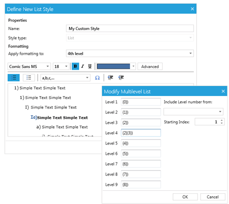
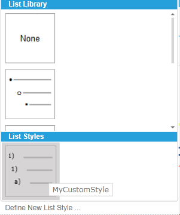
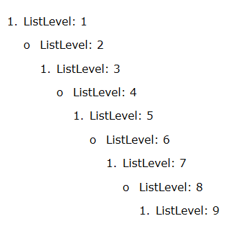

# List Styles

A list represents a set of properties which are used to describe the appearance and behavior of a set of numbered paragraphs. All lists are kept in **ListManager**, accessible through **RadDocument’s ListManager** property.
__RadRichTextBox__ has support for bulleted, numbered and multilevel lists. In addition, you have the ability to create custom list styles and add them to the list styles gallery.

In this article you will find:

* [User Interface](#user-interface)

* [List Style Overview](#list-style-overview)

* [List Level Style Overview](#list-level-style-overview)

* [Document List Overview](#document-list-overview)

* [List Manager Overview](#list-manager-overview)

* [Predefined Lists in RadRichTextBox](#predefined-lists-in-radRichTextBox)

* [Create List Programmatically](#create-list-programmatically)

* [Apply List](#apply-list)

## User Interface

You can specify whether you wish to use bulleted, numbered or some kind of multilevel list from the predefined UI of __RadRichTextBox__:

When using a multilevel list, you can easily change the level using the default key-bindings (Tab for increasing the indent and Shift + Tab for decreasing it).

Through the user interface, you can also create a multilevel list using the *Define New List Style* dialog. Your new style can have up to 9 levels, each of which can be customized. You can choose the font, font size, font weight, color and symbol to be used as the current level's mark. In addition, using the advanced settings you can create a level which includes in itself the symbol from another level.

After defining your new style, it is added to the list gallery and can easily be accessed and used throughout the document.

## List Style Overview

The **ListStyle** class contains the structure corresponding to a list and exposes the following properties: 

* **ID**: The Id of the list.
* **Levels**: [NotifiableCollection](https://docs.telerik.com/devtools/wpf/api/html/t_telerik_windows_documents_utils_notifiablecollection_1.htm) representing the **ListLevelStyle** objects related to the list. Every List can contain up to 9 levels.
* **StyleLink**: Specifies the numbering style associated with the list.
* **IsDefault**: Indicates if the list is registered in the default lists styles and it is [implemented out of the box](#predefined-lists-in-radrichtextbox). Such list won’t be shown in the List Styles Gallery.

## List Level Style Overview

The class, which contains the structure corresponding to the list level is **ListLevelStyle**. The exposed properties specify the appearance and behavior of the associated numbered paragraphs:

* **StartIndex**: Specifies the starting number of a **ListLevelStyle**.
* **NumberingFormat**: Specifies the numbering format of a list level, described in [ListNumberingFormat](https://docs.telerik.com/devtools/wpf/api/html/T_Telerik_Windows_Documents_Lists_ListNumberingFormat.htm) enumeration. It can be a number, bullet, letter, etc. The default value is **ListNumberingFormat.Bullet**.
* **LevelText**: Specifies the number format string for a list level.
* **StyleName**: Specifies the name of the [paragraph style](http://localhost/devtools/wpf/controls/radrichtextbox/features/styles/styles#paragraph-style) associated with the list level. **ListLevelStyle** can be associated only with paragraph style.
* **SpanProperties**: Represent the associated [span properties](https://docs.telerik.com/devtools/wpf/api/html/Properties_T_Telerik_Windows_Documents_Model_Span.htm).
* **FontFamily**: Specifies the font-family for the level text. Its short property from the **SpanProperties** of a list level.
* **FontWeight**: Specifies the font-weight for the level text. Its short property from the **SpanProperties** of a list level.
* **ForeColor**: Specifies the fore-color for the level text. Its short property from the **SpanProperties** of a list level.
* **Indent**: Specifies the left indentation.
* **HangingIndent**: Specifies the hanging indent.

## Document List Overview

[DocumentList](https://docs.telerik.com/devtools/wpf/api/html/T_Telerik_Windows_Documents_Lists_DocumentList.htm) is the connection point between the paragraphs and a list style inside a document. Its Id is referenced in the [Paragraph](https://docs.telerik.com/devtools/wpf/api/html/T_Telerik_Windows_Documents_Model_Paragraph.htm).ListId property. Additionally, the class provides functionality to easily associate a paragraph with list style.

* **ID**: The Id of the document list.
* **StyleId**: Represents the Id of the **ListStyle**.
* **Style**: Specifies the **ListStyle**.
* **Document**: Reference to the owner [RadDocument](https://docs.telerik.com/devtools/wpf/api/html/t_telerik_windows_documents_model_raddocument.htm).

## List Manager Overview

[ListManager](https://docs.telerik.com/devtools/wpf/api/html/T_Telerik_Windows_Documents_Lists_ListManager.htm) is the structure holding all ListStyles and DocumentLists. Can be accessed through **RadDocument’s ListManager** property.

## Predefined Lists in RadRichTextBox

There are some predefined lists in RadRichTextBox:

* None
* Bulleted
* Numbered
* Numbered 
* Parenthesis
* Numbered Hierarchical. 

They can be accessed through the [DefaultListStyles](https://docs.telerik.com/devtools/wpf/api/html/T_Telerik_Windows_Documents_Lists_DefaultListStyles.htm) static class. 

## Create List Programmatically 

In this section you will find how to create a list, customize its properties and insert it in a document. 

Step 1: Define new instance of RadDocument and add Section in it:

#### __C#__

{{region radrichtextbox-features-lists_0}}
	RadDocument document = new RadDocument();
	Section section = new Section();
	document.Sections.Add(section);
{{endregion}}

#### __VB.NET__

{{region radrichtextbox-features-lists_1}}
	Dim document = New RadDocument();
	Dim section = New Section()
	document.Sections.Add(section)
{{endregion}}

Step 2: Create list

#### __C#__

{{region radrichtextbox-features-lists_2}}
	ListStyle list = new ListStyle();
{{endregion}}

#### __VB.NET__

{{region radrichtextbox-features-lists_3}}
	Dim list = new ListStyle()
{{endregion}}

Step 3: Add the list levels to the list

Initially, the list doesn’t have any associated list levels. The possible list levels in a list are 9.

#### __C#__

{{region radrichtextbox-features-lists_4}}
	for (int levelIndex = 0; levelIndex < 9; levelIndex++)
	{
	    ListLevelStyle listLevel = new ListLevelStyle();
	    list.Levels.Add(listLevel);
	}
{{endregion}}

#### __VB.NET__

{{region radrichtextbox-features-lists_5}}
	For i As Integer = 0 To 8
	    Dim listLevel = New ListLevelStyle()
	    list.Levels.Add(listLevel)
	Next
{{endregion}}

Step 4: Customize list level. 

#### __C#__

{{region radrichtextbox-features-lists_6}}
	for (int levelIndex = 0; levelIndex < 9; levelIndex++)
	{
	    bool isEven = (levelIndex % 2) == 0;
	    list.Levels[levelIndex].StartingIndex = 1;
	    list.Levels[levelIndex].NumberingFormat = ListNumberingFormat.Decimal;
	    list.Levels[levelIndex].LevelText = isEven ? "{" + levelIndex + "}." : "o";
	    list.Levels[levelIndex].Indent = 48 + (levelIndex * 24);
	}
{{endregion}}

#### __VB.NET__

{{region radrichtextbox-features-lists_7}}
	For levelIndex As Integer = 0 To 8
	    Dim isEven As Boolean = (levelIndex Mod 2) = 0
	    list.Levels(levelIndex).StartingIndex = 1
	    list.Levels(levelIndex).NumberingFormat = ListNumberingFormat.Decimal
	    list.Levels(levelIndex).LevelText = If(isEven = True, "{" + levelIndex.ToString() + "}.", "o")
	    list.Levels(levelIndex).Indent = 48 + (levelIndex * 24)
	Next
{{endregion}}

>Note: It is mandatory the level text to be in the format “{levelIndex}”, where levelIndex is the list level index. Otherwise, the level text may not be shown correctly.

Step 5: Add the list to the document

You can insert two types of lists: Simple and Custom. Creating Custom lists,will allow you to [use the UI to modify the list](#user-interface), while the Simple  type does not allow this. 

Here is how to add simple list to the document:

#### __C#__

{{region radrichtextbox-features-lists_8}}
	DocumentList documentList = new DocumentList(list, document);
{{endregion}}

#### __VB.NET__

{{region radrichtextbox-features-lists_9}}
	Dim documentList = New DocumentList(list, document)
{{endregion}}

And how to add custom list:

#### __C#__

{{region radrichtextbox-features-lists_10}}
	ListStyle newList = document.AddCustomListStyle(list);
	DocumentList documentList = new DocumentList(newList, document);
{{endregion}}

#### __VB.NET__

{{region radrichtextbox-features-lists_11}}
    Dim newList = document.AddCustomListStyle(list)
    Dim documentList = New DocumentList(newList, document)
{{endregion}}

## Apply List

Once the list is created it can be applied over set of paragraphs by setting the ListId property of the paragraph to the document lists’ id.

Approach 1: Apply the required paragraph properties on your own.

#### __C#__

{{region radrichtextbox-features-lists_12}}
    for (int levelIndex = 0; levelIndex < list.Levels.Count; levelIndex++)
    {
        Paragraph paragraph = new Paragraph();
        document.Sections.First.Blocks.Add(paragraph);
        paragraph.Inlines.Add(new Span(string.Format("ListLevel: {0}", levelIndex + 1)));
        paragraph.ListId = documentList.ID;
        paragraph.ListLevel = levelIndex;
    }
{{endregion}}

#### __VB.NET__

{{region radrichtextbox-features-lists_13}}
	For levelIndex As Integer = 0 To (list.Levels.Count - 1)
	    Dim paragraph = New Paragraph()
	    section.Blocks.Add(paragraph)
	    paragraph.Inlines.Add(New Span(String.Format("ListLevel: {0}", levelIndex + 1)))
	    paragraph.ListId = documentList.ID
	    paragraph.ListLevel = levelIndex
	Next
{{endregion}}

Approach 2: Pass the level Index and the paragraph to the DocumentList.AddParagraph method. By doing that the document list will automatically apply the required properties over the paragraph.

#### __C#__

{{region radrichtextbox-features-lists_14}}
	for (int levelIndex = 0; levelIndex < list.Levels.Count; levelIndex++)
	{
	    Paragraph paragraph = new Paragraph();
	    document.Sections.First.Blocks.Add(paragraph);
	    paragraph.Inlines.Add(new Span(string.Format("ListLevel: {0}", levelIndex + 1)));
	    documentList.AddParagraph(paragraph, levelIndex);
	}
{{endregion}}

#### __VB.NET__

{{region radrichtextbox-features-lists_15}}
	For levelIndex As Integer = 0 To list.Levels.Count
	    Dim paragraph = New Paragraph()
	    section.Blocks.Add(paragraph)
	    paragraph.Inlines.Add(New Span(String.Format("ListLevel: {0}", levelIndex + 1)))
	    documentList.AddParagraph(paragraph, levelIndex)
	Next
{{endregion}}

Figure 1: The result of the created list.

## See Also

 * [Formatting API]()
