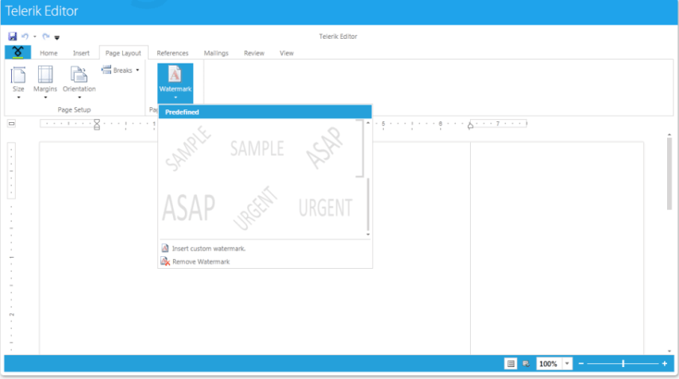
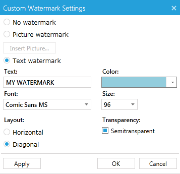

# Watermark


Watermarks are text or pictures that appear behind document text. They often add interest or identify the document status. You can see watermarks in Paged layout mode; they can be printed and exported to all rich-text formats, except HTML.
      

>tipMore on the specifics of the format providers you can find [here]().
        

* [Using UI](#using-ui)

* [Manipulating Watermarks Programatically](#manipulating-watermarks-programatically)

## Using UI

__RadRichTextBox__'s predefined UI – __RadRichTextBoxRibbonUI__ provides an easy way to insert watermarks. You can choose from several predefined watermarks:



Alternatively, you can create your custom watermark from text or picture through the *Insert custom watermark* option.



## Manipulating Watermarks Programmatically

There are two types of watermarks - text and image. Both of them are shown behind the contents of the documents - text, images, tables, etc. and are applied on a per document basis.

There is also a set of predefined textual watermarks - the most commonly used ones like ASAP, Urgent, Confidential, etc., that can be easily set in the following way:


```C#
	this.editor.SetWatermark(Telerik.Windows.Documents.Model.PredefinedWatermarkType.Confidential);
```


You can create custom watermarks using the __WatermarkTextSettings__ and __WatermarkImageSettings__ classes and the respective methods of __RadRichTextBox__ - __SetWatermarkText()__ and __SetWatermarkImage()__.
        

The following example demonstrates how to crate a text watermark and apply it to the document in the editor:


```C#
	WatermarkTextSettings textSettings = new WatermarkTextSettings();
	textSettings.Text = "Purple Watermark";
	textSettings.RotateAngle = 30;
	textSettings.Opacity = 1;
	textSettings.ForegroundColor = Colors.Purple;

	this.editor.SetWatermarkText(textSettings);
```


And this is how you create an image watermark and apply it:


```C#
	WatermarkImageSettings imageSettings = new WatermarkImageSettings();
	imageSettings.UriSource = uri; 
	imageSettings.Size = new Size(500, 665);

	this.editor.SetWatermarkImage(imageSettings);
```



>tipYou can download a runnable project of the previous example from our online SDK repository: [Watermark SDK example](https://github.com/telerik/xaml-sdk/tree/master/RichTextBox/Watermark).
          

## See Also

 * [RadRichTextBoxRibbonUI]()

 * [Formatting API]()
