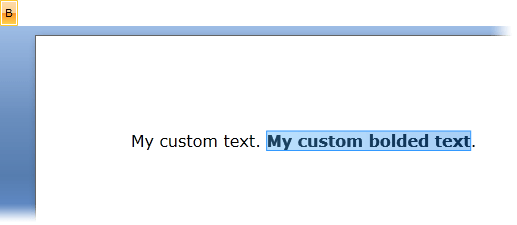

# Formatting API


If you want to format the content of __RadRichTextBox__ at run time, you have to use the API exposed by __RadRichTextBox__. This is essential, as the main purpose of __RadRichTextBox__ is to allow the users to format their input via UI. The UI should call the respective API methods of the control.
      

>To learn more about the methods exposed by the API take a look at [this topic](http://www.telerik.com/help/wpf/allmembers_t_telerik_windows_controls_radrichtextbox.html)[this topic](http://www.telerik.com/help/silverlight/allmembers_t_telerik_windows_controls_radrichtextbox.html).
        

## Changing the text formatting

The __RadRichTextBox__ exposes methods that change the style of the selected text or the paragraph. When a method is called, the respective style is applied to the selected text. If there is no selection available, the style is applied to the word in which the caret is located.
        

>tipRadRichTextBox provides a fully functional formatting UI out of the box. To learn more about it read the [RadRichTextBoxRibbonUI]() topic.
          

Here is an example of a toggle button that upon checking should make the selection or the current word bold. In the handler of the __Click__ event of the __RadToggleButton__, the __ToggleBold()__ method of __RadRichTextBox__ is called.
        

#### __XAML__

```XAML
    <StackPanel>
        <telerik:RadToggleButton x:Name="BoldButton" Content="B" Padding="5" HorizontalAlignment="Left" Click="BoldButton_Click" />
        <telerik:RadRichTextBox x:Name="radRichTextBox" LayoutMode="Paged" Height="200" />
    </StackPanel>
```


#### __C#__

```C#
    private void BoldButton_Click(object sender, RoutedEventArgs e)
    {
        this.radRichTextBox.ToggleBold();
    }
```


#### __VB.NET__

```VB.NET
    Private Sub BoldButton_Click(sender As Object, e As RoutedEventArgs)
        Me.radRichTextBox.ToggleBold()
    End Sub
```



## Using the active editor

__RadRichTextBox__ supports headers and footers. They are represented through separate instances of  __RadRichTextBox__. When a document has headers and footers you can use the __ActiveDocumentEditor__ property           of __RadRichTextBox__ to get the editor instance where the caret is currently situated.
        

>tipYou can find more about the Header and Footer functionality in [this article]().
          

The following example inserts the word "text" at the CaretPosition.

#### __C#__

```C#
    this.radRichTextBox.ActiveDocumentEditor.Insert("text");
```


#### __VB.NET__

```VB.NET
	Me.radRichTextBox.ActiveDocumentEditor.Insert("text")
```


## Creating a DocumentFragment

One of the common uses of the API is creating and inserting a __DocumentFragment__. Currently you can create a fragment in two ways:
        

* through __DocumentFragment__'s constructor;
            

* through selection.
            

Both approaches can be used to insert content at the caret position with the __InsertFragment__ method:
        

#### __C#__

```C#
    this.radRichTextBox.InsertFragment(fragment);
```

### Using the constructor of DocumentFragment

If you create a fragment in this way, it will end with a new paragraph. This is convenient when you want to separate the inserted fragment and end it with a new line. Furthermore, in this way if the last paragraph is in a list, it will appear properly in the new document.

#### __C#__

```C#
    DocumentFragment fragmentFromDocument = new DocumentFragment(radDocument);
```


#### __VB.NET__

```VB.NET
    Dim fragment As New DocumentFragment(radDocument)
```


This is also the suggested approach when merging several documents into one.

### Using the selection

If you choose to use the document selection when creating a __DocumentFragment__, there will be no additional paragraph after the fragment.
            

#### __C#__

```C#
    DocumentFragment fragmentFromSelection = radDocument.Selection.CopySelectedDocumentElements();
```


#### __VB.NET__

```VB.NET
    Dim fragment As DocumentFragment = document.Selection.CopySelectedDocumentElements()
```


>For merging RadDocument instances, you can use the [RadDocumentMerger class]().

## See Also

 * [Import/Export]()
 * [RadDocumentMerger]()
