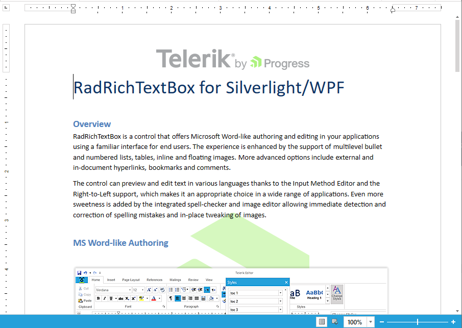
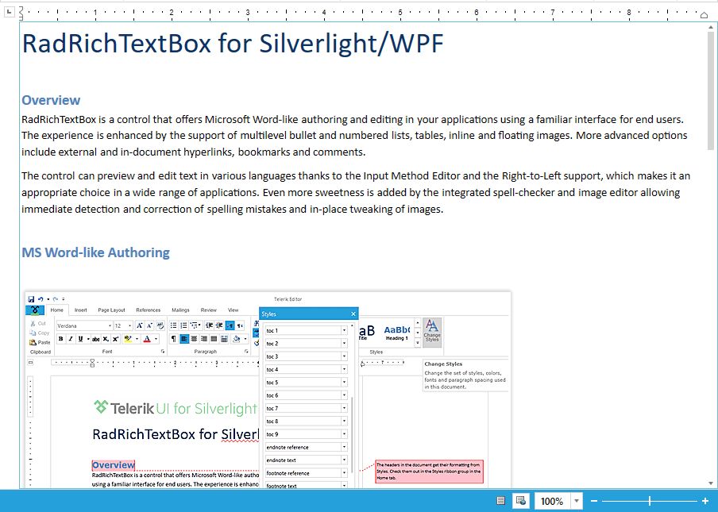
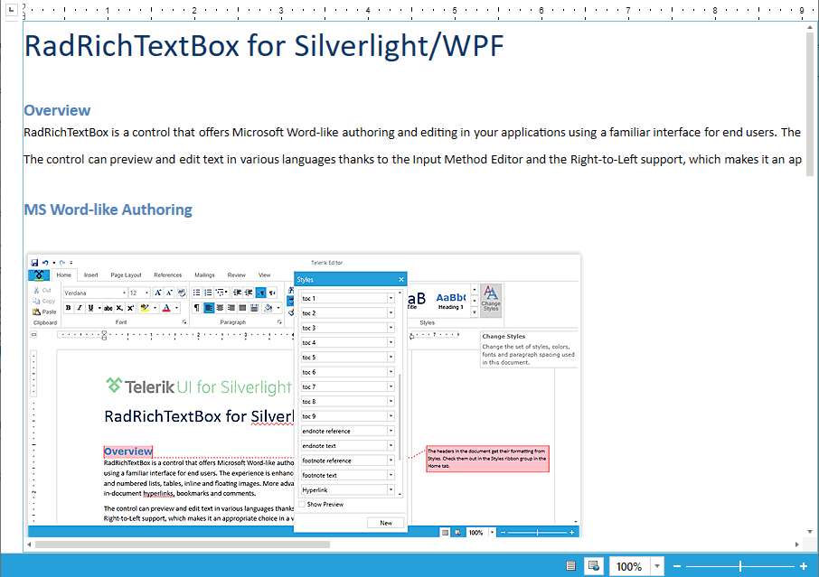

# Layout Modes


The __RadRichTextBox__ allows you to choose between several layout modes.


* [Paged](#paged)

* [Flow](#flow)

* [FlowNoWrap](#flownowrap)

### Paged

When using the paged mode, the content of the edited document is divided into pages. The size and layout of each page are defined by the __DefaultPageLayoutSettings__ property of [RadDocument]() and specifically - the __Width__ and __Height__ properties of the __PageLayoutSettings__ object.

Next, the margins of the control in a page are specified by the __PageMargin__ property of each [Section]().

In __Paged__ mode, resizing a __RadRichTextBox__ will not affect the document layout but scroll bars will appear if the document does not fit in the view.



### Flow

In __Flow__ layout mode, the document content is not divided into pages. Instead the whole content is displayed as in a TextBox or RichTextBox. This layout option resembles __MS Word’s Web-Layout__ mode. The width of the document is the same as that of the __RadRichTextBox__ and changing the control’s width will also resize the content of the document.



### FlowNoWrap

The __FlowNoWrap__ layout mode is similar to the __Flow__ layout mode, but it doesn't allow the text in the separate paragraphs to get wrapped when the free space gets exceeded. Instead a horizontal scroll bar will appear.



### Change the Layout Mode

#### **[XAML] Example 1: Setting the layout mode**

```XAML
	<telerik:RadRichTextBox x:Name="radRichTextBox" LayoutMode="Paged"/>
```


#### **[C#] Example 1: Setting the layout mode**

```C#
	this.radRichTextBox.LayoutMode = DocumentLayoutMode.Paged;
```


#### **[VB.NET] Example 1: Setting the layout mode**

```VB.NET
	Me.radRichTextBox.LayoutMode = DocumentLayoutMode.Paged
```

## See Also

 * [History]()
