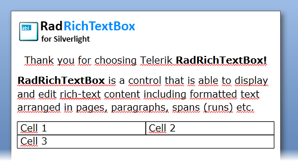

# Working with RadRichTextBox

The __RadRichTextBox__ is a control that allows you to visualize rich text content and allows the user to format it.

>tipFor a quick review of the basics you can take a look at the [Getting Started]() topic. 

This topic will take you through the basic features of the __RadRichTextBox__:

* [Instantiate a RadRichTextBox](#instantiate-a-radrichtextbox)

* [Design-Time Documents](#design-time-documents)

* [RadRichTextBox_API](#radrichtextbox-api)

* [Scrolling](#scrolling)

* [Current Span](#current-span)

## Instantiate a RadRichTextBox

In order to use __RadRichTextBox__in your application you have to add a reference to __Telerik.Windows.Documents__ assembly in your project.

After the reference is available, you can declare a __RadRichTextBox__. Here is an example.

To use the __RadRichTextBox__ in XAML you have to declare the following namespace:

#### __XAML__

{{region radrichtextbox-features-working-with-radrichtextbox_3}}
	        xmlns:telerik="http://schemas.telerik.com/2008/xaml/presentation"
	{{endregion}}

#### __XAML__

{{region radrichtextbox-features-working-with-radrichtextbox_0}}
	        <telerik:RadRichTextBox x:Name="radRichTextBox" />
	{{endregion}}

## Design-Time Documents

You are able to predefine the content of the __RadRichTextBox__ at design time. This means that the __RadRichTextBox__ can be used to display static rich content. Defining such a content can be done via the following UI Elements:

* [Section]()

* [Paragraph]()

* [Span]()

* [InlineImage]()

* [Hyperlink]()

* [Table]()

Here is an example of a text formatted at design time:

>tipTo learn how to make the __RadRichTextBox__ read only, take a look at [this topic]().

#### __XAML__

{{region radrichtextbox-features-working-with-radrichtextbox_1}}
	        <telerik:RadRichTextBox x:Name="radRichTextBox" Width="500" Height="500" CurrentSpanStyleChanged="radRichTextBox_CurrentSpanStyleChanged" Margin="2,0,2,-189" Grid.Row="1">
	            <telerik:RadDocument LayoutMode="Paged">
	                <telerik:Section PageMargin="10, 10, 10, 10">
	                    <telerik:Paragraph>
	                        <telerik:ImageInline Width="236" Height="50" UriSource="/Working-with-RRTB;component/Images/RadRichTextBox.png" />
	                    </telerik:Paragraph>
	                    <telerik:Paragraph TextAlignment="Center">
	                        <telerik:Span Text="Thank you for choosing Telerik" />
	                        <telerik:Span FontWeight="Bold" Text=" RadRichTextBox!" />
	                    </telerik:Paragraph>
	                    <telerik:Paragraph>
	                        <telerik:Span FontWeight="Bold" Text="RadRichTextBox" />
	                        <telerik:Span Text=" is a control that is able to display and edit rich-text content including formatted text arranged in pages, paragraphs, spans (runs) etc." />
	                    </telerik:Paragraph>
	                    <telerik:Table LayoutMode="AutoFit" StyleName="TableGrid">
	                        <telerik:TableRow>
	                            <telerik:TableCell>
	                                <telerik:Paragraph>
	                                    <telerik:Span Text="Cell 1" />
	                                </telerik:Paragraph>
	                            </telerik:TableCell>
	                            <telerik:TableCell>
	                                <telerik:Paragraph>
	                                    <telerik:Span Text="Cell 2" />
	                                </telerik:Paragraph>
	                            </telerik:TableCell>
	                        </telerik:TableRow>
	                        <telerik:TableRow>
	                            <telerik:TableCell ColumnSpan="2">
	                                <telerik:Paragraph>
	                                    <telerik:Span Text="Cell 3" />
	                                </telerik:Paragraph>
	                            </telerik:TableCell>
	                        </telerik:TableRow>
	                    </telerik:Table>
	                    <telerik:Paragraph/>
	                </telerik:Section>
	            </telerik:RadDocument>
	        </telerik:RadRichTextBox>
	{{endregion}}





## RadRichTextBox API

Instead of visualizing a static rich content, you may want to use the __RadRichTextBox__ as an input UI element. In this case, in order to provide the user with the ability to format the inputted content, you have to provide a UI that communicates with the __RadRichTextBox__. For that purpose the __RadRichTextBox__ exposes an __API__, which contains various methods that can apply different formatting to the inputted content. 

To learn more about the __API__ methods read [this topic]().

To see an example of a __RadRichTextBox__ that allows to apply bold, italic and underline formatting, take a look at [this topic](6BBED7E4-2299-44A8-8BEB-76AE0B8F74AC).

## Scrolling

When the available size for the control becomes less than the size of the content, the __RadRichTextBox__ will automatically display horizontal or vertical scrollbars respectively.

## Current Span

The __CurrentEditingStyle__ property returns an instance of the __StyleDefinition__ class, which allows you to get information about the current element. You can combine the usage of this property with the usage of the __CurrentSpanStyleChanged__ event in order to update the UI (if any) when the text style changes.

>tipThe same approach can be used for the __CurrentParagraphStyleChanged__ event.

For example, you have a button that makes the text bold:

#### __XAML__

{{region radrichtextbox-features-working-with-radrichtextbox_2}}
	        <ToggleButton Content="B" x:Name="BoldButton" Click="BoldButton_Click" />
	{{endregion}}

In the event handler for the __CurrentSpanStyleChanged__ you can do the following:

#### __C#__

{{region radrichtextbox-features-working-with-radrichtextbox_3}}
	private void radRichTextBox_CurrentSpanStyleChanged( object sender, EventArgs e )
	{
	    StyleDefinition style = this.radRichTextBox.CurrentEditingStyle;
	    FontWeight fontWeight = style.SpanProperties.FontWeight;
	    this.BoldButton.IsChecked = fontWeight == FontWeights.Bold;
	}
	{{endregion}}

#### __VB.NET__

{{region radrichtextbox-features-working-with-radrichtextbox_4}}
	    Private Sub radRichTextBox_CurrentSpanStyleChanged(sender As Object, e As EventArgs)
	        Dim style As StyleDefinition = Me.radRichTextBox.CurrentEditingStyle
	        Dim fontWeight As FontWeight = style.SpanProperties.FontWeight
	        Me.BoldButton.IsChecked = fontWeight = FontWeights.Bold
	    End Sub
	{{endregion}}

This will keep the button synchronized with the current position of the caret.

# See Also

 * [Import/Export]()>
      

 * [Formatting API]()

 * [Layout Modes]()

 * [History]()
