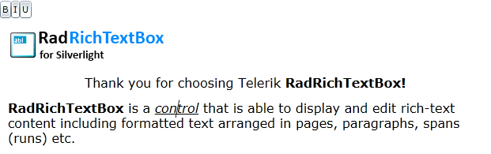
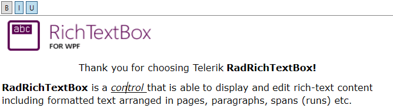

# Formatting via a Sample UI

If you want to allow the user to edit and format the content of __RadRichTextBox__, you have to create UI and use the API exposed by __RadRichTextBox__. The __API__ exposes methods (like __ToggleBold()__, __ToggleItalic()__ etc.) that modify the text in the control when called. **Example 1** shows a sample code that creates UI for making the text bold, italic and underlined.
        

__Example 1: Creating Formatting UI__

```XAML
    <StackPanel Orientation="Horizontal">
        <ToggleButton Content="B"
        x:Name="BoldButton"
        Click="BoldButton_Click" />
        <ToggleButton Content="I"
        x:Name="ItalicButton"
        Click="ItalicButton_Click" />
        <ToggleButton Content="U"
        x:Name="UnderlineButton"
        Click="UnderlineButton_Click" />
    </StackPanel>
```


**Example 2** demonstrates how you can call the corresponding API methods from code-behind.

__Example 2: Using the Formatting API in Code-Behind__

```C#
    private void BoldButton_Click(object sender, RoutedEventArgs e)
    {
        this.radRichTextBox.ToggleBold();
        this.radRichTextBox.Focus(); //return focus to the control
    }
    private void ItalicButton_Click(object sender, RoutedEventArgs e)
    {
        this.radRichTextBox.ToggleItalic();
        this.radRichTextBox.Focus(); //return focus to the control
    }
    private void UnderlineButton_Click(object sender, RoutedEventArgs e)
    {
        this.radRichTextBox.ToggleUnderline();
        this.radRichTextBox.Focus(); //return focus to the control
    }
```
```VB.NET
	Private Sub BoldButton_Click(sender As Object, e As RoutedEventArgs)
	    Me.radRichTextBox.ToggleBold()
	    Me.radRichTextBox.Focus()
	End Sub
	Private Sub ItalicButton_Click(sender As Object, e As RoutedEventArgs)
	    Me.radRichTextBox.ToggleItalic()
	    Me.radRichTextBox.Focus()
	End Sub
	Private Sub UnderlineButton_Click(sender As Object, e As RoutedEventArgs)
	    Me.radRichTextBox.ToggleUnderline()
	    Me.radRichTextBox.Focus()
	End Sub
```


The UI should also respond when the caret is on a document position where the text is modified. For example, the __BoldButton__ should be toggled if the caret is on bold text. This can be done by handling the __ToggleStateChanged__ event as demonstrated in **Example 3**. 
        

__Example 3: Changing the Toggle State of a Button Depending on the Caret Position__

```C#

	    InitializeComponent();
	    this.radRichTextBox.Commands.ToggleBoldCommand.ToggleStateChanged += new EventHandler<Telerik.Windows.Documents.RichTextBoxCommands.StylePropertyChangedEventArgs<bool>>(ToggleCommand_ToggleStateChanged);
	    this.radRichTextBox.Commands.ToggleItalicCommand.ToggleStateChanged += new EventHandler<Telerik.Windows.Documents.RichTextBoxCommands.StylePropertyChangedEventArgs<bool>>(ToggleCommand_ToggleStateChanged);
	    this.radRichTextBox.Commands.ToggleUnderlineCommand.ToggleStateChanged += new EventHandler<Telerik.Windows.Documents.RichTextBoxCommands.StylePropertyChangedEventArgs<bool>>(ToggleCommand_ToggleStateChanged);
	}
	
	void ToggleCommand_ToggleStateChanged(object sender, Telerik.Windows.Documents.RichTextBoxCommands.StylePropertyChangedEventArgs<bool> e)
	{
	    ToggleButton button = sender as ToggleButton;
	    if (button != null)
	    {
	        button.IsChecked = e.NewValue;
	    }
	}
```
```VB.NET
    Public Sub New()
        InitializeComponent()

        Me.radRichTextBox.Commands.ToggleBoldCommand.ToggleStateChanged += New EventHandler(Of Telerik.Windows.Documents.RichTextBoxCommands.StylePropertyChangedEventArgs(Of Boolean))(ToggleBoldCommand_ToggleStateChanged)
        Me.radRichTextBox.Commands.ToggleItalicCommand.ToggleStateChanged += New EventHandler(Of Telerik.Windows.Documents.RichTextBoxCommands.StylePropertyChangedEventArgs(Of Boolean))(ToggleItalicCommand_ToggleStateChanged)
        Me.radRichTextBox.Commands.ToggleUnderlineCommand.ToggleStateChanged += New EventHandler(Of Telerik.Windows.Documents.RichTextBoxCommands.StylePropertyChangedEventArgs(Of Boolean))(ToggleUnderlineCommand_ToggleStateChanged)
    End Sub

    Private Sub ToggleBoldCommand_ToggleStateChanged(sender As Object, e As Telerik.Windows.Documents.RichTextBoxCommands.StylePropertyChangedEventArgs(Of Boolean))
        BoldButton.IsChecked = e.NewValue
    End Sub
```


>You can download a runnable project with the code illustrated in this article from our SDK repository [here](https://github.com/telerik/xaml-sdk/tree/master/RichTextBox/GettingStarted).


#### Figure 1: Changing the Toggle State of a Button Depending on the Caret Position




>tip**RadRichTextBox** comes with a fully functional formatting UI out of the box. You can read more on the following links - [RadRichTextBoxRibbonUI](), [ContextMenu](), [SelectionMiniToolBar]().


 
## See Also

* [Selection Mini Tool Bar]()

* [Context Menu]()
 
* [Formatting API]()

* [RadDocumentEditor]()