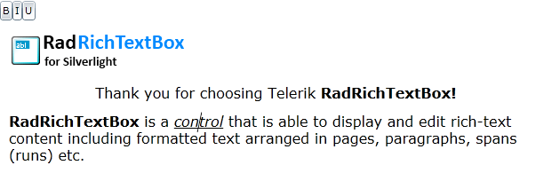
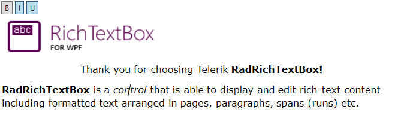

# Formatting via a Sample UI

If you want to allow the user to edit and format the content of __RadRichTextBox__, you have to create UI and use the API exposed by __RadRichTextBox__. The __API__ exposes methods (like __ToggleBold()__, __ToggleItalic()__ etc.) that modify the text in the control when called. **Example 1** shows a sample code that creates UI for making the text bold, italic and underlined.
        

__Example 1: Creating Formatting UI__

<snippet id='radrichtextbox-getting-started-formatting-via-a-sample-ui-block_1-xaml' />

**Example 2** demonstrates how you can call the corresponding API methods from code-behind.

__Example 2: Using the Formatting API in Code-Behind__

<snippet id='radrichtextbox-getting-started-formatting-via-a-sample-ui-block_2-cs' />
<snippet id='radrichtextbox-getting-started-formatting-via-a-sample-ui-block_3-vb' />

The UI should also respond when the caret is on a document position where the text is modified. For example, the __BoldButton__ should be toggled if the caret is on bold text. This can be done by handling the __ToggleStateChanged__ event as demonstrated in **Example 3**. 
        

__Example 3: Changing the Toggle State of a Button Depending on the Caret Position__

<snippet id='radrichtextbox-getting-started-formatting-via-a-sample-ui-block_4-cs' />
<snippet id='radrichtextbox-getting-started-formatting-via-a-sample-ui-block_5-vb' />

>You can download a runnable project with the code illustrated in this article from our SDK repository [here](https://github.com/telerik/xaml-sdk/tree/master/RichTextBox/GettingStarted).

#### Figure 1: Changing the Toggle State of a Button Depending on the Caret Position




>tip**RadRichTextBox** comes with a fully functional formatting UI out of the box. You can read more on the following links - [RadRichTextBoxRibbonUI](), [ContextMenu](), [SelectionMiniToolBar]().

 
## See Also

* [Selection Mini Tool Bar]()

* [Context Menu]()
 
* [Formatting API]()

* [RadDocumentEditor]()