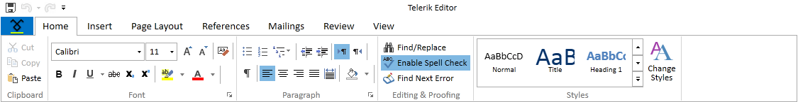

# Getting Started with RichTextBox

`RadRichTextBox` is a control that allows you to display and edit rich text content including sections, paragraphs, spans, italic text, bold text, inline images, tables etc. This topic will help you to quickly get started using the control. It will focus on the following:      

* [Assembly References](#assembly-references)
* [Adding RadRichTextBox to the Project](#adding-radrichtextbox-to-the-project)
* [Using the predefined UI of RadRichTextBox](#using-the-predefined-ui-of-radrichtextbox)
* [Showing a Document in RadRichTextBox](#showing-a-document-in-radrichtextbox)
* [Tables, Track Changes and Document Protection](#tables-track-changes-and-document-protection)
* [RadDocumentEditor](#raddocumenteditor)

## Adding Telerik Assemblies Using NuGet

To use RadRichTextBox when working with NuGet packages in __.NET Framework 4.6.2__, install the `Telerik.Windows.Documents.for.Wpf.Xaml` package. In .NET Framework 4.6.2 you will need to install packages also for the format providers and the RichTextBoxUI component. In .NET 6 these components are merged in the RichTextBox package mentioned below.

To use RadRichTextBox when working with NuGet packages in __.NET 6__ and later, install the `Telerik.Windows.Controls.RichTextBox.for.Wpf.Xaml` package. 

The [package name may vary]() slightly based on the Telerik dlls set - [Xaml or NoXaml]()

Read more about NuGet installation in the [Installing UI for WPF from NuGet Package]() article.

>tip With the 2025 Q1 release, the Telerik UI for WPF has a new licensing mechanism. You can learn more about it [here]().

## Adding Assembly References Manually

, you can add a reference to the following assemblies:

>The references required to use RadRichTextBox in __.NET__ 6 or later projects have been united. Check the [.NET Support]() help topic for the full list of dependencies.

If you are not using NuGet packages, you can add a reference to the required assemblies manually. The minimal set of references you need to have in your application in order to have a RadRichTextBox are as follows:

* __Telerik.Licensing.Runtime__
* __Telerik.Windows.Controls__
* __Telerik.Windows.Data__
* __Telerik.Windows.Documents__ 
* __Telerik.Windows.Documents.Core__
* __System.ComponentModel.Composition__
* __System.Drawing.Common NuGet package__&mdash;Required only for __.NET 6__ and later and only if the Telerik assemblies are referenced manually in the project. In case you install the dlls using NuGet or the Telerik Visual Studio Extension, this package is included automatically.

In order to use the built-in pop-ups (SelectionMiniToolBar, ContextMenu, all dialogs), you should add references to the following assemblies:

* __Telerik.Windows.Controls.RichTextBoxUI__
* __Telerik.Windows.Controls.ImageEditor__
* __Telerik.Windows.Controls.Input__
* __Telerik.Windows.Controls.Navigation__
* __Telerik.Windows.Controls.RibbonView__

For more information on using RadRichTextBox with `RadRichTextBoxRibbonUI`, please refer to [this article]().        

If you are not using the SelectionMiniToolbar, the ContextMenu and RadRichTextBoxRibbonUI, you can omit the last five assemblies.

For import from/ export to different file formats, you would need references to:

* __Telerik.Windows.Documents.FormatProviders.OpenXml__ and __Telerik.Windows.Zip__ for DOCX.
* __Telerik.Windows.Documents.FormatProviders.Html__ for HTML.
* __Telerik.Windows.Documents.FormatProviders.Xaml__ for XAML.
* __Telerik.Windows.Documents.FormatProviders.Rtf__ for RTF.
* __Telerik.Windows.Documents.FormatProviders.Pdf__ and __Telerik.Windows.Zip__ for PDF (export only).

The default en-US dictionary for SpellChecking is located in:

* __Telerik.Windows.Documents.Proofing.Dictionaries.En-US__.

>In order to be able to __copy/paste rich text__ from desktop applications, you have to add references to __Telerik.Windows.Documents.FormatProviders.Rtf__ and __Telerik.Windows.Documents.FormatProviders.Html__.

## Adding RadRichTextBox to the Project

After adding references to the aforementioned assemblies, you can declare RadRichTextBox manually by writing the XAML code as in the following example or add the control by dragging it from the Visual Studio Toolbox and dropping it over the XAML view.        

#### __[XAML] Adding RadRichTextBox in XAML__
{{region radrichtextbox-getting-started_0}}
    <telerik:RadRichTextBox x:Name="radRichTextBox" />
{{endregion}}

When you run the application, you will see an empty RadRichTextBox.

__Empty RadRichTextBox__

>tip RadRichTextBox uses __UI Virtualization__ by creating UI elements only for the parts of the document currently visible in the viewport. For this purpose, the control __should not be measured in infinity__, so avoid placing it in containers that might cause this (e.g. `StackPanel`, `ScrollViewer`).
          
## Using the Predefined UI of RadRichTextBox

In addition to its API, RadRichTextBox has a rich set of commands, exposed through its `Commands` property. In order to use them with a UI element which supports commanding, you have to bind the `Command` property of the element to the respective command of the RadRichTextBox.

>tip To learn more about Commands read [this topic]().       

These commands can also be used with the predefined UI that comes with RadRichTextBox - RadRichTextBoxRibbonUI, which is a ribbon control based on [RadRibbonView](). You can use the predefined and customizable `ContextMenu` and `SelectionMiniToolBar` as well. In order to do so, make sure your project references the following assemblies:        

* __Telerik.Windows.Controls__
* __Telerik.Windows.Controls.Input__
* __Telerik.Windows.Controls.Navigation__
* __Telerik.Windows.Controls.RibbonView__
* __Telerik.Windows.Controls.RichTextBoxUI__

__Predefined RadRichTextBoxRibbonUI__

>tip You can read more about the predefined UI by following these links - [RadRichTextBoxRibbonUI](), [ContextMenu](), [SelectionMiniToolBar]().

## Showing a Document in RadRichTextBox

You can bind a document in XAML or directly set the Document property of RadRichTextBox in code-behind.

### Binding in XAML

With the DataProvider classes you can easily bind RTF, HTML or XAML documents represented as strings to a RadRichTextBox. The DocxDataProvider works with documents represented as a byte array. 

The next example shows the implementation of a sample class that will be later used as data context for RadRichTextBox.

<a name="example3"><a/>
#### __[C#] Sample DataContext class__
{{region radrichtextbox-getting-started_1}}

    public class ExampleDataContext : INotifyPropertyChanged
    {
        private string xamlData;

        public string XamlData
        {
            get
            {
                return this.xamlData;
            }
            set
            {
                if (value != this.xamlData)
                {
                    this.xamlData = value;
                    OnPropertyChanged("XamlData");
                }
            }
        }

        public event PropertyChangedEventHandler PropertyChanged;

        private void OnPropertyChanged(string propertyName)
        {
            if (PropertyChanged != null)
            {
                PropertyChanged(this, new PropertyChangedEventArgs(propertyName));
            }
        }
    }
{{endregion}}

#### __[VB.NET] Sample DataContext class__
{{region radrichtextbox-getting-started_2}}

	Public Class ExampleDataContext
    	Implements INotifyPropertyChanged

    	Private _xamlData As String

    	Public Property XamlData() As String
    	    Get
    	        Return Me._xamlData
    	    End Get
    	    Set(value As String)
    	        If value <> Me._xamlData Then
    	            Me._xamlData = value
    	            OnPropertyChanged("XamlData")
    	        End If
    	    End Set
    	End Property
    	
    	Public Event PropertyChanged As PropertyChangedEventHandler Implements INotifyPropertyChanged.PropertyChanged
	
    	Private Sub OnPropertyChanged(propertyName As String)
    	    RaiseEvent PropertyChanged(Me, New PropertyChangedEventArgs(propertyName))
    	End Sub
	End Class
{{endregion}}

>The ExampleDataContext class implements the `INotifyPropertyChanged` interface and raises the `PropertyChanged` event every time a property value changes, in order to __support two-way binding__.

When you already have prepared the sample data, you can bind it to RadRichTextBox. This is done through the corresponding DataProvider.

The following example shows how to bind the XamlData property from [the above example](#example3) to a XamlDataProvider and a RadRichTextBox.

#### __[XAML] Using a DataProvider__
{{region radrichtextbox-getting-started_3}}
    <Grid>
        <Grid.Resources>
            <local:ExampleDataContext x:Key="ExampleDataContext"/>
        </Grid.Resources>
        <telerik:XamlDataProvider RichTextBox="{Binding ElementName=radRichTextBox}" 
								  DataContext="{StaticResource ExampleDataContext}" 
								  Xaml="{Binding Path=XamlData, Mode=TwoWay}" />
        <telerik:RadRichTextBox Name="radRichTextBox" />
    </Grid>
{{endregion}}

>tip More details on using data providers in RadRichTextBox are available [here]().

>tip You can download the complete runnable project demonstrating __Data Binding__ in RadRichTextBox from our [SDK Repository](https://github.com/telerik/xaml-sdk/tree/master/RichTextBox/DataBinding).

### Setting the Document in Code-Behind

The RadRichTextBox class exposes the `Document` property of type [`RadDocument`]() that allows you to assign a document to the control in code-behind. You can import an existing document and show it in RadRichTextBox using a format provider as the next shows.

#### __[C#] Showing an Existing Document in RadRichTextBox__
{{region radrichtextbox-getting-started_4}}
    RadDocument document;
    Telerik.Windows.Documents.FormatProviders.OpenXml.Docx.DocxFormatProvider provider = new Telerik.Windows.Documents.FormatProviders.OpenXml.Docx.DocxFormatProvider();

    using (Stream stream = Application.GetResourceStream(GetResourceUri("sampleDocument.docx")).Stream)
    {
        document = provider.Import(stream);
    }

    this.radRichTextBox.Document = document;
{{endregion}}

#### __[VB.NET] Showing an Existing Document in RadRichTextBox__
{{region radrichtextbox-getting-started_5}}
	Dim document As RadDocument
	Dim provider As New Telerik.Windows.Documents.FormatProviders.OpenXml.Docx.DocxFormatProvider()

	Using stream As Stream = Application.GetResourceStream(GetResourceUri("sampleDocument.docx")).Stream
		document = provider.Import(stream)
	End Using

	Me.radRichTextBox.Document = document
{{endregion}}

>tip All the supported document formats and the corresponding format providers are described in the [Import/Export section](). 

## Tables, Track Changes and Document Protection

RadRichTextBox comes with many built-in features. Here are some of them:

* You can create, modify and delete tables. For more details you can refer to [this topic]().

* The [Track Changes]() functionality by default is disabled. To enable it, set the `IsTrackChangesEnabled` property to __True__.

* You can enable the [Document Protection]() with the `ProtectDocument()` method.

## RadDocumentEditor

`RadDocument` has an [API](https://docs.telerik.com/devtools/wpf/api/telerik.windows.documents.model.raddocument) of its own, but using it has a set of limitations. First of all, adding and removing Blocks and Inlines from the document can be done only before the document has been measured – a procedure that calculates the desired size of the spans, paragraphs and the document altogether in order to calculate its layout. These operations are usually invoked by the framework when the document in shown in a `RadRichTextBox`. However, some of the methods of RadDocument and RadRichTextBox require that the document be measured before their execution, so if such a method is invoked, the document will be measured. Then, adding Paragraphs, Tables, Sections and Spans will break the structure of the document.

Another issue that the use of the methods of RadDocument causes is due to the fact that they are not registered in the undo/redo stack. Thus, once such a method is used, the history stack is cleared and users will no longer be able to undo and redo their previous changes.
      
### What is RadDocumentEditor

On the other hand, RadRichTextBox provides a much richer [API](https://docs.telerik.com/devtools/wpf/api/telerik.windows.controls.radrichtextbox) for editing the RadDocument instance in it. All respective methods from that API are located in the [IDocumentEditor](https://docs.telerik.com/devtools/wpf/api/telerik.windows.documents.model.idocumenteditor) interface which defines all method that edit fields, annotation ranges, document elements, history, headers and footers and so on and is inherited from RadRichTextBox. In that regard, if you are modifying the document in a class that knows of the existence of RadRichTextBox, you can use the methods of RadRichTextBox in order to manipulate the document in a way transparent to the end user.

The appropriate API, however, should be available in cases when you want to modify a document from code without having a RadRichTextBox. For this purpose, a `RadDocumentEditor` class has been introduced. It also implements the `IDocumentEditor` interface and includes all relevant methods of RadRichTextBox for manipulating the document programmatically.

### How to Use RadDocumentEditor

When a RadDocument instance was for some reason created from code – built using the elements hierarchy or imported, it can be passed to a RadDocumentEditor like this:

#### __[C#] Creating a RadDocumentEditor__
{{region radrichtextbox-getting-started_6}}
	RadDocumentEditor documentEditor = new RadDocumentEditor(document);
{{endregion}}

#### __[VB.NET] Creating a RadDocumentEditor__
{{region radrichtextbox-getting-started_7}}
	Dim documentEditor As New RadDocumentEditor(document)
{{endregion}}

The newly created __documentEditor__ instance now provides all capabilities that a RadRichTextBox provides. Moreover, you can group several methods so that they are added to the Undo/Redo stack as a single item. Click [here](#undogroup) to learn more about this functionality.
    
### RadDocumentEditor Methods

#### [Annotations Related]()

|__Method__|__Description__|
|---|---|
|InsertAnnotationRange(AnnotationRangeStart rangeStart, AnnotationRangeEnd rangeEnd)| Inserts an annotation range over the current selection. If the selection is empty, the annotation range is inserted at the caret position.|
|SplitAnnotationRange(AnnotationRangeStart rangeStart)|Splits an annotation range at the caret position, resulting in two new ranges.|
|SplitAnnotationRange(AnnotationRangeStart rangeStart, DocumentPosition position)|Splits an annotation range at the specified position, resulting in two new ranges.|
|DeleteAnnotationRange(AnnotationRangeStart rangeStart)|Deletes an annotation range.|
|InsertBookmark(string bookmarkName)|Inserts a bookmark around the current selection. If the selection is empty, the bookmark is inserted at the caret position.|
|InsertBookmark(string bookmarkName)|Deletes the bookmark with the specifies name.|
|DeleteBookmark(BookmarkRangeStart bookmarkRangeStart)|Deletes the bookmark with the specifies start range|
|InsertComment(Comment comment)|Inserts a comment around the current selection. If the selection is empty, the comment is inserted at the caret position.|
|DeleteComment()|Deletes the comment at the caret postion.|
|DeleteAllComments()|Deletes all comments in the document.|
|InsertPermissionRange(IEnumerable<PermissionRangeInfo> permissionInfos)|Inserts a new permission range over the current selection. If the selection is empty, the permission range is inserted at the caret position.|
|DeletePermissionRange(PermissionRangeStart permissionRangeStart)|Deletes a permission range.|
|UpdatePermissionRanges(IEnumerable<PermissionRangeInfo> permissionsToAdd, IEnumerable<PermissionRangeInfo> permissionsToRemove)|Updates the permissions inside the current selection.|
|InsertReadOnlyRange()|Inserts a read only range over the current selection. If the selection is empty noting is inserted.|
|DeleteReadOnlyRange()|Deletes the read only range at the current caret position or inside the current selection.|
|DeleteReadOnlyRange(ReadOnlyRangeStart readOnlyRangeStart)|Deletes read only range.|
|InsertFootnote()|Inserts footnote at the current position.|
|InsertFootnote(Note footnote)|Inserts the passed footnode.|
|InsertEndnote()|Inserts endnote at the current position.|
|InsertEndnote(Note endnote)|Inserts the passed endnode.|
|InsertHyperlink(HyperlinkInfo hyperlinkInfo)|Inserts a hyperlink in the document. The hyperlink will be created around the current selection.|
|InsertHyperlink(HyperlinkInfo hyperlinkInfo, string hyperlinkText)|Inserts a hyperlink with spesific text into the document.|
|DeleteHyperlink()|Deletes the current hyperlink.|
|DeleteHyperlink(HyperlinkRangeStart hyperlinkRangeStart)|Deletes a hyperlink with the specifies start element.|
|PreviewFirstMailMergeDataRecord()|Updates all fields in the document with the values evaluated using the first data record.|
|PreviewLastMailMergeDataRecord()|Updates all fields in the document with the values evaluated using the last data record.|
|PreviewPreviousMailMergeDataRecord()|Updates all fields in the document with the values evaluated using the previous data record.|
|PreviewNextMailMergeDataRecord()|Updates all fields in the document with the values evaluated using the next data record.|
|PreviewMailMergeDataRecordAtIndex(int index)| Updates all fields in the document with the values evaluated using a specified data record.|
|MailMergeCurrentRecord()|Creates a new RadDocument" containing the result of merging the template with the values of the current data record.|
|MailMerge(bool startEachRecordOnNewPage)|Produces a mail merged document containing the results for all data records.|
|AcceptRevision(Revision revision)|Accepts a revision.|
|RejectRevision(Revision revision)|Rejects a revision.|
|AcceptAllRevisions()|Accepts all revisions in the document.|
|RejectAllRevisions()|Rejects all revisions in the document.|

#### Editing Related

|Method|Description|
|---|---|
| InsertFragment(DocumentFragment documentFragment) | Inserts a fragment at the current caret position. |
| InsertFragment(DocumentFragment documentFragment, DocumentPosition documentPosition) | Inserts a fragment at a specified position. Document selection should be cleared in advance. |
| Insert(string text) | Inserts text into the document at the current caret position. |
| InsertImage(Stream imageStream, string extension) | Inserts an inline image into the document at the current caret position. |
| InsertInline(Inline inline) | Inserts inline element into the document at the current caret position. |
| InsertInline(Inline inline, DocumentPosition documentPosition) | Inserts inline element into the document at a specified caret position. Document selection should be cleared in advance. |
| InsertParagraph() | Inserts a new paragraph at the current caret position. |
| InsertLine(string text) | Inserts text at the current caret position and adds a new paragraph after it. |
| InsertLineBreak() | Inserts a line break into the document at the current caret position. |
| InsertPageBreak() | Inserts a page break into the document at the current caret position. |
| InsertColumnBreak() | Inserts a column break into the document at the current caret position. |
| InsertNonBreakingSpace() | Inserts a non-breaking space into the document at the current caret position. |
| InsertSectionBreak() | Inserts a section break into the document at the current caret position. |
| InsertSectionBreak(SectionBreakType sectionBreakType) | Inserts a section break of the specified type into the document at the current caret position. |
| InsertCodeBlock(string code, CodeFormattingSettings settings) | Inserts a code block at the caret position. If the caret position is in code block, replaces the current code block. |
| InsertTable(int rows, int columns)|Inserts a new table with spesic row and column count.|
| InsertTable(int rows, int columns, bool shouldInsertParagraphBeforeTable)|Inserts a new table in the document.Optioanly isnerts a new paragrpah before it.|
| InsertTable(Table table)|Inserts a table in the document. The tale instance is copied before insertion.|
| InsertTableColumn()|Inserts a table column in the table which is under the caret position.|
| InsertTableColumnToTheLeft()|Inserts a table column to the left in the table which is under the caret position.|
| InsertTableColumnToTheRight()|Inserts a table column to the right in the table which is under the caret position.|
|InsertTableRow()|Inserts a new table row in the table under the caret position.|
| InsertTableRowAbove() | Inserts a table row above the one under the caret position. |
| InsertTableRowBelow() | Inserts a table row below the one under the caret position. |
| MergeTableCells() | Merges the currently selected table cells into one. |
| UnmergeTableCells() | Splits the currently selected table cell. |
| Delete(bool deletePrevious) | Deletes content from the document. If the Selection is not empty, deletes the selected content. Otherwise, deletes the character next to the CaretPosition. |
| DeleteTable() | Deletes the table the current caret position is in. |
| DeleteTable(Table table) | Deletes a passed table instance. |
| DeleteTableRow(TableRow row) | Deletes a table row. |
| DeleteTableColumn()|Deletes the current table column which is under the caret position.|
| ResizeTableColumn(Table table, int columnIndex, double columnWidth)|Changes the width of a table column. The specified width value will be applied with width type TableWidthUnitType.Fixed"|
| ChangeTableGridColumnWidth(Table table, int columnIndex, TableWidthUnit width)|Changes the width of a table column.|
| DeleteTableRow() | Deletes the table row under the caret position. |
| DeleteCodeBlock(CodeAnnotationRangeStart rangeStart) | Deletes a code block. |
| Copy()|Copies the currently selected document elements into the clipboard.|
| Cut()|Cuts the currently selected document elements into the clipboard.|
| CopyFormatting()|Copies the formatting of the current selection.|
| PasteFormatting()|Pastes the currently copied formatting on the current selection.|
| MoveSelection(DocumentPosition movePosition, bool deleteSelection)|Moves the current selection along with the selected document elements to a specified position.|
|RestartListNumbering()|Creates a new list from the current paragraph. The paragraph must be in a list, otherwise this method does nothing.|
|ContinueListNumbering()|Removes all paragraphs from the current list and continues the first possible list before that paragraph. The paragraph must be in a list and should be first in the list, otherwise this method does nothing.|
|SetListNumbering(int numbersToSkip)|Skips numbers and starts the counting of the current list from the specified value.|

#### [Header Footer Related]()

|Method|Description|
|---|---|
|ChangeSectionHeader(Section section, HeaderFooterType headerType, Header header)|Changes the section header.|
|ChangeSectionFooter(Section section, HeaderFooterType footerType, Footer footer)| Changes the section footer.|
|ChangeSectionHeaderLinkToPrevious(Section section, HeaderFooterType headerType, bool value)|Changes the value indicating whether the section header should be linked to the header of the previous section.|
|ChangeSectionHeaderLinkToPrevious(Section section, HeaderFooterType headerType, bool value)|Changes the value indicating whether the section header should be linked to the header of the previous section.|
|ChangeSectionFooterLinkToPrevious|Changes the value indicating whether the section footer should be linked to the footer of the previous section.|

#### [Fields realated]()

|Method|Description|
|---|---|
|InsertField(Field field)|Inserts a field into the document at the current caret position.|
|InsertField(Field field, FieldDisplayMode displayMode)|Inserts a field into the document at the current caret position in a specified display mode.|
|ToggleFieldCodes(FieldRangeStart fieldStart)|Toggles the display mode of a field.|
|ChangeFieldDisplayMode(FieldRangeStart fieldRangeStart, FieldDisplayMode displayMode)|Changes the display mode of a field.|
|UpdateField(FieldRangeStart fieldStart)| Updates a field. |
| UpdateAllFields() | Updates all fields in the document. |
| UpdateAllFields(FieldDisplayMode displayMode) | Updates all fields in the document and displays them in the specified display mode. |
| ChangeAllFieldsDisplayMode(FieldDisplayMode displayMode) | Changes the display mode of all fields in the document. |
| ChangeBibliographicStyle(BibliographicReferenceStyleBase newBibliographicStyle) | Changes the bibliographic style of all bibliography related fields in the document. |
| InsertCaption(CaptionDefinition captionDefinition, string caption, bool includeLabel, bool insertBelow) | Inserts a caption around the current selection. If the selection is empty, the caption is inserted at the current caret position. |
| UpdateAllCaptions(CaptionDefinition captionDefinition) | Updates all captions in the document related to a caption definition. |
| InsertCrossReferenceToBookmark(string bookmarkName, ReferenceContentType contentType, bool insertAsHyperlink) | Inserts a cross-reference to a bookmark into the document at the current caret position. |
| InsertCrossReferenceToHeading(Paragraph headingParagraph, ReferenceContentType contentType, bool insertAsHyperlink) | Inserts a cross-reference to a paragraph with Heading style into the document at the current caret position. |
| InsertCrossReferenceToCaption(Paragraph captionParagraph, ReferenceContentType contentType, bool insertAsHyperlink) | Inserts a cross-reference to a caption into the document at the current caret position. |



#### [Content Controls Related]()

|Method|Description|
|---|---|
|InsertStructuredDocumentTag()|Inserts a default structured document tag (Content Control). The default type is RichText.|
|InsertStructuredDocumentTag(SdtType insertType)|Inserts a structured document tag (Content Control) of the given type.|
|InsertStructuredDocumentTag(SdtProperties insertProperties)|nserts a structured document tag (Content Control) based on the provided properties.|

#### [Shapes Related]()

|Method|Description|
|---|---|
|ChangeShapeSize(ShapeInline shape, Size size)|Changes the size of a shape.|
|ChangeShapeRotateAngle(ShapeInline shape, double angle)|Changes the rotate angle of a shape.|
|ChangeShapeOutlineDash(ShapeInline shape, LineDashType dashType)|Changes the dashing pattern of a shape outline.|
|InsertShape(ShapeType shapeType, Size size)|Inserts an inline shape into the document at the current caret position.|
|ChangeShapeOutlineFill(ShapeInline shape, IShapeOutlineFill lineFill)|Changes the fill of a shape outline.|
|ChangeShapeFill(ShapeInline shape, IShapeFill fill)|Changes the fill of a shape.|
|ChangeShapeOutlineWidth(ShapeInline shape, double width)|Changes the width a shape outline.|
|ChangeShapeTextVerticalAlignment(ShapeInline shape, RadVerticalAlignment alignment)|Changes the vertical alignment of a shape text box element.|
|ChangeShapeTextLeftMargin(ShapeInline shape, double margin)|Changes the left margin (inset) of the shape's text box element.|
|ChangeShapeTextRightMargin(ShapeInline shape, double margin)|Changes the right margin (inset) of the shape's text box element.|
|ChangeShapeTextTopMargin(ShapeInline shape, double margin)|Changes the top margin (inset) of the shape's text box element.|
|ChangeShapeTextBottomMargin(ShapeInline shape, double margin)|Changes the bottom margin (inset) of the shape's text box element.|
|ChangeShapeTextRotation(ShapeInline shape, TextRotation rotation)|Changes the rotation angle of the shape's text box element.|
|ChangeRotateTextWithShape(ShapeInline shape, bool shouldRotate)|Changes a value that indicates whether shape's text box element will rotate when the shape is rotated.|
|ChangeShapeTextWrap(ShapeInline shape, bool shouldWrap)|Changes a value that indicates whether shape's text box element should wrap text vertically.|
|ChangeShapeAutoFitToText(ShapeInline shape, bool shouldAutoFit)| Changes a value that indicates whether the parent shape should be horizontally resized in accordance to the text box element's width.|
|AddShapeTextBox(ShapeInline shape)|Initializes a text box element for a shape that does not have any.|
|EditShapeTextBox(ShapeInline shape)|Initiates editing of a shape's text box element.|
|InsertTextBox()|Inserts a placeholder text box element to the document. It comes with a default shape layout.|
|ChangeShapeTextOutlineFill(ShapeInline shape, IShapeOutlineFill fill)|Changes the fill of a shape's text outline.|
|ChangeShapeTextFill(ShapeInline shape, IShapeFill fill)|Changes the fill of a shape's text.|
|ChangeShapeTextOutlineDash(ShapeInline shape, LineDashType dash)|Changes the dash of a shape's text outline dash.|
|ChangeShapeTextOutlineWidth(ShapeInline shape, double width)|Changes the width of a shape's outline width.|



#### [Styles Related]()

|Method|Description|
|---|---|
|ChangeStyleName(string styleName)|Applies style with a given name to the selected elements in the document.|
|ChangeStyleName(string styleName, bool useLinkedStyle)|Applies style with a given name to the selected elements in the document.|
|ChangeDocumentElementTag(DocumentElement element, string tag)|Changes the Tag property of a specified DocumentElement.|
|ChangeFontWeight(FontWeight fontWeight)|Changes the font weight of the selected content. If selection is not present, the current editing style is updated.|
|ChangeFontStyle(FontStyle fontStyle)|Changes the font style of the selected content.|
|ChangeStrikethrough(bool isStriketrough)|Changes the strike-through of the selected content.|
|ToggleBold()|Toggles the font weight of the selected content between FontWeights.Bold and FontWeights.Normal.|
|ToggleItalic()|Toggles the font style of the selected content between FontStyles.Italic and FontStyles.Normal.|
|ToggleStrikethrough()|Toggles the strike-through of the selected content.|
|ChangeBaselineAlignment(BaselineAlignment baselineAlignment)|Changes the baseline alignment of the selected content.|
|ChangeFontFamily(FontFamily fontFamily)|Changes the font family of the selected content.|
|ChangeFontSize(double fontSize)|Changes the size of the font of the selected content.|
|DecrementFontSize()|Decrements the size of the font of the selected content with 2 points.|
|IncrementFontSize()|Increments the size of the font of the selected content with 2 points.|
|ChangeSpanStyle(StyleDefinition styleInfo)|Changes the span style of the selected content.|
|ChangeForeColor(Color color)|Changes the fore color of the selected content.|
|ChangeHighlightColor(Color color)|Changes the highlight color of the selected content.|
|ChangeUnderlineColor(Color color)|Changes the underline color of the selected content.|
|ChangeUnderlineDecoration(IUnderlineUIDecorationProvider decoration)|Changes the underline decoration of the selected content.|
|ClearFormatting()|Clears the character formatting of the selected content.|
|ChangeImageSize(ImageInline image, Size size)|Changes the size of an image.|
|ChangeImageRotateAngle(ImageInline image, double angle) | Changes the rotate angle of an image. |
|ChangeParagraphStyle(StyleDefinition styleInfo) | Changes the paragraph style of the selected content. |
|ChangeParagraphListStyle(ListStyle style, IEnumerable<Paragraph> paragraphs) | Changes the list style of the specified paragraphs. |
|ChangeParagraphListStyle(ListStyle style) | Changes the paragraph list style of the selected paragraphs. |
|ChangeParagraphTextAlignment(RadTextAlignment alignment) | Changes the text alignment of the selected paragraphs. |
|ChangeParagraphBackground(Color color) | Changes the background of the selected paragraphs. |
|ChangeParagraphFlowDirection(FlowDirection flowDirection) | Changes the flow direction of the selected paragraphs. |
|ChangeParagraphLineSpacing(double lineSpacing) | Changes the line spacing of the selected paragraphs. |
|ChangeParagraphLineSpacingType(LineSpacingType lineSpacingType) | Changes the type of the line spacing of the selected paragraphs. |
|ChangeParagraphLineSpacing(double lineSpacing, LineSpacingType lineSpacingType) | Changes the line spacing of the selected paragraphs. |
|IncreaseLeftIndent() | Increases the left indent of the selected paragraphs. The default step used for indentation is 24. |
|DecreaseLeftIndent() | Decreases the left indent of the selected paragraphs. The default step used for indentation is 24. |
|IncrementParagraphLeftIndent()|Increments the left indent of the selected paragraphs. The default step used for indentation is 24.|
|DecrementParagraphLeftIndent()|Decrements the left indent of the selected paragraphs. The default step used for indentation is 24.|
|ChangeParagraphLeftIndent(double leftIndent)|Changes the left indent of the selected paragraphs.|
|ChangeParagraphRightIndent(double rightIndent)|Changes the right indent of the selected paragraphs.|
|ChangeParagraphFirstLineIndent(double firstLineIndent)|Changes the first line indent of the selected paragraphs.|
|ChangeParagraphSpacingBefore(double spacingBefore)|Changes the spacing before of the selected paragraphs.|
|ChangeParagraphAutomaticSpacingBefore(bool value)|Changes the automatic spacing before of the selected paragraphs.|
|ChangeParagraphSpacingAfter(double spacingAfter)|Changes the spacing after of the selected paragraphs.|
|ChangeParagraphAutomaticSpacingAfter(bool value)|Changes the automatic spacing after of the selected paragraphs.|
|ChangeParagraphListLevel(int listLevel)|Changes the list level of the selected paragraphs.|
|IncrementParagraphListLevel(int value)|Increments the paragraph list level of the selected paragraphs.|
|ReplaceTabStop(TabStop oldTabStop, TabStop newTabStop)|Replaces a tab stop inside the selected paragraphs.|
|AddTabStop(TabStop tabStop)|Adds a tab stop to the current paragraph.|
|AddTabStopRange(IEnumerable<TabStop> tabStops)|Adds a tab stop range to the current paragraph.|
|RemoveTabStop(TabStop tabStop)|Removes a tab stop from the selected paragraphs.|
|RemoveTabStopRange(IEnumerable<TabStop> tabStops)|Removes a collection of tab stops in the selected paragraphs.|
|ClearTabStops()|Clears the tab stops inside the selected paragraphs.|
|ClearParagraphFormatting()|Clears the paragraph formatting of the selected content.|
|ClearAllFormatting()|Clears all the formatting (character and paragraph) from the selected content.|
|ChangeParagraphIsLineBreakingRuleEnabled(bool value)|Changes the Paragraph.IsLineBreakingRuleEnabled property. This property indicates whether East Asian typography rules will be applied to determine which characters may begin and end each line.|
|ChangeTableLayoutMode(Table table, TableLayoutMode tableLayoutMode)|Changes the layout mode of the selected tables.|
|ChangeTableDefaultCellPadding(Padding padding)|Changes the default cell padding of the selected tables.|
|ChangeTableFlowDirection(FlowDirection flowDirection)|Changes the flow direction of the selected tables.|
|ChangeTableIndent(double indent)|Changes the indent of the selected tables.|
|ChangeTableHorizontalAlignment(RadHorizontalAlignment alignment)|Changes the horizontal alignment of the selected tables.|
|ChangeTablePreferredWidth(TableWidthUnit tableWidth)|Changes the preferred width of the selected tables.|
|ChangeTableBorders(TableBorders tableBorders)|Changes the borders of the selected tables.|
|ChangeTableCellSpacing(double cellSpacing)|Changes the cell spacing of the selected tables.|
|ChangeTableLook(TableLook tableLook)|Changes the look of the selected tables.|
|ChangeTableRowHeight(TableRow tableRow, double height)|Changes the height of a table row.|
|ChangeTableRowRepeatOnEveryPage(TableRow tableRow)|Depending on the current value, enables or disables the repetition of a table row on every page.|
|ChangeTableCellBackground(Color color)|Changes the background of the selected table cells.|
|ChangeTableCellBorders(Border border)|Changes the borders of the selected table cells.|
|ChangeTableCellBorders(TableCellBorders tableCellBorders)|Changes the borders of the selected table cells.|
|ChangeTableCellContentAlignment(RadTextAlignment textAlignment, RadVerticalAlignment verticalAlignment)|Changes the content alignment of the selected table cells.|
|hangeTableCellVerticalContentAlignment(RadVerticalAlignment verticalAlignment)|Changes the vertical content alignment of the selected table cells.|
|ChangeTableCellHorizontalContentAlignment(RadTextAlignment textAlignment)|Changes the horizontal content alignment of the selected table cells.|
|ChangeTableCellPadding(Padding padding)|Changes the padding of the selected table cells.|
|ChangeSectionActualPageMargin(Padding sectionMargin)|Changes the page margin of the selected sections respecting their current orientation.|
|ChangeSectionPageMargin(Padding sectionMargin)|Changes the page margin of the selected sections.|
|ChangeSectionPageOrientation(PageOrientation sectionPageOrientation)|Changes the page orientation of the selected sections.|
|ChangeSectionPageSize(Size newSize)|Changes the page size of the selected sections.|
|ChangeDifferentFirstPageHeaderFooter(bool value)|Sets a value determining whether the headers and footers of the first page in the selected sections are different than the ones of the other pages.|
|ChangeSectionHeaderTopMargin(int sectionHeaderTopMargin)|Changes the header top margin of the selected sections.|
|ChangeSectionFooterBottomMargin(int sectionFooterBottomMargin)|Changes the footer bottom margin of the selected sections.|
|ChangeSectionFootnotesNumberingFormat(ListNumberingFormat numberingFormat)|Changes the numbering format of the footnotes in the selected sections.|
|ChangeSectionFootnotesFirstNumber(int firstNumber)|Changes the first number of the footnotes in the selected sections.|
|ChangeSectionFootnotesNumberingRestartType(NumberingRestartType numberingRestartType)|Changes the type of numbering restart of the footnotes in the selected sections.|
|ChangeSectionEndnotesNumberingFormat(ListNumberingFormat numberingFormat)|Changes the numbering format of the endnotes in the selected sections.|
|ChangeSectionEndnotesFirstNumber(int firstNumber)|Changes the first number of the endnotes in the selected sections.|
|ChangeSectionEndnotesNumberingRestartType(NumberingRestartType numberingRestartType)|Changes the type of numbering restart of the endnotes in the selected sections.|
|SetWatermark(PredefinedWatermarkType predefinedType)|Sets a predefined watermark to the selected sections.|
|SetWatermark(DocumentWatermarkSettings watermarkSettings)|Sets a watermark to the selected sections.|
|ChangeSectionFirstPageNumber(int? firstPageNumber)|Changes the first page number of the selected sections.|
|ChangeSectionColumns(SectionColumnCollection sectionColumns)|Changes the section columns for the selected sections.|
|ChangeSectionColumns(SectionColumnsLayout sectionColumnsLayout)|Changes the section columns for a given collection of section elements.|
|ChangeDifferentOddAndEvenPagesHeaderFooter(bool value) | Changes the value determining whether the sections should have different odd and even pages header/footer. |
|ChangeDocumentFootnotesNumberingFormat(ListNumberingFormat numberingFormat) | Changes the numbering format of the footnotes in the document. |
|ChangeDocumentFootnotesFirstNumber(int firstNumber) | Changes the first number of the footnotes in the document. |
|ChangeDocumentFootnotesNumberingRestartType(NumberingRestartType numberingRestartType)|Changes the type of numbering restart of the endnotes in the document.|
|ChangeDocumentFootnotesPosition(FootnotesPosition footnotesPosition)|Changes the position of the footnotes in the document.|
|ChangeDocumentEndnotesNumberingFormat(ListNumberingFormat numberingFormat)|Changes the numbering format of the endnotes in the document.|
|ChangeDocumentEndnotesFirstNumber(int firstNumber)|Changes the first number of the endnotes in the document.|
|ChangeDocumentEndnotesNumberingRestartType(NumberingRestartType numberingRestartType)|Changes the type of numbering restart of the endnotes in the document.|
|ChangeDocumentEndnotesPosition(EndnotesPosition endnotesPosition)|Changes the position of the endnotes in the document.|
|ChangeDocumentDefaultTabWidth(double tabWidth)|Changes default tab stop width for the document.|
|ChangeDocumentIsStrictLineBreakingRuleEnabled(bool value)|Sets a value determining whether the strict line breaking rule will be applied to Japanese text in this document.|
|ChangeDocumentNoLineBreaksBeforeRule(LineBreakingRule lineBreakingCharacterRule)| Sets a rule determining which characters cannot start a line in East-Asian languages.|
|ChangeDocumentNoLineBreaksAfterRule(LineBreakingRule lineBreakingCharacterRule)|Sets a rule determining which characters cannot end a line in East-Asian languages.|
|ChangeDocumentLineBreakingRuleLanguage(LineBreakingRuleLanguage lineBreakingRuleLanguage)|Sets the language whose rules should be used for line breaking in the paragraphs.|

## See Also
 * [Document Elements]()
 * [Import/Export]()
 * [Events]()
 * [Styles and Templates]()
 * [History]()
 * [Using RadRichTextBox's formatting API ]()
 * [Merge Documents]()
