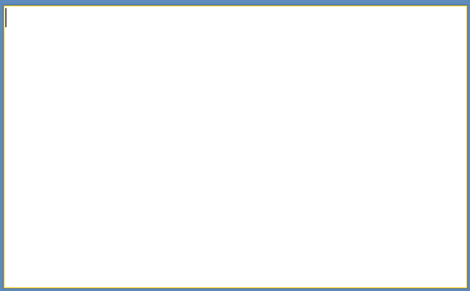

# Getting Started

__RadRichTextBox__ is a control that allows you to display and edit rich text content including sections, paragraphs, spans, italic text, bold text, inline images, tables etc. This topic will help you to quickly get started using the control. It will focus on the following:
      

* [Assembly References](#assembly-references)

* [Creating a RadRichTextBox](#creating-a-radrichtextbox)

* [Formatting the text via sample UI](#formatting-via-a-sample-ui)

* [Using the predefined UI of RadRichTextBox](#using-the-predefined-ui-of-radrichtextbox)

* [Creating a Document at run time](#creating-a-document-at-run-time)

## Assembly References

The minimal set of references you need to have in your application in order to have a RadRichTextBox are as follows:

* Telerik.Windows.Controls

* Telerik.Windows.Data

* Telerik.Windows.Documents

* Telerik.Windows.Documents.Core

* Telerik.Windows.Documents.Flow

* System.ComponentModel.Composition

All pop-ups that RadRichTextBox uses (SelectionMiniToolBar, ContextMenu, all dialogs) are located in

* Telerik.Windows.Controls.RichTextBoxUI.

In order to use them, you have to add references to the assemblies that RichTextBoxUI has a dependency on.

* Telerik.Windows.Controls.ImageEditor

* Telerik.Windows.Controls.Input

* Telerik.Windows.Controls.Navigation

* Telerik.Windows.Controls.RibbonView

For more information on using RadRichTextBox with RadRichTextBoxRibbonUI (based on RadRibbonView), please refer to [this article]().
        

If you are not using the SelectionMiniToolbar, the ContextMenu and RadRichTextBoxRibbonUI, you can omit the last five assemblies.

For import from/ export to different file formats, you would need references to:

* Telerik.Windows.Documents.FormatProviders.OpenXml and Telerik.Windows.Zip for docx.

* Telerik.Windows.Documents.FormatProviders.Html for HTML.

* Telerik.Windows.Documents.FormatProviders.Xaml for XAML.

* Telerik.Windows.Documents.FormatProviders.Rtf for RTF.

* Telerik.Windows.Documents.FormatProviders.Pdf and Telerik.Windows.Zip for PDF (export only).

The default en-US dictionary for SpellChecking is located in:

* Telerik.Windows.Documents.Proofing.Dictionaries.En-US.


>A reference to Telerik.Windows.Documents.FormatProviders.Html has to be added in order to use HTML printing.


>In order to be able to copy/paste rich text from desktop applications, you have to add a reference to Telerik.Windows.Documents.FormatProviders.Rtf and Telerik.Windows.Documents.FormatProviders.Html.

## Creating a RadRichTextBox

After adding references to the aforementioned dlls, you can declare a new __RadRichTextBox__ as any normal Silverlight/WPF control.
        

#### __XAML__

{{region radrichtextbox-getting-started_0}}
    <telerik:RadRichTextBox x:Name="radRichTextBox" />
{{endregion}}

>In order to use __RadRichTextBox__ in XAML you have to add the following namespace declaration:
          

#### __XAML__

{{region telerik-schemas}}
    xmlns:telerik="http://schemas.telerik.com/2008/xaml/presentation"
{{endregion}}

>tipRadRichTextBox uses UI Virtualization by creating UI elements only for the parts of the document currently visible in the view port. For this purpose, the control should not be measured in infinity, so avoid placing it in containers that might cause this (e.g. StackPanel, ScrollViewer).
          

## Formatting via a sample UI

If you want to allow the user to edit and format the content of __RadRichTextBox__, you have to create UI and use the API exposed by __RadRichTextBox__. The __API__ exposes methods (like __ToggleBold()__, __ToggleItalic()__ etc.) that modify the text in the control when called. Here is an example of creating UI for making the text bold, italic and underlined.
        

#### __XAML__

{{region radrichtextbox-getting-started_3}}
    <StackPanel Orientation="Horizontal">
        <ToggleButton Content="B"
        x:Name="BoldButton"
        Click="BoldButton_Click" />
        <ToggleButton Content="I"
        x:Name="ItalicButton"
        Click="ItalicButton_Click" />
        <ToggleButton Content="U"
        x:Name="UnderlineButton"
        Click="UnderlineButton_Click" />
    </StackPanel>
{{endregion}}

Here is the code-behind that makes calls to the API methods.

#### __C#__

{{region radrichtextbox-getting-started_4}}
    private void BoldButton_Click(object sender, RoutedEventArgs e)
    {
        this.radRichTextBox.ToggleBold();
        this.radRichTextBox.Focus(); //return focus to the control
    }
    private void ItalicButton_Click(object sender, RoutedEventArgs e)
    {
        this.radRichTextBox.ToggleItalic();
        this.radRichTextBox.Focus(); //return focus to the control
    }
    private void UnderlineButton_Click(object sender, RoutedEventArgs e)
    {
        this.radRichTextBox.ToggleUnderline();
        this.radRichTextBox.Focus(); //return focus to the control
    }
{{endregion}}

#### __VB.NET__

{{region radrichtextbox-getting-started_5}}
	Private Sub BoldButton_Click(sender As Object, e As RoutedEventArgs)
	    Me.radRichTextBox.ToggleBold()
	    Me.radRichTextBox.Focus()
	End Sub
	Private Sub ItalicButton_Click(sender As Object, e As RoutedEventArgs)
	    Me.radRichTextBox.ToggleItalic()
	    Me.radRichTextBox.Focus()
	End Sub
	Private Sub UnderlineButton_Click(sender As Object, e As RoutedEventArgs)
	    Me.radRichTextBox.ToggleUnderline()
	    Me.radRichTextBox.Focus()
	End Sub
{{endregion}}

The UI should also respond when the caret is on a document position where the text is modified. For example, the __BoldButton__ should be toggled if the caret is on bold text. This can be done by handling the __ToggleStateChanged__ event. Here is an example:
        

#### __C#__

{{region radrichtextbox-getting-started_7}}
        InitializeComponent();

        this.radRichTextBox.Commands.ToggleBoldCommand.ToggleStateChanged += new EventHandler<Telerik.Windows.Documents.RichTextBoxCommands.StylePropertyChangedEventArgs<bool>>(ToggleBoldCommand_ToggleStateChanged);
        this.radRichTextBox.Commands.ToggleItalicCommand.ToggleStateChanged += new EventHandler<Telerik.Windows.Documents.RichTextBoxCommands.StylePropertyChangedEventArgs<bool>>(ToggleItalicCommand_ToggleStateChanged);
        this.radRichTextBox.Commands.ToggleUnderlineCommand.ToggleStateChanged += new EventHandler<Telerik.Windows.Documents.RichTextBoxCommands.StylePropertyChangedEventArgs<bool>>(ToggleUnderlineCommand_ToggleStateChanged);
    }

    void ToggleBoldCommand_ToggleStateChanged(object sender, Telerik.Windows.Documents.RichTextBoxCommands.StylePropertyChangedEventArgs<bool> e)
    {
        BoldButton.IsChecked = e.NewValue;
    }

    void ToggleUnderlineCommand_ToggleStateChanged(object sender, Telerik.Windows.Documents.RichTextBoxCommands.StylePropertyChangedEventArgs<bool> e)
    {
        UnderlineButton.IsChecked = e.NewValue;
    }

    void ToggleItalicCommand_ToggleStateChanged(object sender, Telerik.Windows.Documents.RichTextBoxCommands.StylePropertyChangedEventArgs<bool> e)
    {
        ItalicButton.IsChecked = e.NewValue;
    }
{{endregion}}

#### __VB.NET__

{{region radrichtextbox-getting-started_8}}
    Public Sub New()
        InitializeComponent()

        Me.radRichTextBox.Commands.ToggleBoldCommand.ToggleStateChanged += New EventHandler(Of Telerik.Windows.Documents.RichTextBoxCommands.StylePropertyChangedEventArgs(Of Boolean))(ToggleBoldCommand_ToggleStateChanged)
        Me.radRichTextBox.Commands.ToggleItalicCommand.ToggleStateChanged += New EventHandler(Of Telerik.Windows.Documents.RichTextBoxCommands.StylePropertyChangedEventArgs(Of Boolean))(ToggleItalicCommand_ToggleStateChanged)
        Me.radRichTextBox.Commands.ToggleUnderlineCommand.ToggleStateChanged += New EventHandler(Of Telerik.Windows.Documents.RichTextBoxCommands.StylePropertyChangedEventArgs(Of Boolean))(ToggleUnderlineCommand_ToggleStateChanged)
    End Sub

    Private Sub ToggleBoldCommand_ToggleStateChanged(sender As Object, e As Telerik.Windows.Documents.RichTextBoxCommands.StylePropertyChangedEventArgs(Of Boolean))
        BoldButton.IsChecked = e.NewValue
    End Sub
{{endregion}}





## Using the predefined UI of RadRichTextBox

In addition to its API, __RadRichTextBox__ has a rich set of commands, exposed through its __Commands__ property. In order to use them with an UI element which supports commanding, you have to bind the __Command__ property of the element to the respective command of the __RadRichTextBox__.
        

>tipTo learn more about __Commands__ read [this topic]().
          

These commands can also be used with the predefined UI that comes with __RadRichTextBox__ - __RadRichTextBoxRibbonUI__, which is a ribbon control based on [RadRibbonView](). You can also use the predefined and customizable __ContextMenu__ and __SelectionMiniToolBar__. In order to do so, you would need references to the following assemblies:
        

* __Telerik.Windows.Controls,__

* __Telerik.Windows.Controls.Input,__

* __Telerik.Windows.Controls.Navigation,__

* __Telerik.Windows.Controls.RibbonView,__

* __Telerik.Windows.Controls.RichTextBoxUI.__

>tipYou can read more about the predefined UI by following these links - [RadRichTextBoxRibbonUI](), [ContextMenu](), [SelectionMiniToolBar]()

## Creating a Document at run time

One of the common uses of __RadRichTextBox__ is to create a document programatically and show it in the editor. The root element - [RadDocument]() can contain several other elements:
        

* [Section]()

* [Paragraph]()

* [Span]()

* [InlineImage]()

* [Hyperlink]()

* [Table]()

The whole hierarchy of the elements can be found [here]()

Here is an example of a document created from code-behind

#### __C#__

{{region radrichtextbox-getting-started_9}}
    RadDocument document = new RadDocument();
    Section section = new Section();

    Paragraph paragraph1 = new Paragraph();
    Stream stream = Application.GetResourceStream(new Uri(@"/RadRichTextBox-Getting-Started;component/Images/RadRichTextBox.png", UriKind.RelativeOrAbsolute)).Stream;
    Size size = new Size(236, 50);
    ImageInline imageInline = new ImageInline(stream, size, "png");
    paragraph1.Inlines.Add(imageInline);
    section.Blocks.Add(paragraph1);

    Paragraph paragraph2 = new Paragraph();
    paragraph2.TextAlignment = Telerik.Windows.Documents.Layout.RadTextAlignment.Center;
    Span span1 = new Span("Thank you for choosing Telerik");
    paragraph2.Inlines.Add(span1);

    Span span2 = new Span();
    span2.Text = " RadRichTextBox!";
    span2.FontWeight = FontWeights.Bold;
    paragraph2.Inlines.Add(span2);
    section.Blocks.Add(paragraph2);

    Paragraph paragraph3 = new Paragraph();
    Span span3 = new Span("RadRichTextBox");
    span3.FontWeight = FontWeights.Bold;
    paragraph3.Inlines.Add(span3);

    Span span4 = new Span(" is a control that is able to display and edit rich-text content including formatted text arranged in pages, paragraphs, spans (runs) etc.");
    paragraph3.Inlines.Add(span4);
    section.Blocks.Add(paragraph3);

    Table table = new Table();
    table.LayoutMode = TableLayoutMode.AutoFit;
    table.StyleName = RadDocumentDefaultStyles.DefaultTableGridStyleName;

    TableRow row1 = new TableRow();

    TableCell cell1 = new TableCell();
    Paragraph p1 = new Paragraph();
    Span s1 = new Span();
    s1.Text = "Cell 1";
    p1.Inlines.Add(s1);
    cell1.Blocks.Add(p1);
    row1.Cells.Add(cell1);

    TableCell cell2 = new TableCell();
    Paragraph p2 = new Paragraph();
    Span s2 = new Span();
    s2.Text = "Cell 2";
    p2.Inlines.Add(s2);
    cell2.Blocks.Add(p2);
    row1.Cells.Add(cell2);
    table.Rows.Add(row1);

    TableRow row2 = new TableRow();

    TableCell cell3 = new TableCell();
    cell3.ColumnSpan = 2;
    Paragraph p3 = new Paragraph();
    Span s3 = new Span();
    s3.Text = "Cell 3";
    p3.Inlines.Add(s3);
    cell3.Blocks.Add(p3);
    row2.Cells.Add(cell3);
    table.Rows.Add(row2);

    section.Blocks.Add(table);
    section.Blocks.Add(new Paragraph());
    document.Sections.Add(section);

    this.radRichTextBox.Document = document;
{{endregion}}





This document is editable.  To make it read only you have to set the __IsReadOnly__ property of the __RadRichTextBox__ to __True__.
        

>tipTo learn more about the read only feature read [this topic]().
          

# See Also

 * [Import/Export]()

 * [Events]()

 * [Styles and Templates]()
